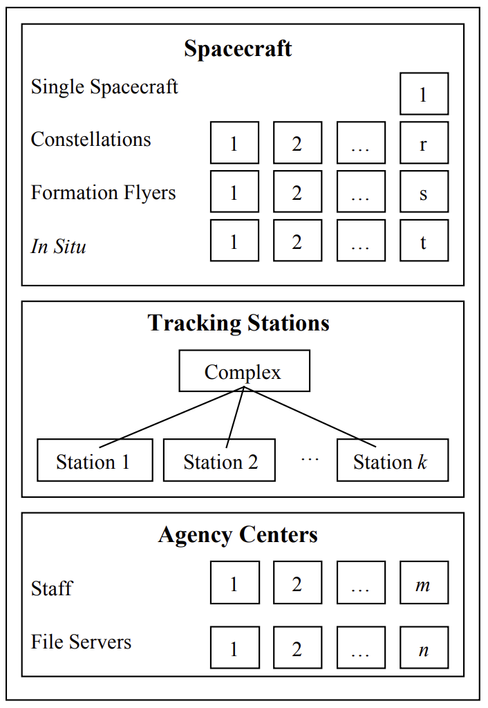
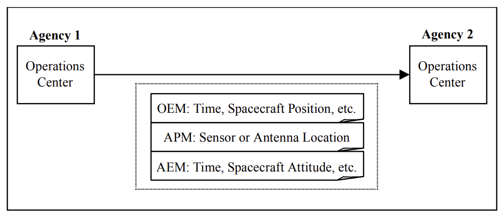
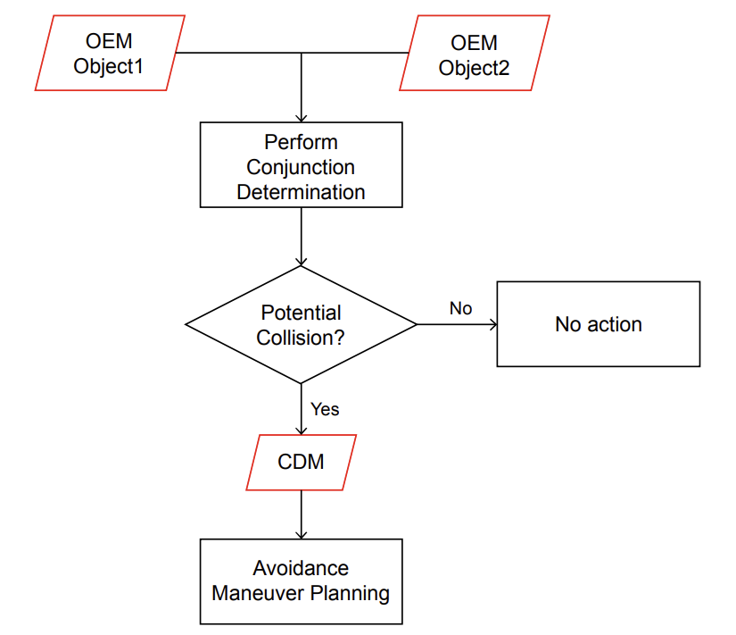

===
NDM
===

.. title:: NAVIGATION DATA MESSAGES OVERVIEW

.. rubric:: INFORMATIONAL REPORT

.. centered:: CCSDS 500.2-G-3

.. centered:: GREEN BOOK
.. centered:: March 2023

AUTHORITY
=========

.. table::
   :align: center

   +----------+-------------------------------------+
   | Issue:   | Informational Report, Issue 3       |
   +----------+-------------------------------------+
   | Date:    | March 2023                          |
   +----------+-------------------------------------+
   | Location:| Washington, DC, USA                 |
   +----------+-------------------------------------+

This document has been approved for publication by the Management Council of the
Consultative Committee for Space Data Systems (CCSDS) and reflects the consensus of
technical panel experts from CCSDS Member Agencies. The procedure for review and
authorization of CCSDS Reports is detailed in Organization and Processes for the
Consultative Committee for Space Data Systems (CCSDS A02.1-Y-4).

This document is published and maintained by:

CCSDS Secretariat
National Aeronautics and Space Administration
Washington, DC, USA
Email: secretariat@mailman.ccsds.org

FOREWORD
========

This CCSDS report, Navigation Data Messages Overview, contains background and
explanatory material to supplement the CCSDS Recommended Standards for spacecraft
navigation data. The document presents the conceptual framework and rationale for the
exchange of navigation data, the definitions and conventions associated with inter-Agency
cross-support situations involving the transfer of navigation data, as well as current and
envisioned CCSDS Navigation Data Messages.

Through the process of normal evolution, it is expected that expansion, deletion, or
modification of this document may occur. This Report is therefore subject to CCSDS
document management and change control procedures, which are defined in Organization
and Processes for the Consultative Committee for Space Data Systems (CCSDS A02.1-Y-4).
Current versions of CCSDS documents are maintained at the CCSDS Web site:

http://www.ccsds.org/

Questions relating to the contents or status of this document should be sent to the CCSDS
Secretariat at the email address indicated on page i.

At time of publication, the active Member and Observer Agencies of the CCSDS were:

Member Agencies
---------------

- Agenzia Spaziale Italiana (ASI)/Italy.
- Canadian Space Agency (CSA)/Canada.
- Centre National d’Etudes Spatiales (CNES)/France.
- China National Space Administration (CNSA)/People’s Republic of China.
- Deutsches Zentrum für Luft- und Raumfahrt (DLR)/Germany.
- European Space Agency (ESA)/Europe.
- Federal Space Agency (FSA)/Russian Federation.
- Instituto Nacional de Pesquisas Espaciais (INPE)/Brazil.
- Japan Aerospace Exploration Agency (JAXA)/Japan.
- National Aeronautics and Space Administration (NASA)/USA.
- UK Space Agency/United Kingdom.

Observer Agencies
-----------------

- Austrian Space Agency (ASA)/Austria.
- Belgian Science Policy Office (BELSPO)/Belgium.
- Central Research Institute of Machine Building (TsNIIMash)/Russian Federation.
- China Satellite Launch and Tracking Control General, Beijing Institute of Tracking and
  Telecommunications Technology (CLTC/BITTT)/China.
- Chinese Academy of Sciences (CAS)/China.
- China Academy of Space Technology (CAST)/China.
- Commonwealth Scientific and Industrial Research Organization (CSIRO)/Australia.
- Danish National Space Center (DNSC)/Denmark.
- Departamento de Ciência e Tecnologia Aeroespacial (DCTA)/Brazil.
- Electronics and Telecommunications Research Institute (ETRI)/Korea.
- European Organization for the Exploitation of Meteorological Satellites (EUMETSAT)/Europe.
- European Telecommunications Satellite Organization (EUTELSAT)/Europe.
- Geo-Informatics and Space Technology Development Agency (GISTDA)/Thailand.
- Hellenic National Space Committee (HNSC)/Greece.
- Hellenic Space Agency (HSA)/Greece.
- Indian Space Research Organization (ISRO)/India.
- Institute of Space Research (IKI)/Russian Federation.
- Korea Aerospace Research Institute (KARI)/Korea.
- Ministry of Communications (MOC)/Israel.
- Mohammed Bin Rashid Space Centre (MBRSC)/United Arab Emirates.
- National Institute of Information and Communications Technology (NICT)/Japan.
- National Oceanic and Atmospheric Administration (NOAA)/USA.
- National Space Agency of the Republic of Kazakhstan (NSARK)/Kazakhstan.
- National Space Organization (NSPO)/Chinese Taipei.
- Naval Center for Space Technology (NCST)/USA.
- Netherlands Space Office (NSO)/The Netherlands.
- Research Institute for Particle & Nuclear Physics (KFKI)/Hungary.
- Scientific and Technological Research Council of Turkey (TUBITAK)/Turkey.
- South African National Space Agency (SANSA)/Republic of South Africa.
- Space and Upper Atmosphere Research Commission (SUPARCO)/Pakistan.
- Swedish Space Corporation (SSC)/Sweden.
- Swiss Space Office (SSO)/Switzerland.
- United States Geological Survey (USGS)/USA.

DOCUMENT CONTROL
================

.. list-table::
   :widths: 25 50 25 25
   :header-rows: 1

   * - Document
     - Title
     - Date
     - Status
   * - CCSDS 500.2-G-1
     - Navigation Data Messages Overview, Informational Report, Issue 1
     - December 2015
     - Original issue, superseded
   * - CCSDS 500.2-G-2
     - Navigation Data Messages Overview, Informational Report, Issue 2
     - April 2020
     - Issue 2, superseded
   * - CCSDS 500.2-G-3
     - Navigation Data Messages Overview, Informational Report, Issue 3
     - March 2023
     - Current issue
.. _introduction:

.. _ndm_sec_1:

1 INTRODUCTION
==============

.. _ndm_sec_1_1:

1.1 PURPOSE AND SCOPE
---------------------

Spacecraft navigation data is exchanged during cross support of space missions. The purpose of
this document is to establish a common understanding for the exchange of spacecraft navigation
data. This exchange is facilitated through the use of the various navigation data messages
defined in section :ref:`4 <ndm_sec_4>`. This document presents the general definitions and terms of spacecraft
navigation and flight dynamics, the conceptual framework and rationale for the exchange of
navigation data, the definitions and conventions associated with interagency cross-support
situations involving the transfer of navigation data, as well as current and envisioned CCSDS
Navigation Data Messages. [17]_ deals explicitly with the technical definitions and
conventions used widely to describe the properties, measurements, and ancillary information of
spacecraft dynamics required for navigation. [17]_ is a registry of technical
definitions of navigation standard time systems, coordinate frames, and element sets.

For the purposes of this document, orbit, attitude, maneuver, tracking data, conjunction
assessment information, pointing, and re-entry data are considered integral parts of the
spacecraft navigation process.

Types of navigation data exchanged and discussed in both this document and [17]_ include:

- orbit data in the form of orbit elements or position and velocity of a spacecraft in
  Cartesian coordinates;
- attitude data for either a spinning or three-axis stabilized spacecraft;
- tracking data and network system information;
- conjunction assessment data;
- environmental models;
- properties and measurements of spacecraft dynamics;
- ancillary data required for the proper interpretation of properties and measurements
  within spacecraft navigation.

.. _ndm_sec_1_2:

1.2 APPLICABILITY
-----------------

This document serves as a guideline for the development and usage of international standards
for the exchange of spacecraft navigation data.

.. _ndm_sec_1_3:

1.3 STRUCTURE OF THIS DOCUMENT
------------------------------

Section :ref:`1 <ndm_sec_1>` (this section) provides an introduction including the document’s purpose and
scope, applicability, structure, and references.

Section :ref:`2 <ndm_sec_2>` provides a brief overview of the spacecraft navigation processes as well as the
definition of key terms relevant to this process.

Section :ref:`3 <ndm_sec_3>` provides foundational information regarding the navigation data message exchange
architecture.

Section :ref:`4 <ndm_sec_4>` provides an overview of the CCSDS Navigation Data Messages (NDMs), and introduces
the current recommended and envisioned CCSDS standards for the exchange of navigation data.

Annex A provides a listing of abbreviations and acronyms.

.. _ndm_sec_1_4:

1.4 REFERENCES
----------------

The following publications are referenced in this document. At the time of publication, the
editions indicated were valid. All publications are subject to revision, and users of this
document are encouraged to investigate the possibility of applying the most recent editions of
the publications indicated below. The CCSDS Secretariat maintains a register of currently
valid CCSDS publications.

.. [1]
  Organization and Processes for the Consultative Committee for Space Data Systems.
  Issue 4. CCSDS Record (Yellow Book), CCSDS A02.1-Y-4. Washington, D.C.:
  CCSDS, April 2014.

.. [2]
  Bob Schutz, Byron Tapley, and George Born. Statistical Orbit Determination.
  Burlington, Massachusetts: Academic Press, 2004.

.. [3]
  James R. Wertz, ed. Spacecraft Attitude Determination and Control. Astrophysics
  and Space Science Library 73. Dordrecht, The Netherlands: D. Reidel, 1978.

.. [4]
  William G. Melbourne. “Navigation between the Planets.” Scientific American 234,
  no. 6 (June 1976): 58–64, 68–74.

.. [5]
  Catherine L. Thornton and James S. Border. Radiometric Tracking Techniques for
  Deep-Space Navigation. JPL Deep-Space Communications and Navigation Series.
  Joseph H. Yuen, Series Editor. Hoboken, N.J.: Wiley, 2003.

[6]
  Attitude Data Messages. Issue 2. Recommendation for Space Data System Standards
  (Blue Book), CCSDS 504.0-B-2. Washington, D.C.: CCSDS, forthcoming.

[7]
  Orbit Data Messages. Issue 3. Recommendation for Space Data System Standards
  (Blue Book), CCSDS 502.0-B-3. Washington, D.C.: CCSDS, forthcoming.

[8]
  Tracking Data Message. Issue 2. Recommendation for Space Data System Standards
  (Blue Book), CCSDS 503.0-B-2. Washington, D.C.: CCSDS, June 2020.

[9]
  Time Code Formats. Issue 4. Recommendation for Space Data System Standards
  (Blue Book), CCSDS 301.0-B-4. Washington, D.C.: CCSDS, November 2010.

[10]
  David A. Vallado, et al. “Revisiting Spacetrack Report #3.” In Proceedings of the
  AIAA/AAS Astrodynamics Specialist Conference and Exhibit. AIAA 2006-6753.
  Reston, Virginia: AIAA, 2006.

[11]
  XML Specification for Navigation Data Messages. Issue 3. Recommendation for
  Space Data System Standards (Blue Book), CCSDS 505.0-B-3. Washington, D.C.:
  CCSDS, forthcoming.

.. [12]
  David A. Vallado. Fundamentals of Astrodynamics and Applications. 5th ed. Space
  Technology Library. El Segundo, CA: Microcosm Press, 2022.

[13]
  Conjunction Data Message. Issue 1. Recommendation for Space Data System
  Standards (Blue Book), CCSDS 508.0-B-1. Washington, D.C.: CCSDS, June 2013.

[14]
  Pointing Request Message. Issue 1. Recommendation for Space Data System
  Standards (Blue Book), CCSDS 509.0-B-1. Washington, D.C.: CCSDS, February
  2018.

[15]
  Re-entry Data Message. Issue 1. Recommendation for Space Data System Standards
  (Blue Book), CCSDS 508.1-B-1. Washington, D.C.: CCSDS, November 2019.

[16]
  Navigation Events Message. Under development.

.. [17]
  Navigation Data—Definitions and Conventions. Issue 4. Report Concerning Space
  Data System Standards (Green Book), CCSDS 500.0-G-4. Washington, D.C.:
  CCSDS, November 2019.

[18]
  “CCSDS Navigation Standards Normative Annexes.” Space Assigned Numbers
  Authority. https://sanaregistry.org/r/navigation_standard_normative_annexes.

[19]
  “Navigation Data Messages XML Schema.” Space Assigned Numbers Authority
  (SANA). https://sanaregistry.org/r/ndmxml.

[20]
  “Publications.” The Consultative Committee for Space Data Systems.
  https://public.ccsds.org/Publications/default.aspx.

[21]
  Cross Support Transfer Service—Tracking Data Service. Issue 2. Recommendation
  for Space Data System Standards (Blue Book), CCSDS 922.2-B-2. Washington, D.C.:
  CCSDS, February 2023.

[22]
  Fragmentation Data Message. Under development.

.. _scope_of_navigation:

.. _ndm_sec_2:

2 SCOPE OF NAVIGATION
=====================

.. _ndm_sec_2_1:

2.1 OVERVIEW
------------

This section briefly describes the spacecraft navigation process and defines terms relevant to
this process.

.. _ndm_sec_2_2:

2.2 NAVIGATION
--------------

.. _ndm_sec_2_2_1:

2.2.1 DEFINITION
^^^^^^^^^^^^^^^^

The word ‘navigate’ is derived from the Latin words navis, meaning ship, and agere,
meaning to move or direct. The common definition of navigation establishes that it is the
science of getting any object, a craft or person, from one place or orientation to another. In
this document, navigation is the determination and prediction of the spacecraft orbit and
attitude, which are specified by their translational and rotational motion, respectively.

.. _ndm_sec_2_2_2:

2.2.2 SPACECRAFT NAVIGATION TERMS AND DEFINITIONS
^^^^^^^^^^^^^^^^^^^^^^^^^^^^^^^^^^^^^^^^^^^^^^^^^^^

In order to establish a solid standard for the exchange of spacecraft navigation data among
agencies, it is important that terms relevant to this process be clearly defined. These terms are
as follows:

property
  An attribute or characteristic of an object or concept. In the context of this
  document, properties represent the physical attributes of the spacecraft, rovers, equipment,
  tracking stations, and relevant environment needed for navigation.

measurement
  Quantitative data collected by an instrument specifically to improve the
  knowledge of properties. In the context of this document, measurements are quantities
  obtained from devices such as radio receivers, attitude sensors, and so on.

.. NOTE::
   Any piece of information can be treated as a property or a measurement; the
   distinction is in how the information is used.

ancillary information
  Any data type needed to correctly interpret properties and
  measurements. In general, ancillary information makes it possible to take properties or
  measurements and incorporate them correctly into numerical computations.

navigation data
  A set of measurements, properties, and ancillary information related to
  navigation.

navigation data message
  A particular arrangement of the navigation data whose structure
  and content are the subjects of CCSDS Recommended Standards as developed by the
  CCSDS Navigation Working Group.

participant
  An entity that has the ability to acquire or broadcast navigation data. Possible
  participants can be arranged into three categories, as depicted in :ref:`figure 2-1 <fig_2_1>`.

.. _fig_2_1:

   Figure 2-1: Participant Categories

spacecraft
  Participant type consisting of a single vehicle orbiting a celestial body or point,
  or as part of a set, such as constellations or formations. The term ‘spacecraft’ also includes
  assets in operations at, or in close proximity to, a remote body. These types of participants
  are referred to as in situ assets, and consist of rovers, landers, aircraft, and so on. Navigation
  data are exchanged to/from these participants and are usually optimized in response to
  bandwidth, power, or message format constraints.

ground stations and space networks
  Participant types that enable spacecraft tracking and
  communications between the spacecraft and ground. Communications with the spacecraft are
  made possible by either a network of fixed ground stations located around the world, or a
  network of space-borne assets with a ground-based terminal. Some spacecraft are equipped with the
  necessary navigation software and/or hardware to do onboard orbit determination and control
  with data from space networks or communication links. Ground-based facilities that provide
  tracking capabilities are used to monitor the location of a spacecraft. Whenever an orbiting
  spacecraft passes across the field of view of a ground station, it is possible to collect tracking
  data that will be used for determining the spacecraft position and velocity. Some agencies have
  multiple stations operated by a central entity, referred to as a complex. Similarly, multiple
  space-borne assets in a network operated by a central entity are referred to as a fleet.

agency center
  Participant type that includes the facilities used for the uplink of commands
  or software loads to the spacecraft, as well as for spacecraft telemetry monitoring, tracking,
  flight dynamics, and other engineering activities. Navigation data may be exchanged between
  agency centers by operations staff (e.g., via email or FTP) or by servers across a computer
  network common to both the broadcasting and acquiring agents.

navigation session
  The interchange of navigation data messages between participants.

orbit
  The translational motion of a spacecraft around a larger central body, resulting from
  gravity forces of the larger mass acting on the spacecraft. The orbit of a spacecraft is the
  trajectory that does not, in the absence of perturbations, intersect with the central body. This
  trajectory is the path of the small mass, or spacecraft, orbiting the central body through space.
  The orbit can be represented as position and velocity in a state vector, or as orbital elements
  as defined in [17]_ [12]_. There are other types of orbits that are affected by the
  gravity pull of two larger masses, for example, the Moon and Earth, such that the spacecraft
  with an appropriate velocity will remain in the same position relative to the two larger
  bodies. These orbits are called Lagrange or libration point orbits.

attitude
  The orientation and/or pointing of a spacecraft, defined by its rotation relative to a
  defined reference coordinate system. The preferred attitude representation depends on the
  stabilization mode of the spacecraft. For instance, a spin-stabilized spacecraft can best be
  represented by the attitude of a single axis either as a three-component unit vector or as a
  point on the unit celestial sphere. This representation sometimes includes the phase of
  rotation about that axis. For three-axis stabilized spacecraft, the attitude can best be
  represented by a coordinate transformation from reference axes in inertial space to the
  spacecraft body frame. (See [17]_ [3]_ for available attitude representations.)

orbital dynamics
  The study of the changes in the position of all orbiting bodies. In
  contrast, attitude dynamics deals with the changes in the orientation and pointing of the
  spacecraft.

flight dynamics
  A term used to cover both orbital and attitude dynamics. It refers to the
  study of translational and rotational motion and control of a flying object, whether it is an
  aircraft or spacecraft. Within the aerospace industry, the flight dynamics term could be used
  for mission design and analysis as well as the support required for determining, controlling,
  and maintaining the orbit and attitude of a spacecraft.

orbit determination and attitude determination
  The processes within navigation to find the
  present and past positions and orientations of a spacecraft. These two navigation processes fit a
  set of measurements to a physical model in some optimal way to obtain the best orbit and
  attitude solutions. Although they are related, these processes affect each other only weakly so
  they can generally be performed separately. For example, a nominal or representative attitude
  can generally be used in drag models that affect orbit determination, and a predetermined
  ephemeris can generally be used in attitude determination. The results of these two processes
  can also be used to predict future positions and orientations of the spacecraft.

guidance
  The process of defining a path to move a spacecraft from one point to another or
  from one orientation to another.

control
  The process to maintain a spacecraft within the prescribed path and attitude.

The above terms guidance, navigation, and control are commonly grouped together and
abbreviated GN&C. The term GN&C is used to describe a system or subsystem forming part
of a spacecraft or aircraft. The GN&C system includes all the hardware (sensors and
actuators) and software necessary for both onboard or ground-based orbit and attitude
determination and control.

The Attitude Control System (ACS), or alternatively, the Attitude Determination and
Control System (ADCS), is part of GN&C and consists specifically of hardware and
software for onboard attitude estimation and pointing control. The propulsion system is an
essential element of GN&C and a complement for ACS within a spacecraft for attitude
and/or orbit thruster control.

The discussion of guidance and control is outside of the scope of this Report.

.. _ndm_sec_2_2_3:

2.2.3 SPACECRAFT NAVIGATION PROCESSES
^^^^^^^^^^^^^^^^^^^^^^^^^^^^^^^^^^^^^^

In addition to orbit and attitude determination introduced in 2.2.2, maneuver planning and
reconstruction for orbit and attitude control, conjunction assessment and collision risk analysis,
and calibration of hardware used for navigation are also important processes. In general
estimation terms, all of these spacecraft navigation processes can take place either in real time,
near-real time, or after the fact (also referred to as reconstruction), as illustrated in :ref:`figure 2-2 <fig_2_2>`.

.. _fig_2_2:

.. figure:: ../images/ccsds_books/ndm/2_2.png
   :alt: Figure 2-2: Navigation Estimation Process
   :align: center

   Figure 2-2: Navigation Estimation Process

Examples of the navigation data exchanged during orbit and attitude determination processes
include tracking measurements or observations, orbit parameters, planned or conducted
maneuvers, attitude parameters, and an ephemeris as described in section :ref:`4 <ndm_sec_4>`. These
determination processes produce single orbit and attitude parameter or history solutions by
fitting hardware measurements to a physical model. This physical model represents the
relationship between the measurements and the desired solution (position, velocity, attitude,
etc.). Often additional model parameters that affect the solution are also solved for to
improve the navigation solution. Examples of such parameters are drag coefficients or gyro
biases. The set of all parameters that is solved for is called the state of the system.

The more parameters in the state, and the more complex the model, the more data is needed
to find a solution. Once a model with the dynamics is defined, data at different times may be
used, so there is generally more data available than the minimum needed to find a unique
solution. In such ‘over determined’ cases, especially when the observations are uncertain,
least-squares or other estimation techniques are used to find the best state to match the
observations to the model.

For example, if one knows the position of a spacecraft, it is easy to compute the distance from
the spacecraft to known points. The reverse process, computing the position of the spacecraft
from a single distance measurement, does not give a unique solution. To obtain a unique
solution, distances from several known points at one time are needed. Alternatively, distances
from a known point at different times or different types of data (e.g., velocity measurements)
can be used. In order to use the time-dependent differences, a model of the change of position
of the spacecraft with time must be generated from the principles of physics. This model can be
made more accurate by including perturbations in it, such as drag, and solving for parameters
that help define the effect of these perturbations on the position as a function of time.

For the most part, the orbit and attitude determination processes can, however, be generalized
to the following four steps:

a) A set of measurements is acquired.
b) A dynamic model is fit to a set of measurements to provide a solution state (cf.
   [2]_ [3]_ [4]_ [5]_ [12]_), which is found by minimizing the differences
   between measurements and reference values corresponding to the measurements.
c) The solution state may be used in the model to predict the future state.
d) If necessary, the spacecraft state is altered at some future time:

   1) For trajectories/flight paths: A spacecraft propulsive maneuver is performed to
      correct the trajectory to meet mission requirements and constraints or in the
      performance of debris avoidance. This process is called ‘flight path control’.
   2) For attitudes: A maneuver is performed to modify the spacecraft attitude to meet
      mission requirements and constraints. This process is called ‘attitude adjustment’.
      
.. _navigation_data_message_exchange_framework:

.. _ndm_sec_3:

3 NAVIGATION DATA MESSAGE EXCHANGE FRAMEWORK
============================================

.. _ndm_sec_3_1:

3.1 OVERVIEW
------------

This section describes the elements, characteristics, and major groupings of navigation data
message exchanges.

.. _ndm_sec_3_2:

3.2 NAVIGATION DATA AND NAVIGATION DATA MESSAGES
--------------------------------------------------

.. _ndm_sec_3_2_1:

3.2.1 GENERAL
^^^^^^^^^^^^^

:ref:`Figure 3-1 <fig_3_1>` describes the roles of navigation data versus navigation data messages.

.. _fig_3_1:

.. figure:: ../images/ccsds_books/ndm/3_1.png
   :alt: Figure 3-1: Navigation Data Message Exchange Definitions
   :align: center

   Figure 3-1: Navigation Data Message Exchange Definitions

Ideally, every navigation data message exchange will be covered by a CCSDS
Recommended Standard related to flight dynamics. However, the completed CCSDS
Recommended Standards cannot presently cover the entire range of exchanges. It should also
be noted that spacecraft telemetry downlinked to the ground that contains navigation data is
treated using CCSDS standards that are not in the flight dynamics domain. Section :ref:`4 <ndm_sec_4>`
introduces the current and proposed Recommended Standards for the exchange of navigation
data. Agencies can benefit from utilizing these formats at the present time. The following are
the current exchange scenarios within the scope of CCSDS:

- Ground-to-ground exchanges are defined as the set of exchanges between two non-
  spacecraft participants.
- Ground-to-flight and flight-to-ground exchanges are defined as the set of
  exchanges between a spacecraft participant and a non-spacecraft participant.
- Flight-to-flight exchanges are defined as the set of exchanges between two
  spacecraft participants.

.. _ndm_sec_3_2_2:

3.2.2 NAVIGATION DATA EXCHANGE CHARACTERISTICS
^^^^^^^^^^^^^^^^^^^^^^^^^^^^^^^^^^^^^^^^^^^^^^^^

This subsection describes a framework for the exchange of messages between any two types
of participants (see :ref:`2.2.2 <ndm_sec_2_2_2>` and :ref:`figure 2-1 <fig_2_1>`). It is not possible to describe every potential
navigation session in detail, but navigation sessions generally have the following three
general characteristics:

a) Navigation sessions may be divided so as to accommodate constraints on data
   rates or availability of relevant information. For example, for launch support of a
   spacecraft, state vectors (see [17]_ [12]_ [3]_) could be exchanged
   between operations centers of two agencies. This exchange may be digital or through
   sharing of an image of the data. The text contains (1) the relevant property
   information (the position and velocity or attitude of the spacecraft), and (2) all of the
   necessary ancillary information needed to interpret the position and velocity or
   attitude of the spacecraft (coordinate frame, time, time system, spacecraft ID, etc.).
   All of the information needed to unambiguously interpret the property information is
   sent in one event. In a second example, it may be necessary to send spacecraft
   position or orientation updates from one spacecraft to another in real time. Because of
   bandwidth limitations on the telemetry, it may not be desirable to send any other
   ancillary information at that time. In that case, the participating agencies should agree 
   on the coordinate frames, time frames, and so on, beforehand, and commit these
   pieces of information to an Interface Control Document (ICD). This document, in
   fact, becomes part of the overall navigation session as depicted in :ref:`figure 3-2 <fig_3_2>`.

.. _fig_3_2:

.. figure::../images/ccsds_books/ndm/3_2.png
   :alt: Figure 3-2: Examples of Navigation Sessions
   :align: center

   Figure 3-2: Examples of Navigation Sessions

b) Navigation data messages may utilize a shorthand of a CCSDS Recommended
   Standard to convey ancillary information. The shorthand developed in each case
   should be unambiguous, flexible, and extensible. For example, in the case described in
   part (a) of :ref:`figure 3-2 <fig_3_2>`, the coordinate frame can be an ASCII string, such as ‘Earth
   Centered True of Date’. It is possible to assign each coordinate frame a unique ASCII
   string, but there is a loss of extensibility with that approach, and in some cases, the
   required number of bits of information may be prohibitive. It is also possible to assign a
   unique ID number to each coordinate frame; this approach would result in a fairly
   compact message, but the resulting order of coordinate frame IDs would have little
   physical meaning. (Shorthand conventions for commonly used data types are reviewed in
   [17]_.)

c) The content of a navigation session may be governed by more than one CCSDS
   Recommended Standard. For example, if one agency is to provide another with the
   time history of the position of a sensor or antenna on a spacecraft, there are three pieces
   of information that need to be exchanged, each with its own format: (1) the time history
   of the spacecraft trajectory or orbit, (2) the position of the sensor or antenna with respect
   to the spacecraft center of mass (given most likely in a spacecraft fixed frame), and (3)
   the attitude history of the spacecraft. Although the content of these pieces comes from
   different Recommended Standards, the information itself can be sent at one time or in
   separate events (see :ref:`figure 3-3 <fig_3_3>`).

.. _fig_3_3:

   Figure 3-3: Navigation Session Using Multiple CCSDS Recommended Standards
.. _ccsds_navigation_data_messages:

.. _ndm_sec_4:

4 CCSDS NAVIGATION DATA MESSAGES
================================

.. _ndm_sec_4_1:

4.1 GENERAL
-----------

This section provides an overview of the current and envisioned CCSDS Navigation Data
Messages. It also reflects an application of the Navigation Data Message Exchange
Framework described in section :ref:`3 <ndm_sec_3>`.

The selection of navigation data formats and interfaces necessary for mission-operations
support is done very early during the development of the ground system. Standards are
highly desirable for the correct interpretation and common understanding of the exchange of
navigation data, with the purpose of facilitating communications within an agency and/or
between agencies. Because interagency partnering in mission operations is becoming more
widespread, standardization of navigation data formats facilitates interoperability between
space agencies, where navigation functions for a mission of agency A could be performed by
agency B, or vice-versa. In addition, standards for spacecraft navigation data could permit the
reuse of software modules that read the input and generate the proper output products within
the navigation process. This could facilitate an increased level of automation within the
ground system.

There are currently six published standards for the exchange of spacecraft navigation data:
Attitude Data Message (ADM), Orbit Data Message (ODM), Tracking Data Message (TDM),
Conjunction Data Message (CDM), Pointing Request Message (PRM), and Re-Entry Data
Message (RDM). An overview of these standards is provided in the subsequent subsections.
The details of the ADM, ODM, TDM, CDM, PRM, and RDM are specified in references [6],
[7], [8], [13], [14], and [15], respectively. The published standards are reviewed every five
years. The three actions to be considered in the five-year review are ‘reconfirm’, ‘retire’, or
‘revise’, as applicable (see [1]_).

There are additional navigation data standards being developed and envisioned to fulfill and
facilitate the execution and implementation of other navigation functions. Such standards
under development are: Navigation Events Message (NEM, reference [16]) and
Fragmentation Data Message (FDM, reference [22]), which will provide a standard
framework for the exchange of orbit and attitude events and a standard message format for
the exchange of fragmentation information, respectively.

The objective of all navigation data messages is to minimize the burden during the
implementation phase by giving a specification and unambiguous interpretation of the input and
output data for common navigation processes. Each standard is developed to communicate the
necessary data elements in a compact format that is readable to the human eye, as well as
readable by computers to enable automation of navigation processes. The NDM standards are
only applicable to the message format and content, but not to its transmission. The transmission
method or mechanism used by the partners exchanging NDMs is beyond the scope of the
standards and should be specified in ICDs. The message transmission could be based on a
CCSDS data transfer protocol, file based transfer protocol such as SFTP, stream-oriented
media, or other secure transmission mechanism. Once published by the CCSDS, all the CCSDS
Navigation Standards are posted and available free of charge at the CCSDS Web site
(reference [20]). The following is a brief summary of all NDMs described in 4.2 and 4.2.6:

- The TDM contains information that can be used to determine the orbit state of a spacecraft.
- The ODM contains information that defines the orbit state of a spacecraft at one or
  more times.
- The ADM contains information that defines the attitude state of a spacecraft or
  instrument at one or more times.
- The CDM contains information that defines the relationship between the orbit states
  of different space objects at their time of closest approach.
- The PRM contains information on the desired attitude state of an object at one or
  more future times.
- The RDM contains information that describes the re-entry event of a space object.
- The NEM provides a framework for the exchange of orbit, attitude, and related events.

The remainder of this document provides a more detailed overview of the CCSDS navigation
standards that have either been published (see :ref:`4.2 <ndm_sec_4_2>`) or are under development (see :ref:`4.2.6 <ndm_sec_4_2_6>`).

.. _ndm_sec_4_2:

4.2 PUBLISHED NAVIGATION DATA MESSAGES
---------------------------------------

.. _ndm_sec_4_2_1:

4.2.1 TRACKING DATA MESSAGE
^^^^^^^^^^^^^^^^^^^^^^^^^^^^^

The TDM (reference [8])¹ specifies a standard format for a single message type used in the
exchange of spacecraft tracking data between space agencies. Such exchanges are used for
distributing tracking data output from routine interagency cross support in which spacecraft
missions managed by one agency are tracked from a ground station managed by a second
agency. The standardization of tracking data formats facilitates orbit determination as well as
space agency allocation of sessions to alternate tracking resources and international
cooperation in the provision of tracking services. Additionally, it increases the ability of
space agencies to tolerate availability issues with their primary antennas.

The TDM standard is designed for the interagency exchange of the following tracking data
types (see reference [17]):

- ground- and space-based radio metric tracking data types:

  - uplink and downlink (transmitted/received) frequencies,
  - range,
  - Delta Differential One-way Ranging (Delta-DOR),
  - range rate,
  - differenced range,
  - Doppler (one-way, two-way, three-way, and four-way),
  - differenced Doppler,
  - antenna angles,
  - interferometric types,
  - optical data;

- spacecraft-to-spacecraft Doppler and range;
- ancillary information needed to calculate the measurement residuals, such as
  meteorological data (weather), media delays/correction, and clock bias/drift
  measurements.

The metadata section in the TDM contains keywords that qualify the data section keywords and
provide supplementary information that is necessary to interpret the data. For any given TDM data
type, the metadata keywords fall into three categories: required metadata, situation-specific
required metadata, and completely optional metadata. There are relatively few metadata keywords
that are required for every TDM; as in general, there are only a small number of the metadata
keywords that are meaningful across every data type. One of the most important metadata
keywords, required in all TDMs, are the keywords that represent the participants (spacecraft,
antennas, etc.) involved in a tracking data session. The details for the full range of data types that
may be exchanged via the TDM can be found in reference [8].

Because of the large amount of data typically collected during a tracking pass, the TDM is suited to
interagency exchanges from one computer to another (e.g., file transfer) in an automated fashion.
Based on the variety of data types and the diversity of tracking systems existing in various
agencies, a TDM should be supplemented by an ICD written jointly by the service provider and
customer agency that discusses such things as tracking instrument locations, corrections that will or
will not be applied to the data, the specific methods/mechanism of transferring data that will be
supported, frequency of exchange, and so on. While most agencies are transferring TDMs using a
file-based transfer protocol, another CCSDS Working Group, the Cross Support Transfer Services
(CSTS) Working Group, has developed a standard for real-time transfer of radiometric tracking
data that will use the TDM as the data format [21].

The TDM has been assimilated into the operations environments of several of the CCSDS Member
Agencies. A partial list of implementations follows. The TDM is the format used by NASA’s Jet
Propulsion Laboratory (JPL) for providing tracking data from the Deep Space Network (DSN) for
multiple European Space Agency (ESA) spacecraft (e.g., Mars Express, Venus Express,
ROSETTA) and for the Indian Space Research Organization (ISRO) Mars Orbiter Mission. The
TDM has also been used for tracking data exchanges between Goddard Space Flight Center
(GSFC) and Johnson Spaceflight Center for the Orion Exploration Flight Test-1 (EFT-1), and
between ESA and China for the Chang-E-2 mission and with Russia for the Phobos-Grunt mission.

.. [Note1] At time of publication the TDM is undergoing revision as a result of mandatory CCSDS five-year review.

.. _ndm_sec_4_2_2:

4.2.2 ORBIT DATA MESSAGES
^^^^^^^^^^^^^^^^^^^^^^^^^^^

The ODM (reference [7]) represents the orbit data for a single spacecraft and specifies the
formats for use in transferring orbit information between space agencies, commercial spacecraft
operators, and/or government spacecraft operators in a clear, concise, and compact manner. The
ODM may be one of the following four messages that serve different purposes: the Orbit
Parameter Message (OPM), the Orbit Mean-Elements Message (OMM), the Orbit Ephemeris
Message (OEM), and the Orbit Comprehensive Message (OCM). The OPM and OMM could be
used in exchange scenarios that involve automated and/or human interaction; however, the OEM
is best suitable for exchanges that require a high level of automation for fast, frequent, and
reliable interpretation and processing of the data. Full details on the ODM can be found in
reference [7].

The OPM specifies the orbital state (single position and velocity in Cartesian coordinates) or
osculating Keplerian elements of a spacecraft at a particular instant; whereas the OMM
specifies the characteristics of the spacecraft orbit expressed in mean Keplerian elements at a
specified epoch. Neither the OPM nor OMM is designed for higher fidelity propagation.
However, the OPM allows the user to specify simple parameters related to finite and
instantaneous maneuvers and provides simple parameters for the modeling of solar radiation
pressure and atmospheric drag. One feature of the OMM is that it includes keywords and
values to generate canonical NORAD Two Line Elements Sets (TLEs) for accommodating
the needs of heritage users (see reference [10]).

The OEM specifies the orbital state vectors at multiple epochs within a time range in a single
message and allows for the modeling of any number of gravitational and non-gravitational
accelerations. The OEM represents the history or forecast (prediction) of the state vectors,
which can be interpolated to obtain the spacecraft orbit position and velocity state at times
other than those explicitly specified in the message (i.e., from the tabular epochs).

An OCM specifies position and velocity of either a single object or an en masse parent/child
deployment scenario stemming from a single object. The OCM aggregates and extends OPM,
OEM, and OMM content in a single comprehensive hybrid message (file) and includes the
following additional capabilities:

- optional Earth Orientation (UT1 and UTC) at a nearby (relevant) reference epoch;
- optional Leap second specification;
- optional area cross-sections for drag, SRP perturbations modeling;
- optional spacecraft dimensions and orientation information for collision probability
  estimation;
- optional orbit states (specified using one or more of Cartesian and orbit elements and
  reference frames) for a single or parent object at either a single epoch or as a time
  history (ephemeris);
- optional covariance matrix of selectable/arbitrary order for a single or parent object at
  either a single epoch or as a time history (ephemeris) that reflects the uncertainty of
  the orbit solution or simulation used to obtain the nominal states in the orbit state(s);
- optional covariance content options (e.g., Cartesian 3x3, 6x6, 7x7, or any
  combination of order, reference frame and orbit elements);
- optional maneuver specification (impulsive or finite burn);
- optional perturbations model specification;
- optional orbit determination data and metrics.

A covariance matrix, which is optional for all the ODMs, reflects the uncertainties of the
orbit solutions used to generate the states in the OEM, uncertainties of the orbit state in the
OPM, uncertainties of the mean Keplerian elements in the OMM, and uncertainties of the
orbit solution for a single or parent object in the OCM.

If ephemeris information of multiple spacecraft is being exchanged, then multiple OPM,
OMM, or OEM messages must be used (these could be packaged in a single file, if desired),
or alternately as an OCM, where a parent/child object association is applicable.

The ODM has been assimilated into the operations environments of several of the CCSDS
Member Agencies. A partial list of implementations follows. The OEM is the format used by
ESA for submission of spacecraft ephemeris to NASA’s JPL for tracking of multiple ESA
spacecraft (e.g., Mars Express, Venus Express, ROSETTA) by the DSN. The OEM has also
been used to deliver the trajectories to the European Space Operations Centre (ESOC) for
possible contingency tracking (e.g., Mars missions, SOHO). Additionally, the Japan
Aerospace Exploration Agency (JAXA) used the OEM for DSN tracking of the SELENE
spacecraft. The OPM has been implemented at NASA/JPL Navigation, Deutsches Zentrum
fur Luft-und Raumfahrt (DLR), Centre National d’Etudes Spatiales (CNES), and ESOC, and
is used frequently for external support. The ODMs have also been implemented and used to
support projects within NASA GSFC. For instance, OEMs are used for owner/operator
ephemerides in conjunction assessment by the NASA GSFC by Conjunction Assessment
Risk Analysis (CARA), by the Combined Space Operations Center (CSpOC), by the Space
Data Association, and in the Magnetospheric Multiscale Mission (MMS) for definitive and
predictive products for mission operations and science. OEMs are also in use within NASA
Johnson Space Center for the delivery of International Space Station (ISS) trajectories to
GSFC and Orion spacecraft ephemerides to GSFC and JPL. Numerous other implementations
are likely to exist given the popularity and flexibility of the OEM.

.. _ndm_sec_4_2_3:

4.2.3 ATTITUDE DATA MESSAGES
^^^^^^^^^^^^^^^^^^^^^^^^^^^^^^

The purpose of the ADM Recommended Standard (reference [6]) is to delineate a format and
keywords that allow the exchange of attitude information in an unambiguous manner.
Though the parameterization can take many forms, the information conveyed must at a
minimum address the following to give an unambiguous attitude:

- epoch of the attitude;
- coordinate system being transformed from (1);
- coordinate system being transformed to (2);
- attitude parameters.

Depending on the particular parameterization of the attitude, additional information may be
necessary to fully specify an unambiguous attitude. In addition to these parameters, the
rotational rates of coordinate system 1 with respect to coordinate system 2 are needed to
propagate the attitude.

The ADM Recommended Standard specifies three message formats for use in transferring
spacecraft attitude information between space agencies: the Attitude Parameter Message
(APM), the Attitude Ephemeris Message (AEM), and the Attitude Comprehensive Message
(ACM). All ADMs provide the proper parameters for spin-stabilized and three-axis stabilized
spacecraft. Each parameterization requires specification of different quantities, thus requiring
a different set of keywords.

The APM consists of instantaneous attitude state and optional attitude maneuvers. It specifies
the attitude state of a single object at an instant of time (an epoch). The recipient of the message
requires the use of an attitude propagator or technique to determine the attitude at times
different from the epoch. The recipient needs to have, therefore, angular velocity data or the
proper modeling of spacecraft attitude dynamics, atmospheric torque, other internal and
external torques (e.g., magnetic, gravitation, solar pressure, etc.), thrust or reaction wheel
maneuvers, and attitude control to fulfill the accuracy requirements for a particular mission. For
the propagation, additional ancillary information (spacecraft properties, such as inertia tensor,
torque vectors, and maneuver planning data, if applicable) can be included in the message.

The AEM consists of a history or forecast of the spacecraft’s attitude. The user or recipient of
the AEM can interpolate the history/forecast to determine the attitude states at arbitrary times
contained within the span of the ephemeris, but different from the tabular epochs. Because of
the interpolation technique, a predictive AEM accommodates higher fidelity or precision
dynamic modeling than is possible in the APM to allow for the modeling of any number of
torques induced by flexible structures, more complex attitude movements, solar pressure,
atmospheric torques, magnetic torques, and so on.

The ACM specifies the attitude state of a single object at multiple epochs, contained within a
specified time range. The ACM aggregates and extends the APM and AEM content in a single
hybrid message. The ACM simultaneously emphasizes flexibility and message conciseness by
offering extensive optional standardized content while minimizing mandatory content.

The APM allows for modeling of any number of finite maneuvers; the propagation technique
leads to a higher level of effort for software implementation than for the AEM. When inertial
reference frames are specified, the APM and AEM are self-contained and do not require
additional information. If local orbital reference frames are specified, then an AEM or an
APM must be used in conjunction with an OEM and/or OPM, respectively.

Multiple APM, AEM, or ACM messages may be provided in a message exchange session
requiring different levels of precise modeling of the spacecraft dynamics to achieve the
fidelity requirements. If attitude information for multiple spacecraft is being exchanged, then
multiple APM, AEM, or ACM messages must be used. Full details on the ADM can be found
in reference [6]. Currently, ADMs are being used to support some mission operations within
NASA GSFC and ESA ESOC.

.. _ndm_sec_4_2_4:

4.2.4 CONJUNCTION DATA MESSAGE
^^^^^^^^^^^^^^^^^^^^^^^^^^^^^^^^^^

The CDM (reference [13]) specifies a standard message format for exchanging spacecraft
conjunction information between providers of Conjunction Assessment (CA) results and
spacecraft owners and operators. CA is the process of predicting conjunction events by
comparing observations and orbit determination solutions for more than one space object. The
CA results provide information associated with the closest point of approach or local minimum
in the difference between the position components of two space object trajectories at their Time
of Closest Approach (TCA). Within the overall CA processes, the owner/operator of a
spacecraft exchanges ODMs with the CA providers/CDM originators. Once the CA process or
screening of conjunction events is completed, a CDM is transmitted to the owner/operator of a
spacecraft or the group that performs the conjunction assessment analysis.

CA considerations when assessing the conjunction risk include the trajectory geometry,
collision probability and variability, evolution and trends, solution quality, as well as
mitigation strategies and maneuver evaluation. The assessment of each solution is based on
the number of tracks and observations, last observations, sensor geometry and observability,
fit span, residual acceptance, Weighted Root-Mean Square (WRMS), ballistic coefficient,
solar radiation pressure coefficient, energy dissipation rate, radar cross sectional area, force
modeling (e.g., solid Earth tides), and consistency between solutions.

In summary, the CDM is the final product of CA results and is intended to provide spacecraft
owner/operators with sufficient information they can use to assess the risk of collision and
design collision avoidance maneuvers, if necessary. Therefore the information exchanged
within a CDM notifies the spacecraft operator(s) of possible conjunctions with another space
object and enables consistent warning by different organizations employing diverse CA
techniques. Conjunction information includes data types such as the identity of the affected
objects, miss distance, Probability Of Collision (POC), TCA, closest approach relative
position and velocity, Cartesian states of the affected objects at TCA, and a covariance
matrix that reflects the uncertainty of the states. Full information describing the conjunction
information contained in this message can be found in reference [13].

The CSpOC has fully implemented the CDM in operations. It is their primary means of
notifying an operator of a conjunction assessment. They are also used at NASA JSC in
support of Human Spaceflight operations and at GSFC for the support of CARA operations.

The CDM is currently undergoing revision as a result of the mandatory CCSDS five-year
review, but it would be premature to provide details.

.. _ndm_sec_4_2_5:

4.2.5 POINTING REQUEST MESSAGE
^^^^^^^^^^^^^^^^^^^^^^^^^^^^^^^^

The PRM (reference [14]) provides a common and standardized format for the exchange of
pointing requests between the requestor and spacecraft owner/operators. These pointing
requests allow the analysis and execution of changes to the spacecraft attitude or to the
orientation of an articulated spacecraft component. The analysis may include operational
constraint checks in detail because of the fact that the requestors may not necessarily know
the spacecraft attitude. The requestors desire to point the spacecraft and describe their needs
through a PRM. Processing of the PRM taking into account the trajectory, attitude, and
desired target will determine whether or not the pointing is feasible.

The basic element of all pointing requests is the orientation or attitude of an object or the
direction of an axis defined relative to this object at an instant in time. The object can be a
spacecraft; or an instrument, sensor, antenna, or articulated solar array mounted on a
spacecraft. The attitude or axis direction can be defined either relative to inertial space or to
another object. PRMs could be transmitted from scientists who operate an onboard
instrument to the operator of the spacecraft. These could be referred to as science pointing
requests. The following are text representations of examples of science pointing requests:

- point the boresight of an instrument onboard a planetary orbiter at the limb of the
  illuminated section of the planet;
- point the onboard high-gain antenna of a planetary orbiter at the Earth such that the
  antenna beam passes through the planet’s atmosphere at a given altitude;
- perform with the boresight of an instrument a raster scan of a target with a defined
  size, geometry, number of points, and dwell time at each point.

Another exchange of PRMs could be between service providers and users of relay
communication satellites, for example, Tracking and Data Relay Satellite System (TDRSS).
Text representations of examples of such pointing requests are as follows:

- point the relay antenna of spacecraft 1 (which serves as relay) to spacecraft 2 (which
  uses the relay service) during a given time period;
- point the relay antenna of a planetary orbiter to a lander or rover on the surface of the
  planet during a given time period;
- point the relay antenna of a planetary orbiter to a lander on approach to the planet
  while it passes through a given altitude range.

.. _ndm_sec_4_2_6:

4.2.6 RE-ENTRY DATA MESSAGE
^^^^^^^^^^^^^^^^^^^^^^^^^^^^^

The RDM (reference [15]) specifies a standard message format to be used in the exchange of
spacecraft re-entry information between Space Situational Awareness (SSA) or Space
Surveillance and Tracking (SST) data providers, satellite owners/operators, and other parties.
These messages are used to inform spacecraft owners/operators of predicted re-entries, warn
civil protection agencies about potential ground impacts, or, conversely, to inform SSA/SST
providers of the prediction.

The RDM is applicable to SST activities, spacecraft operations, and other ‘ground’-based
activities (e.g., civil protection, civil and military aviation) in which re-entering space objects are
a concern. It contains the specifications for re-entry prediction information exchange between
originators of re-entry data and recipients. Re-entry data includes remaining orbital lifetime, start
and end of the re-entry and impact windows, impact location, and object physical properties.

The RDM is suitable for both manual and automated interaction, and for machine-to-machine
interfaces for high data volume. The RDM is self-contained, but it can be paired with other
Navigation Data Messages to enhance its functionality. For example, an RDM could be paired
with several OPMs to exchange state vectors at critical epochs (last orbit determination, current,
re-entry, etc.) or with one OEM to give the trajectory for (most of) the re-entry. The presence of
user defined keywords allows other information to be exchanged after being specified in an ICD;
ICDs are not necessary for most RDM exchanges, but are expected in some cases (especially if
ODMs are to be exchanged for object position).

.. _ndm_sec_4_3:

4.3 NAVIGATION DATA MESSAGES IN DEVELOPMENT
---------------------------------------------

.. _ndm_sec_4_3_1:

4.3.1 NAVIGATION EVENTS MESSAGE
^^^^^^^^^^^^^^^^^^^^^^^^^^^^^^^^^

The NEM (reference [16]) is foreseen to provide a method of exchanging a sequence of navigation
related orbital events for a spacecraft or mission. These messages would enable the capability to
handle exchanges of information not currently handled by CCSDS standard messages for the
classical data types of orbit, attitude, and other measurements. Orbital events (and more precisely,
predicted orbital events) constitute a major data type used in control centers for operations and
science planning. Orbital events describe when, and possibly how, certain situations related to one
or more satellites occur.

Examples of typical events are:

- when, generally, some geometric condition is met (in relation to onboard sensors, celestial
  bodies, possibly other satellites, etc.);
- when certain orbit parameters have some specific value (e.g., a satellite crosses the
  Equator).

.. NOTE::
   The CCSDS Blue Book Cross Support Service Management—Communications
   Planning Information Format (CCSDS 902.2-B-1) specifies standard formats for
   use in transferring communications-planning information related to ground
   stations and/or relay satellites between space agencies and commercial or
   governmental spacecraft operators. The NEM will not duplicate these events.

.. _ndm_sec_4_4:

4.4 NAVIGATION DATA MESSAGES USE CASE EXAMPLES
------------------------------------------------

This subsection provides general examples of NDM use cases as input to and output from
navigation processes.

:ref:`Figure 4-1 <fig_4_1>` below shows a high-level exchange scenario of OEMs and CDMs in an end-to-
end CA process. As seen in the figure, two OEMs are used to determine a conjunction, one
OEM per object. If there is a high probability of collision, a CDM is generated and provided
to the owners and/or operators of the spacecraft. The CDM will then contain all the
conjunction information to assess the risk of the collision and design an avoidance maneuver,
if necessary. Therefore both OEM and CDM exchanges are essential for CA.

.. _fig_4_1:

   Figure 4-1: Use Case Example

Two other navigation processes that require exchanges of NDMs are orbit and attitude
determination (see :ref:`2.2.3 <ndm_sec_2_2_3>`). Orbit determination can be done either with tracking data from a
TDM or orbit related hardware data (e.g., GNSS receiver), while attitude sensor data (e.g.,
quaternion from star sensor, body rates from IRU, etc.) are necessary for attitude
determination. ODMs and ADMs are the spacecraft orbit and attitude state solutions
computed during the determination process. :ref:`Figure 4-2 <fig_4_2>` depicts a diagram of the use of TDMs
as input for orbit determination, and ODMs and ADMs as the generated output of these two
processes, respectively.

.. NOTE::
   NDMs do not cover the format and/or transfer of spacecraft telemetry containing
   navigation data being downlinked to the ground. Other CCSDS standards provide
   the data format and transfer of spacecraft telemetry to the ground.

.. _fig_4_2:

.. figure:: ../images/ccsds_books/ndm/4_2.png
   :alt: Figure 4-2: TDM, ODM, and ADM Use Case Example
   :align: center

   Figure 4-2: TDM, ODM, and ADM Use Case Example

As opposed to the previous use cases, which had to do with message exchanges primarily for
attitude and orbit determination processes, as well as conjunction assessment, an exchange of
a PRM is the catalyst for spacecraft orbit and attitude maneuver planning, execution, and
reconstruction. The PRM may be used to request repointing the spacecraft to a different
attitude, and for orientation changes of spacecraft articulated instruments or appendages. As
seen in :ref:`figure 4-3 <fig_4_3>`, the PRM is provided with the desired instrument pointing to the team that
performs the maneuver planning and execution to achieve the final orientation.

.. _fig_4_3:

.. figure:: ../images/ccsds_books/ndm/4_3.png
   :alt: Figure 4-3: PRM Use Case Example
   :align: center

   Figure 4-3: PRM Use Case Example
.. _ndm_sec_4_5:

4.5 NAVIGATION DATA MESSAGE FORMATS
-------------------------------------

.. _ndm_sec_4_5_1:

4.5.1 GENERAL
^^^^^^^^^^^^^

The NDMs address the format and the approach for formatting each message. Currently, the
NDMs use the Keyword Value Notation (KVN) and Extensible Markup Language (XML)
formats. In the KVN format, a keyword is specified, followed by an equals sign, followed by
a value for the keyword (i.e., ‘keyword = value’), whereas the XML-based format relies on
document tags that specify how to organize the content. NDM tags in the XML format are
usually identical to the keywords used in the KVN format.

Though the KVN format is very useful and common in all computing architectures, the XML-
based format has shown to be a better form of specifying ASCII data and a more convenient
mechanism for Web-based architectures. Likewise, XML seems to be well suited to cover all
possible needs of the NDMs because of limitations on the KVN format. The advantages,
disadvantages, and justification for using the XML instead of the KVN text files can be found
in reference [11]. It should also be noted that the PRM is implemented using a set of XML
templates, rather than as an XML message that can be validated via the XML schema.

XML schemas for all of the CCSDS Navigation Data Messages are available on the CCSDS
SANA registry https://sanaregistry.org/r/ndmxml/ndmxml.html (reference [19]).

.. _ndm_sec_4_5_2:

4.5.2 NAVIGATION DATA MESSAGE GENERIC STRUCTURE
^^^^^^^^^^^^^^^^^^^^^^^^^^^^^^^^^^^^^^^^^^^^^^^^^^^

There is much structural commonality within the suite of NDMs, although they each address
different information at their core. In general, each of the NDMs has a header and a body
consisting of one or more segments, with the exception of the CDM. The body of the CDM
consists of one relative metadata/data and two segment constructs. Each segment construct is
made of a metadata and data section. The common technical elements include the
specification of time and coordinate systems, as well as the ancillary information regarding
the nature or origin of a particular message; also, insofar as is possible, the units for all
measurements in the NDMs are drawn from the International System of Units (SI). The
information standardized across the NDMs involves the version number of the message, the
date and time the message was created, a field for the agency creating the message,
spacecraft/vehicle naming, and comments. With the exception of spacecraft/vehicle naming,
the latter information that is common to all the NDMs is included in the message in a section
known as the header.

The contents in the metadata section, which follows the header in all NDMs, contain the
keywords for the time system and reference frame being used in the message (if applicable),
as well as all the information specific to each message. Reference [9] provides the CCSDS
standard for the format of date and time regardless of what time system is used in the NDMs.
Reference [19] provides a listing of current time systems and reference frames used in
navigation processes and messages.
.. _annex_a:

ANNEX A
=======

ABBREVIATIONS AND ACRONYMS
--------------------------

ACS
  attitude control system

ACM
  Attitude Comprehensive Message

ADCS
  attitude determination and control system

ADM
  Attitude Data Message

AEM
  Attitude Ephemeris Message

AOS
  acquisition of signal

APM
  Attitude Parameter Message

ASCII
  American Standard Code for Information Interchange

CA
  Conjunction Assessment

CARA
  Conjunction Assessment Risk Analysis

CCSDS
  Consultative Committee for Space Data Systems

CDM
  Conjunction Data Message

CNES
  Centre National d’Etudes Spatiales

CSpOC
  Combined Space Operations Center

CSTS
  Cross Support Transfer Services

DLR
  Deutsches Zentrum fur Luft-und Raumfahrt

DOR
  differential one-way ranging

DSN
  Deep Space Network

EFT-1
  Exploration Flight Test-1

ESA
  European Space Agency

ESOC
  European Space Operations Centre

FDM
  Fragmentation Data Message

FTP
  File Transfer Protocol

GN&C
  Guidance, Navigation, and Control

GNSS
  Global Navigation Satellite System

GSFC
  Goddard Space Flight Center

ICD
  interface control document

ID
  identification

IRU
  inertial reference unit

ISRO
  Indian Space Research Organization

ISS
  International Space Station

JAXA
  Japan Aerospace Exploration Agency

JPL
  Jet Propulsion Laboratory

JSC
  Johnson Space Center

KVN
  keyword value notation

LOS
  loss of signal

MMS
  Magnetospheric Multiscale Mission

NASA
  National Aeronautics and Space Administration

NDM
  Navigation Data Message

NEM
  Navigation Event Message

NORAD
  North American Aerospace Defense Command

OCM
  Orbit Comprehensive Message

ODM
  Orbit Data Message

OEM
  Orbit Ephemeris Message

OMM
  Orbit Mean-Elements Message

OPM
  Orbit Parameter Message

POC
  probability of collision

PRM
  Pointing Request Message

RDM
  Re-Entry Data Message

SANA
  Space Assigned Numbers Authority

SFTP
  Secure File Transfer Protocol

SI
  International System of Units

SSA
  space situational awareness

SST
  space surveillance and tracking

TCA
  time of closest approach

TDM
  Tracking Data Message

TDRSS
  Tracking and Data Relay Satellite System

TLE
  two-line elements

UT1
  Universal Time

UTC
  Coordinated Universal Time

WRMS
  weighted root-mean square

XML
  Extensible Markup Language