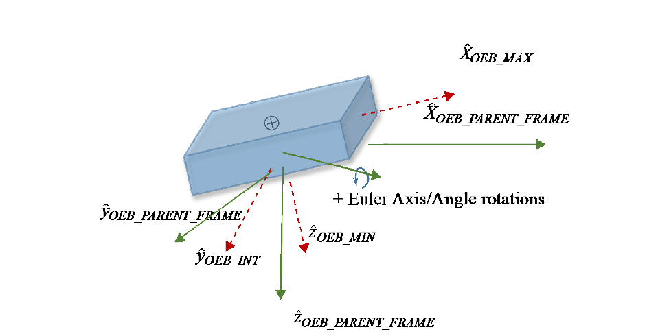

===
ODM
===

.. title:: ORBIT DATA MESSAGES

.. rubric:: RECOMMENDED STANDARD

.. centered:: CCSDS 502.0-B-3

.. centered:: BLUE BOOK
.. centered:: April 2023

AUTHORITY
=========

.. table::
   :align: center

   +----------+--------------------------------+
   | Issue:   | Recommended Standard, Issue 3  |
   +----------+--------------------------------+
   | Date:    | April 2023                     |
   +----------+--------------------------------+
   | Location:| Washington, DC, USA            |
   +----------+--------------------------------+

This document has been approved for publication by the Management Council of the
Consultative Committee for Space Data Systems (CCSDS) and represents the consensus
technical agreement of the participating CCSDS Member Agencies. The procedure for
review and authorization of CCSDS documents is detailed in *Organization and Processes for
the Consultative Committee for Space Data Systems* (CCSDS A02.1-Y-4), and the record of
Agency participation in the authorization of this document can be obtained from the CCSDS
Secretariat at the email address below.

This document is published and maintained by:

   CCSDS Secretariat
   National Aeronautics and Space Administration
   Washington, DC, USA
   Email: secretariat@mailman.ccsds.org

STATEMENT OF INTENT
===================

The Consultative Committee for Space Data Systems (CCSDS) is an organization officially
established by the management of its members. The Committee meets periodically to address
data systems problems that are common to all participants, and to formulate sound technical
solutions to these problems. Inasmuch as participation in the CCSDS is completely
voluntary, the results of Committee actions are termed Recommended Standards and are
not considered binding on any Agency.

This Recommended Standard is issued by, and represents the consensus of, the CCSDS
members. Endorsement of this Recommendation is entirely voluntary. Endorsement,
however, indicates the following understandings:

-  Whenever a member establishes a CCSDS-related standard, this standard will be in
   accord with the relevant Recommended Standard. Establishing such a standard
   does not preclude other provisions which a member may develop.
-  Whenever a member establishes a CCSDS-related standard, that member will
   provide other CCSDS members with the following information:

   -  The standard itself.
   -  The anticipated date of initial operational capability.
   -  The anticipated duration of operational service.

-  Specific service arrangements shall be made via memoranda of agreement. Neither
   this Recommended Standard nor any ensuing standard is a substitute for a
   memorandum of agreement.

No later than five years from its date of issuance, this Recommended Standard will be
reviewed by the CCSDS to determine whether it should: (1) remain in effect without change;
(2) be changed to reflect the impact of new technologies, new requirements, or new
directions; or (3) be retired or canceled.

In those instances when a new version of a Recommended Standard is issued, existing
CCSDS-related member standards and implementations are not negated or deemed to be non-
CCSDS compatible. It is the responsibility of each member to determine when such
standards or implementations are to be modified. Each member is, however, strongly
encouraged to direct planning for its new standards and implementations towards the later
version of the Recommended Standard.

FOREWORD
========

This document is a Recommended Standard for Orbit Data Messages and has been prepared
by the CCSDS. The set of orbit data messages described in this Recommended Standard is
the baseline concept for trajectory representation in data interchange applications that are
cross-supported between Agencies of the CCSDS.

This Recommended Standard establishes a common framework and provides a common
basis for the interchange of orbit and orbit-relevant data. It allows implementing
organizations within each Agency to proceed coherently with the development of compatible
derived standards for the flight and ground systems that are within their cognizance. Derived
Agency standards may implement only a subset of the optional features allowed by the
Recommended Standard and may incorporate features not addressed by this Recommended
Standard.

Attention is drawn to the possibility that some of the elements of this document may be the
subject of patent rights. CCSDS has processes for identifying patent issues and for securing
from the patent holder agreement that all licensing policies are reasonable and non-
discriminatory. However, CCSDS does not have a patent law staff, and CCSDS shall not be
held responsible for identifying any or all such patent rights.

Through the process of normal evolution, it is expected that expansion, deletion, or
modification of this document may occur. This Recommended Standard is therefore subject
to CCSDS document management and change control procedures, which are defined in
*Organization and Processes for the Consultative Committee for Space Data Systems*
(CCSDS A02.1-Y-4). Current versions of CCSDS documents are maintained at the CCSDS
Web site:

   http://www.ccsds.org/

Questions relating to the contents or status of this document should be sent to the CCSDS
Secretariat at the email address indicated on page i.

At time of publication, the active Member and Observer Agencies of the CCSDS were:

Member Agencies
---------------

- Agenzia Spaziale Italiana (ASI)/Italy.
- Canadian Space Agency (CSA)/Canada.
- Centre National d'Etudes Spatiales (CNES)/France.
- China National Space Administration (CNSA)/People's Republic of China.
- Deutsches Zentrum für Luft- und Raumfahrt (DLR)/Germany.
- European Space Agency (ESA)/Europe.
- Federal Space Agency (FSA)/Russian Federation.
- Instituto Nacional de Pesquisas Espaciais (INPE)/Brazil.
- Japan Aerospace Exploration Agency (JAXA)/Japan.
- National Aeronautics and Space Administration (NASA)/USA.
- UK Space Agency/United Kingdom.

Observer Agencies
-----------------

- Austrian Space Agency (ASA)/Austria.
- Belgian Science Policy Office (BELSPO)/Belgium.
- Central Research Institute of Machine Building (TsNIIMash)/Russian Federation.
- China Satellite Launch and Tracking Control General, Beijing Institute of Tracking and
  Telecommunications Technology (CLTC/BITTT)/China.
- Chinese Academy of Sciences (CAS)/China.
- China Academy of Space Technology (CAST)/China.
- Commonwealth Scientific and Industrial Research Organization (CSIRO)/Australia.
- Danish National Space Center (DNSC)/Denmark.
- Departamento de Ciência e Tecnologia Aeroespacial (DCTA)/Brazil.
- Electronics and Telecommunications Research Institute (ETRI)/Korea.
- European Organization for the Exploitation of Meteorological Satellites (EUMETSAT)/Europe.
- European Telecommunications Satellite Organization (EUTELSAT)/Europe.
- Geo-Informatics and Space Technology Development Agency (GISTDA)/Thailand.
- Hellenic National Space Committee (HNSC)/Greece.
- Hellenic Space Agency (HSA)/Greece.
- Indian Space Research Organization (ISRO)/India.
- Institute of Space Research (IKI)/Russian Federation.
- Korea Aerospace Research Institute (KARI)/Korea.
- Ministry of Communications (MOC)/Israel.
- Mohammed Bin Rashid Space Centre (MBRSC)/United Arab Emirates.
- National Institute of Information and Communications Technology (NICT)/Japan.
- National Oceanic and Atmospheric Administration (NOAA)/USA.
- National Space Agency of the Republic of Kazakhstan (NSARK)/Kazakhstan.
- National Space Organization (NSPO)/Chinese Taipei.
- Naval Center for Space Technology (NCST)/USA.
- Netherlands Space Office (NSO)/The Netherlands.
- Research Institute for Particle & Nuclear Physics (KFKI)/Hungary.
- Scientific and Technological Research Council of Turkey (TUBITAK)/Turkey.
- South African National Space Agency (SANSA)/Republic of South Africa.
- Space and Upper Atmosphere Research Commission (SUPARCO)/Pakistan.
- Swedish Space Corporation (SSC)/Sweden.
- Swiss Space Office (SSO)/Switzerland.
- United States Geological Survey (USGS)/USA.

DOCUMENT CONTROL
================

.. list-table::
   :widths: 25 25 25 25
   :header-rows: 1

   * - Document
     - Title
     - Date
     - Status
   * - CCSDS 502.0-B-1
     - Orbit Data Messages, Issue 1
     - September 2004
     - Original issue, superseded
   * - CCSDS 502.0-B-2
     - Orbit Data Messages, Recommended Standard, Issue 2
     - November 2009
     - Issue 2, superseded
   * - CCSDS 502.0-B-3
     - Orbit Data Messages, Recommended Standard, Issue 3
     - April 2023
     - Current issue: changes from the previous issue are documented in annex J (note).
   * - CCSDS 502.0-B-3 EC 1
     - Editorial change 1
     - May 2023
     - Corrects errant cross-refence links, adjusts some minor format and page-layout elements.

.. NOTE::
   Changes from the previous issue are too numerous to permit meaningful
   application of change bars.

.. _introduction_odm:

1 INTRODUCTION
==============

.. _introduction_purpose_and_scope_odm:

1.1 PURPOSE AND SCOPE
---------------------

This Orbit Data Messages (ODM) Recommended Standard specifies four standard message
formats for use in transferring spacecraft orbit information between space agencies and
commercial or governmental spacecraft operators: The Orbit Parameter Message (OPM), the
Orbit Mean-Elements Message (OMM), the Orbit Ephemeris Message (OEM), and the Orbit
Comprehensive Message (OCM). Such exchanges are used for:

a) pre-flight planning for tracking or navigation support;
b) scheduling tracking support;
c) carrying out tracking operations (sometimes called metric predicts);
d) performing orbit comparisons;
e) carrying out navigation operations such as orbit propagation and orbit reconstruction;
f) assessing mutual physical and electromagnetic interference among satellites orbiting
   the same celestial body (primarily Earth, Moon, and Mars at present);
g) performing orbit conjunction (collision avoidance) studies; and
h) developing and executing collaborative maneuvers to mitigate interference or
   enhance mutual operations.

This Recommended Standard includes sets of requirements and criteria that the message
formats have been designed to meet. For exchanges in which these requirements do not
capture the needs of the participating agencies and satellite operators, another mechanism
may be selected.

The ODM Recommended Standard is an international standard published under the auspices
of CCSDS and International Standards Organization (ISO) Technical Committee 20,
Subcommittee 13, developed jointly and in concert with the ISO TC20/SC14. As such, this
CCSDS standard is also properly labeled as ISO 26900.

The recommended Orbit Data Message format is ASCII (reference [4]).

This ODM document describes both ‘Keyword = Value Notation' (KVN) as well as
Extensible Markup Language (XML) (reference [5]) formatted messages. Selection of KVN
or XML format should be mutually agreed between message exchange partners.

.. NOTE::
   As currently specified, an OPM, OMM, or OEM file is to represent orbit data for
   a single spacecraft, and the OCM is to represent orbit data for either a single
   spacecraft or single parent spacecraft of a parent/child spacecraft deployment
   scenario. It is possible that the architecture may support multiple spacecraft per
   file; this could be considered in the future.

.. _introduction_applicability_odm:

1.2 APPLICABILITY
-----------------
The Orbit Data Message family of standardized orbit messages is applicable to all phases of
the spacecraft and launch vehicle life cycle. The rationale behind the design of each orbit
data message is described in annex E and may help the application engineer to select a
suitable message. Definition of the orbit accuracy underlying a particular orbit message is
outside of the scope of this Recommended Standard and should be mutually agreed upon
between message exchange partners (or specified via COMMENT sections in the message
itself). Applicability information specific to each orbit data message format appears in
sections 3, 4, 5, and 6, as well as in annex subsections E2.4 and E2.5.

This Recommended Standard is applicable only to the message format and content, but not to
its transmission. The transmission of the message between agencies and operators is outside
the scope of this document and should be mutually agreed between message exchange
partners.

Description of the message formats based on the use of XML is detailed in section 8.

.. _introduction_rationale_odm:

1.3 RATIONALE
-------------

This update to version 2 of the Orbit Data Messages adds a fourth message type, the OCM,
based on collaboration of the CCSDS Navigation Working Group and the ISO Technical
Committee 20, Subcommittee 14, Working Group 3 (ISO TC20/SC14/WG3). A full list of
the changes in this document is in annex J.

.. _introduction_document_structure_odm:

1.4 DOCUMENT STRUCTURE
----------------------

Section 2 provides a brief overview of the CCSDS-recommended Orbit Data Message types,
the OPM, OMM, OEM, and OCM.

Section 3 provides details about the structure and content of the OPM.

Section 4 provides details about the structure and content of the OMM.

Section 5 provides details about the structure and content of the OEM.

Section 6 provides details about the structure and content of the OCM.

Section 7 discusses the syntax considerations of the set of Orbit Data Messages (OPM,
OMM, OEM, and OCM).

Section 8 provides details on the XML instantiations of the OPM, OMM, OEM, and OCM.

Following the principal content of the document, there are several annexes, both normative
and informative, to guide the ODM user.

.. _introduction_conventions_and_definitions_odm:

1.5 CONVENTIONS AND DEFINITIONS
-------------------------------

.. _introduction_notation_odm:

1.5.1 NOTATION
^^^^^^^^^^^^^^

.. _introduction_unit_notations_odm:

1.5.1.1 Unit Notations
""""""""""""""""""""""

The following conventions for unit notations apply throughout this Recommended Standard,
with message-specific guidance provided in 7.7. Units are drawn from the International
System of Units (SI); units are either SI base units, SI derived units, or units outside the SI
that are accepted for use with the SI (reference [1]). Except as noted, the units used within
this document are as follows:

- d: days, 86400 SI seconds;
- kg: kilograms;
- km: kilometers;
- m: meters;
- n/a: (units are not applicable);
- %: percent;
- s: SI seconds;
- SFU: Solar Flux Units, equivalent to 10\ :sup:`-22` W/(m\ :sup:`2`\ *Hz);
- W: watts.

.. _introduction_general_notations_odm:

1.5.1.2 General
"""""""""""""""

The following notational conventions are used in this document:

a) multiplication of units is denoted with a single asterisk ‘*’ (e.g., ‘kg*s’);
b) exponents of units are denoted with a double asterisk ‘**’ (e.g., m\ :sup:`2` = m**2);
c) square roots of units are denoted by the same exponent notation of a double asterisk
   '**' (e.g., :math:`\sqrt{km}` = km**0.5);
d) division of units is denoted with a single forward slash ‘/’ (e.g., m/s);
e) the usual order of operations ordering applies (e.g., exponents before multiplication).

.. _introduction_nomenclature_odm:

1.5.2 NOMENCLATURE
^^^^^^^^^^^^^^^^^^

.. _introduction_normative_text_odm:

1.5.2.1 Normative Text
""""""""""""""""""""""

The following conventions apply for the normative specifications in this Recommended
Standard:

a) the words 'shall' and 'must' imply a binding and verifiable specification;
b) the word 'should' implies an optional, but desirable, specification;
c) the word 'may' implies an optional specification;
d) the words 'is', 'are', and 'will' imply statements of fact.

.. NOTE::
   These conventions do not imply constraints on diction in text that is clearly
   informative in nature.

.. _introduction_informative_text_odm:

1.5.2.2 Informative Text
""""""""""""""""""""""""

In the normative sections of this document, informative text is set off from the normative
specifications either in notes or under one of the following subsection headings:

- Overview;
- Background;
- Rationale;
- Discussion.

.. _introduction_definitions_odm:

1.5.3 DEFINITIONS
^^^^^^^^^^^^^^^^^

For the purposes of this document, the following definitions apply:

a) the word ‘agencies’ may also be construed as meaning ‘satellite operators' or
   'satellite service providers';
b) the word 'participant' denotes an entity that can acquire or broadcast navigation
   messages and/or radio frequencies, for example, a spacecraft, a tracking station, a
   tracking instrument, or an agency/operator;
c) the notation ‘n/aʼ signifies ‘not applicable';
d) depending on context, the term ‘ODM' may be used to refer to this document or may
   be used to refer collectively to the OPM, OMM, OEM, and OCM messages;
e) an 'observation' is a unique measurement set of a satellite's state from a single sensor
   configuration at a single time (e.g., azimuth from a single sensor at a single time);
f) a 'sensor track' is a set of observations within a specified number of minutes for the
   same object, observed by the same sensor configuration, where each observation is
   within a specified number of minutes (which is dependent on the orbit regime of the
   object) of the other observations in the track (e.g., a set of 10 two-way transponder
   range measurements from the same sensor using the same transponder on the
   satellite), and where the number of minutes could alternately be defined as the time
   between start and stop of the measurement ‘session' or signal modulation that enables
   metric tracking.

.. _introduction_references_odm:

1.6 REFERENCES
--------------

The following publications contain provisions which, through reference in this text,
constitute provisions of this document. At the time of publication, the editions indicated
were valid. All publications are subject to revision, and users of this document are
encouraged to investigate the possibility of applying the most recent editions of the
publications indicated below. The CCSDS Secretariat maintains a register of currently valid
CCSDS publications.

[1] The International System of Units (SI). 8th ed., 2006; updated in 2014. Sèvres, France:
    BIPM, 2006.
[2] Time Code Formats. Issue 4. Recommendation for Space Data System Standards (Blue
    Book), CCSDS 301.0-B-4. Washington, D.C.: CCSDS, November 2010.
[3] "Online Index of Objects Launched into Outer Space.” United Nations Office for Outer
    Space Affairs (UNOOSA). https://www.unoosa.org/oosa/osoindex/.
[4] Information Technology—8-Bit Single-Byte Coded Graphic Character Sets—Part 1:
    Latin Alphabet No. 1. International Standard, ISO/IEC 8859-1:1998. Geneva: ISO,
    1998.
[5] XML Specification for Navigation Data Messages. Issue 3. Recommendation for Space
    Data System Standards (Blue Book), CCSDS 505.0-B-3. Washington, D.C.: CCSDS,
    May 2023.
[6] Paul V. Biron and Ashok Malhotra, eds. XML Schema Part 2: Datatypes. 2nd ed. W3C
    Recommendation.
[7] IEEE Standard for Floating-Point Arithmetic. 3rd ed. IEEE Std 754-2019. New York:
    IEEE, 2019.
[8] Henry S. Thompson, et al., eds. XML Schema Part 1: Structures. 2nd ed. W3C
    Recommendation.
[9] Tracking Data Message. Issue 2. Recommendation for Space Data System Standards
    (Blue Book), CCSDS 503.0-B-2. Washington, D.C.: CCSDS, June 2020.
[10] Attitude Data Messages. Issue 1. Recommendation for Space Data System Standards
     (Blue Book), CCSDS 504.0-B-1. Washington, D.C.: CCSDS, May 2008.
[11] “CCSDS Navigation Standards Normative Annexes.” Space Assigned Numbers
     Authority. https://sanaregistry.org/r/navigation_standard_normative_annexes.
[12] Re-entry Data Message. Issue 1. Recommendation for (Blue Book), CCSDS 508.1-B-1.
     Washington, D.C.: CCSDS, November 2019.
[13] Pointing Request Message. Issue 1. Recommendation for (Blue Book), CCSDS 509.0-
     B-1. Washington, D.C.: CCSDS, February 2018.
[14] Conjunction Data Message. Issue 1. Recommendation for Space Data System
     Standards (Blue Book), CCSDS 508.0-B-1. Washington, D.C.: CCSDS, June 2013.

.. _overview_odm:

2 OVERVIEW
==========

.. _overview_opm_odm:

2.1 ORBIT PARAMETER MESSAGE
---------------------------

An OPM specifies the position and velocity of a single object at a specified epoch.
Optionally, osculating Keplerian elements may be provided. It should be noted that a
sequence of OPMs for either a single object or for multiple objects can be aggregated into a
single Navigation Data Message (NDM) XML file as described in 8.12 and shown in
annex G. This message is suited to exchanges that (1) involve automated interaction and/or
human interaction, and (2) do not require high-fidelity dynamic modeling.

The OPM requires the use of a propagation technique to determine the position and velocity
at times different from the specified epoch, leading to a higher level of effort for software
implementation than for the OEM.

The OPM also contains an optional 6x6 position/velocity covariance matrix that reflects the
uncertainty of the orbit state and may be used in the propagation process to estimate future
uncertainties.

The OPM allows for modeling of any number of maneuvers (as both finite and instantaneous
events) and simple modeling of solar radiation pressure and atmospheric drag.

Though primarily intended for use by computers, the attributes of the OPM also make it
suitable for applications such as exchanges by email, FAX, or voice, or applications in which
the message is to be frequently interpreted by humans.

.. _overview_omm_odm:

2.2 ORBIT MEAN-ELEMENTS MESSAGE
-------------------------------

The OMM contains the orbital characteristics of a single object at a specified epoch,
expressed in mean Keplerian elements: mean motion, eccentricity, inclination, right
ascension of ascending node, argument of perigee, and mean anomaly. These are adequate
for providing the initial mean state of analytical and semi-analytical orbit models. In
addition, the OMM contains values for parameters that facilitate the modeling of non-
conservative forces for various mean element theories.

It may be noted that a sequence of OMMs for either a single object or for multiple objects
can be aggregated into a single NDM XML file as described in 8.12 and shown in annex G.
The OMM is suited to exchanges that (1) involve automated interaction and/or human
interaction, and (2) do not require high-fidelity dynamic modeling. Such exchanges may be
inter-agency exchanges, or ad hoc exchanges among satellite operators when interface
control documents have not been negotiated. Ad hoc interactions usually involve more than
one satellite, each satellite controlled and operated by a different operating authority.

The OMM includes keywords and values that may be used to generate canonical NORAD Two
Line Element (TLE) sets to accommodate the needs of heritage users (see annex H,
reference [H3]).
The OMM also contains an optional covariance matrix that reflects the uncertainty of the
mean Keplerian elements. This information may be used to determine contact parameters
that encompass uncertainties in predicted future states of orbiting objects of interest.

This message is suited for directing antennas and planning contacts with satellites. It is not
recommended for assessing mutual physical or electromagnetic interference among Earth-
orbiting spacecraft, developing collaborative maneuvers, or propagating precisely the orbits
of active satellites, inactive man-made objects, and near-Earth debris fragments. It is not
suitable for numerical integration of the governing equations.

Though primarily intended for use by computers, the attributes of the OMM also make it
suitable for applications such as exchanges by email, FAX, or voice, or applications in which
the message is to be frequently interpreted by humans.

.. _overview_oem_odm:

2.3 ORBIT EPHEMERIS MESSAGE
---------------------------

An OEM specifies the position and velocity of a single object at multiple epochs contained
within a specified time range. It should be noted that a sequence of OEMs for either a single
object or for multiple objects can be aggregated into a single NDM XML file as described
in 8.12 and shown in annex G. The OEM is suited to exchanges that (1) involve automated
interaction (e.g., computer-to-computer communication when frequent, fast automated time
interpretation and processing is required), and (2) require higher fidelity or higher precision
dynamic modeling than is possible with the OPM.

The OEM allows for dynamic modeling of any number of gravitational and non-gravitational
accelerations. The OEM requires the use of an interpolation technique to interpret the
position and velocity at times different from the tabular epochs.

The OEM also contains an optional covariance matrix that reflects the uncertainty of the orbit
solution used to generate states in the ephemeris.

.. _overview_ocm_odm:

2.4 ORBIT COMPREHENSIVE MESSAGE
-------------------------------

An OCM specifies position and velocity of either a single object or an en masse parent/child
deployment scenario stemming from a single object. It should be noted that a sequence of
OCMs for either a single object or for multiple objects can be aggregated into a single NDM
XML file as described in 8.12 and shown in annex G.

The OCM aggregates and extends OPM, OEM, and OMM content in a single comprehensive
hybrid message (file) and includes the following additional capabilities:

- Optional Earth Orientation (UT1 and UTC) at a nearby (relevant) reference epoch;
- Optional Leap second specification;
- Optional area cross-sections for drag, Solar Radiation Pressure (SRP) perturbations
  modeling;
- Optional spacecraft dimensions and orientation information for collision probability
  estimation;
- Optional orbit states (specified using one or more of Cartesian and orbit elements and
  reference frames) for a single or parent object at either a single epoch or as a time
  history (ephemeris);
- Optional covariance matrix of selectable/arbitrary order for a single or parent object
  at either a single epoch or as a time history (ephemeris) that reflects the uncertainty of
  the orbit solution or simulation used to obtain the nominal states in the orbit state(s);
- Optional covariance content options (e.g., Cartesian 3x3, 6x6, 7x7, or any
  combination of order, reference frame, and orbit elements);
- Optional maneuver specification (impulsive or finite burn);
- Optional perturbations model specification;
- Optional orbit determination data and metrics.

The OCM simultaneously emphasizes flexibility and message conciseness by offering
extensive optional content while minimizing mandatory content. The OCM is well-suited for
exchanges that (1) involve automated interaction (e.g., computer-to-computer communication
when frequent, fast automated time interpretation and processing is required), and (2) involve
regular orbit data transfer for numerous objects (e.g., 200,000) using minimal network
bandwidth, disk storage, and quantity of files. The OCM allows the user, in a single
message/file, to either embed high-fidelity orbit propagation into an ephemeris time history
(akin to the OEM ephemeris) or specify orbital states that can be propagated with supplied
perturbations model parameters (akin to OPM content), or both.

.. _overview_exchange_multiple_odm:

2.5 EXCHANGE OF MULTIPLE MESSAGES
---------------------------------

For a given object, multiple OPM, OMM, or OEM messages may be provided in a message
exchange session to achieve ephemeris fidelity requirements, whereas a single, self-contained
OCM may be sufficient. If ephemeris information for multiple objects is to be exchanged,
then multiple OPM, OMM, OEM, or OCM files must be used, with the exception that the
OCM supports parent/child deployment scenario specifications in a single message.

.. _overview_definitions_odm:

2.6 DEFINITIONS
---------------

Definitions of time systems, reference frames, planetary models, maneuvers, and other
fundamental topics related to the interpretation and processing of state vectors and spacecraft
ephemerides are provided in reference [H1].

.. _opm_odm:

3 ORBIT PARAMETER MESSAGE
===========================

.. _opm_general_odm:

3.1 GENERAL
-----------

3.1.1 Orbit information may be exchanged between two participants by sending a state
vector (see reference [H1]) for a specified epoch using an OPM. The message recipient must
have an orbit propagator available that is able to propagate the OPM state vector to compute
the orbit at other desired epochs. For this propagation, additional ancillary information
(spacecraft properties such as mass, area, and maneuver planning data, if applicable) may be
included with the message.

3.1.2 Osculating Keplerian elements and the Gravitational Coefficient may be included in
the OPM in addition to the Cartesian state to aid the message recipient in performing
consistency checks. If any Keplerian element is included, the entire set of elements must be
provided.

3.1.3 If participants wish to exchange mean element information, then the OMM or OCM
should be the selected message type (see sections 4 and 6.)

3.1.4 The use of the OPM is best applicable under the following conditions:

a) an orbit propagator consistent with the models used to develop the orbit data should
   be available at the receiver’s site.
b) the receiver’s modeling of gravitational forces, solar radiation pressure, atmospheric
   drag, and thrust phases (see reference [H1]) should fulfill accuracy requirements
   established between the exchange partners.

3.1.5 The OPM shall be a plain text file consisting of orbit data for a single object.

.. NOTE::
   A sequence of OPMs for either a single object or for multiple objects can be
   aggregated into a single NDM XML file as described in 8.12 and shown in annex G.

3.1.6 The OPM file-naming scheme should be mutually agreed between message exchange
partners.

3.1.7 The method of exchanging OPMs should be mutually agreed between message
exchange partners.

.. NOTE::

   1. Detailed syntax rules for the OPM are specified in section 7.
   2. Example OPMs and associated supplementary (non-normative) information are
      provided in annex G.

.. _opm_content_structure_odm:

3.2 OPM CONTENT/STRUCTURE
-------------------------

.. _opm_content_general_odm:

3.2.1 GENERAL
^^^^^^^^^^^^^

The OPM shall be represented as a combination of the following:

a) a header;
b) metadata (data about data);
c) data; and
d) optional comments (explanatory information).

.. _opm_header_odm:

3.2.2 OPM HEADER
^^^^^^^^^^^^^^^^

3.2.2.1 Table 3-1 specifies for each header item:

a) the keyword to be used;
b) a short description of the item;
c) examples of allowed values; and
d) whether the item is Mandatory (M), Optional (O), or Conditional (C). Conditional
   indicates that the item is mandatory if specified conditions are met (e.g., providing all
   covariance matrix elements if any are provided).

3.2.2.2 Only those keywords shown in table 3-1 shall be used in an OPM header.

.. _opm_header_table_odm:

.. list-table:: OPM Header
   :widths: 25 25 25 25
   :header-rows: 1
   :stub-columns: 1

   * - Keyword
     - Description
     - Examples of Values
     - M/O/C
   * - CCSDS_OPM_VERS
     - Format version in the form of ‘x.y’, where ‘y’ is incremented for corrections and minor changes, and ‘x’ is incremented for major changes.
     - 3.0
     - M
   * - COMMENT
     - Comments (allowed in the OPM Header only immediately after the OPM version number). (See 7.8 for formatting rules.)
     - This is a comment
     - O
   * - CLASSIFICATION
     - User-defined free-text message classification/caveats of this OPM. It is recommended that selected values be pre-coordinated between exchanging entities by mutual agreement.
     - SBU, ‘Operator-proprietary data; secondary distribution not permitted’
     - O
   * - CREATION_DATE
     - File creation date/time in UTC. (For format specification, see 7.5.10.)
     - 2001-11-06T11:17:33, 2002-204T15:56:23Z
     - M
   * - ORIGINATOR
     - Creating agency or operator. Select from the accepted set of values indicated in annex B, subsection B1 from the ‘Abbreviation’ column (when present), or the ‘Name’ column when an Abbreviation column is not populated. If desired organization is not listed there, follow procedures to request that originator be added to SANA registry.
     - CNES, ESOC, GSFC, GSOC, JPL, JAXA, INTELSAT, USAF, INMARSAT
     - M
   * - MESSAGE_ID
     - ID that uniquely identifies a message from a given originator. The format and content of the message identifier value are at the discretion of the originator.
     - OPM_201113719185, ABC-12_34
     - O

.. _opm_metadata_odm:

3.2.3 OPM METADATA
^^^^^^^^^^^^^^^^^^

Table 3-2 specifies for each metadata item:

a) the keyword to be used;
b) a short description of the item;
c) examples of allowed values; and
d) whether the item is Mandatory (M), Optional (O), or Conditional (C). Conditional
   indicates that the item is mandatory if specified conditions are met (e.g., providing all
   covariance matrix elements if any are provided).

3.2.3.1 Only those keywords shown in table 3-2 shall be used in OPM metadata.

.. NOTE::
   For some keywords (OBJECT_NAME, OBJECT_ID) there are no definitive lists
   of authorized values maintained by a control authority; references [3] and [11]
   and the organizations provided on the SANA Registry (annex B, subsection B1)
   are the best known sources for authorized values to date. (For the
   TIME_SYSTEM keyword, see annex B, subsection B3, for guidance and a link
   to the approved set of values.)

.. _opm_metadata_table_odm:

.. list-table:: OPM Metadata
   :widths: 25 25 25 25
   :header-rows: 1
   :stub-columns: 1

   * - Keyword
     - Description
     - Examples of Values
     - M/O/C
   * - COMMENT
     - Comments (allowed at the beginning of the OPM Metadata). (See 7.8 for formatting rules.)
     - This is a comment
     - O
   * - OBJECT_NAME
     - Spacecraft name for which orbit state data is provided. While there is no CCSDS-based restriction on the value for this keyword, it is recommended to use names from the UN Office of Outer Space Affairs designator index (reference [3], which include Object name and international designator of the participant). If OBJECT_NAME is not listed in reference [3] or the content is either unknown or cannot be disclosed, the value should be set to UNKNOWN.
     - EUTELSAT W1, MARS PATHFINDER, STS 106, NEAR, UNKNOWN
     - M
   * - OBJECT_ID
     - Object identifier of the object for which orbit state data is provided. While there is no CCSDS-based restriction on the value for this keyword, it is recommended to use the international spacecraft designator as published in the UN Office of Outer Space Affairs designator index (reference [3]). Recommended values have the format YYYY-NNNP{PP}, where: YYYY = Year of launch. NNN = Three-digit serial number of launch in year YYYY (with leading zeros). P{PP} = At least one capital letter for the identification of the part brought into space by the launch. If the asset is not listed in reference [3], the UN Office of Outer Space Affairs designator index format is not used, or the content is either unknown or cannot be disclosed, the value should be set to UNKNOWN.
     - 2000-052A, 1996-068A, 2000-053A, 1996-008A, UNKNOWN
     - M
   * - CENTER_NAME
     - Origin of the OPM reference frame, which shall be a natural solar system body (planets, asteroids, comets, and natural satellites), including any planet barycenter or the solar system barycenter. Natural bodies shall be selected from the accepted set of values indicated in annex B, subsection B2.
     - EARTH, EARTH BARYCENTER, MOON, SOLAR SYSTEM BARYCENTER, SUN, JUPITER BARYCENTER, STS 106, EROS
     - M
   * - REF_FRAME
     - Reference frame in which the state vector and optional Keplerian element data are given. Use of values other than those in 3.2.3.3 should be documented in an ICD.
     - ICRF, EME2000, ITRF2000, TEME
     - M
   * - REF_FRAME_EPOCH
     - Epoch of reference frame, if not intrinsic to the definition of the reference frame. (See 7.5.10 for formatting rules.)
     - 2001-11-06T11:17:33, 2002-204T15:56:23Z
     - C
   * - TIME_SYSTEM
     - Time system used for state vector, maneuver, and covariance data. Use of values other than those in 3.2.3.2 should be documented in an ICD.
     - UTC, TAI, TT, GPS, TDB, TCB
     - M

3.2.3.2 Values for the TIME_SYSTEM keyword should be selected from the following set:

.. list-table:: Time System Values
   :widths: 50 50
   :header-rows: 1

   * - Time System Value
     - Meaning
   * - GMST
     - Greenwich Mean Sidereal Time
   * - GPS
     - Global Positioning System
   * - MET
     - Mission Elapsed Time (note)
   * - MRT
     - Mission Relative Time (note)
   * - SCLK
     - Spacecraft Clock (receiver) (requires rules for interpretation in ICD)
   * - TAI
     - International Atomic Time
   * - TCB
     - Barycentric Coordinate Time
   * - TDB
     - Barycentric Dynamical Time
   * - TCG
     - Geocentric Coordinate Time
   * - TT
     - Terrestrial Time
   * - UT1
     - Universal Time
   * - UTC
     - Coordinated Universal Time

If MET or MRT is chosen as the TIME_SYSTEM, then the epoch of either the start of the
mission for MRT, or of the event for MET, should either be given in a comment in the
message or provided in an ICD. The time system for the start of the mission or the event
should also be provided in the comment or the ICD. If these values are used for the
TIME_SYSTEM, then the times given in the file denote a duration from the mission start or
event. However, for clarity, an ICD should be used to fully specify the interpretation of the
times if these values are to be used. The time format should only utilize three-digit days
from the MET or MRT epoch, not months and days of the months.

3.2.3.3 Values for the REF_FRAME keyword should be selected from the following set:

.. list-table:: Reference Frame Values
   :widths: 50 50
   :header-rows: 1

   * - REF_FRAME Value
     - Meaning
   * - EME2000
     - Earth Mean Equator and Equinox of J2000
   * - GCRF
     - Geocentric Celestial Reference Frame
   * - GRC
     - Greenwich Rotating Coordinates
   * - ICRF
     - International Celestial Reference Frame
   * - ITRF2000
     - International Terrestrial Reference Frame 2000
   * - ITRF-93
     - International Terrestrial Reference Frame 1993
   * - ITRF-97
     - International Terrestrial Reference Frame 1997
   * - MCI
     - Mars Centered Inertial
   * - TDR
     - True of Date, Rotating
   * - TEME
     - True Equator Mean Equinox (only used in OMMs)
   * - TOD
     - True of Date

.. _opm_data_odm:

3.2.4 OPM DATA
^^^^^^^^^^^^^^

3.2.4.1 Table 3-3 provides an overview of the six logical blocks in the OPM Data section
(State Vector, Osculating Keplerian Elements, Spacecraft Parameters, Position/Velocity
Covariance Matrix, Maneuver Parameters, and User-Defined Parameters), and specifies for
each data item:

a) the keyword to be used;
b) a short description of the item;
c) the units to be used;
d) whether the item is Mandatory (M), Optional (O), or Conditional (C). An ‘M’
   denotes mandatory keywords that must be included in this section if that particular
   data section is included. Conditional indicates that the item is mandatory if specified
   conditions are met (e.g., providing all covariance matrix elements if any are
   provided).

3.2.4.2 Only those keywords shown in table 3-3 shall be used in OPM data.

.. NOTE::
   Requirements relating to the keywords in table 3-3 appear after the table.

.. _opm_data_table_odm:

.. list-table:: OPM Data
   :widths: 25 50 12 13
   :header-rows: 1
   :stub-columns: 1

   * - Keyword
     - Description
     - Units
     - M/O/C
   * - **State Vector Components in the Specified Coordinate System**
     -
     -
     -
   * - COMMENT
     - (see 7.8 for formatting rules)
     -
     - O
   * - EPOCH
     - Epoch of state vector & optional Keplerian elements (see 7.5.10 for formatting rules)
     -
     - M
   * - X
     - Position vector X-component
     - km
     - M
   * - Y
     - Position vector Y-component
     - km
     - M
   * - Z
     - Position vector Z-component
     - km
     - M
   * - X_DOT
     - Velocity vector X-component
     - km/s
     - M
   * - Y_DOT
     - Velocity vector Y-component
     - km/s
     - M
   * - Z_DOT
     - Velocity vector Z-component
     - km/s
     - M
   * - **Osculating Keplerian Elements in the Specified Reference Frame (none or all parameters of this block must be given)**
     -
     -
     -
   * - COMMENT
     - (see 7.8 for formatting rules)
     -
     - O
   * - SEMI_MAJOR_AXIS
     - Semi-major axis
     - km
     - C
   * - ECCENTRICITY
     - Eccentricity
     - n/a
     - C
   * - INCLINATION
     - Inclination
     - deg
     - C
   * - RA_OF_ASC_NODE
     - Right ascension of ascending node
     - deg
     - C
   * - ARG_OF_PERICENTER
     - Argument of pericenter
     - deg
     - C
   * - TRUE_ANOMALY or MEAN_ANOMALY
     - True anomaly or mean anomaly
     - deg
     - C
   * - GM
     - Gravitational Coefficient (Gravitational Constant × Central Mass)
     - km\ :sup:`3`\ /s\ :sup:`2`
     - C
   * - **Spacecraft Parameters (if maneuver is specified, then mass must be provided)**
     -
     -
     -
   * - COMMENT
     - (see 7.8 for formatting rules)
     -
     - O
   * - MASS
     - Spacecraft mass
     - kg
     - C
   * - SOLAR_RAD_AREA
     - Solar Radiation Pressure Area (AR)
     - m\ :sup:`2`
     - O
   * - SOLAR_RAD_COEFF
     - Solar Radiation Pressure Coefficient (CR)
     - n/a
     - O
   * - DRAG_AREA
     - Drag Area (AD)
     - m\ :sup:`2`
     - O
   * - DRAG_COEFF
     - Drag Coefficient (CD)
     - n/a
     - O
   * - **Position/Velocity Covariance Matrix (6x6 Lower Triangular Form. None or all parameters of the matrix must be given. COV_REF_FRAME may be omitted if it is the same as REF_FRAME.)**
     -
     -
     -
   * - COMMENT
     - (see 7.8 for formatting rules)
     -
     - O
   * - COV_REF_FRAME
     - Reference frame in which the covariance data are given. Select from the accepted set of values indicated in 3.2.4.11.
     -
     - C
   * - CX_X
     - Covariance matrix [1,1]
     - km\ :sup:`2`
     - C
   * - CY_X
     - Covariance matrix [2,1]
     - km\ :sup:`2`
     - C
   * - CY_Y
     - Covariance matrix [2,2]
     - km\ :sup:`2`
     - C
   * - CZ_X
     - Covariance matrix [3,1]
     - km\ :sup:`2`
     - C
   * - CZ_Y
     - Covariance matrix [3,2]
     - km\ :sup:`2`
     - C
   * - CZ_Z
     - Covariance matrix [3,3]
     - km\ :sup:`2`
     - C
   * - CX_DOT_X
     - Covariance matrix [4,1]
     - km\ :sup:`2`\ /s
     - C
   * - CX_DOT_Y
     - Covariance matrix [4,2]
     - km\ :sup:`2`\ /s
     - C
   * - CX_DOT_Z
     - Covariance matrix [4,3]
     - km\ :sup:`2`\ /s
     - C
   * - CX_DOT_X_DOT
     - Covariance matrix [4,4]
     - km\ :sup:`2`\ /s\ :sup:`2`
     - C
   * - CY_DOT_X
     - Covariance matrix [5,1]
     - km\ :sup:`2`\ /s
     - C
   * - CY_DOT_Y
     - Covariance matrix [5,2]
     - km\ :sup:`2`\ /s
     - C
   * - CY_DOT_Z
     - Covariance matrix [5,3]
     - km\ :sup:`2`\ /s
     - C
   * - CY_DOT_X_DOT
     - Covariance matrix [5,4]
     - km\ :sup:`2`\ /s\ :sup:`2`
     - C
   * - CY_DOT_Y_DOT
     - Covariance matrix [5,5]
     - km\ :sup:`2`\ /s\ :sup:`2`
     - C
   * - CZ_DOT_X
     - Covariance matrix [6,1]
     - km\ :sup:`2`\ /s
     - C
   * - CZ_DOT_Y
     - Covariance matrix [6,2]
     - km\ :sup:`2`\ /s
     - C
   * - CZ_DOT_Z
     - Covariance matrix [6,3]
     - km\ :sup:`2`\ /s
     - C
   * - CZ_DOT_X_DOT
     - Covariance matrix [6,4]
     - km\ :sup:`2`\ /s\ :sup:`2`
     - C
   * - CZ_DOT_Y_DOT
     - Covariance matrix [6,5]
     - km\ :sup:`2`\ /s\ :sup:`2`
     - C
   * - CZ_DOT_Z_DOT
     - Covariance matrix [6,6]
     - km\ :sup:`2`\ /s\ :sup:`2`
     - C
   * - **Maneuver Parameters (Repeat for each maneuver)**
     -
     -
     -
   * - COMMENT
     - (see 7.8 for formatting rules)
     -
     - O
   * - MAN_EPOCH_IGNITION
     - Epoch of ignition (see 7.5.10 for formatting rules)
     -
     - O
   * - MAN_DURATION
     - Maneuver duration (If = 0, impulsive maneuver)
     - s
     - O
   * - MAN_DELTA_MASS
     - Mass change during maneuver (value is < 0)
     - kg
     - O
   * - MAN_REF_FRAME
     - Reference frame in which the velocity increment vector data are given. The user must select from the accepted set of values indicated in 3.2.4.11.
     -
     - O
   * - MAN_DV_1
     - 1st component of the velocity increment
     - km/s
     - O
   * - MAN_DV_2
     - 2nd component of the velocity increment
     - km/s
     - O
   * - MAN_DV_3
     - 3rd component of the velocity increment
     - km/s
     - O
   * - **User-Defined Parameters (all parameters in this section must be described in an ICD).**
     -
     -
     -
   * - USER_DEFINED_X
     - User-defined parameter, where ‘x’ is replaced by a variable-length user-specified character string. Any number of user-defined parameters may be included, if necessary, to provide essential information that cannot be conveyed in COMMENT statements. Example: USER_DEFINED_EARTH_MODEL = WGS-84
     -
     - O

3.2.4.3 All values except Maneuver Parameters in the OPM data are ‘at epoch’, that is, the
value of the parameter at the time specified in the EPOCH keyword.

3.2.4.4 Table 3-3 is broken into six logical blocks, each of which has a descriptive heading.
These descriptive headings shall not be included in an OPM, unless they appear in a properly
formatted COMMENT statement.

3.2.4.5 If the solar radiation coefficient, Cr, is set to zero, no solar radiation pressure shall
be considered.

.. NOTE::
   It is recommended that Cr and solar radiation pressure area be provided for GEO
   spacecraft.

3.2.4.6 If the atmospheric drag coefficient, CD, is set to zero, no atmospheric drag shall be
considered.

.. NOTE::
   It is recommended that CD and drag area be provided for LEO spacecraft.

3.2.4.7 Parameters for thrust phases may be optionally given for the computation of the
trajectory during or after maneuver execution (see reference [H1] for the simplified modeling
of such maneuvers). For impulsive maneuvers, MAN_DURATION must be set to zero.
MAN_DELTA_MASS may be used for both finite and impulsive maneuvers; the value must
be a negative number.

3.2.4.8 Multiple sets of maneuver parameters may appear. For each maneuver, all the
maneuver parameters shall be repeated in the order shown in table 3-3.

3.2.4.9 If the OPM contains a maneuver definition, then the Conditional elements of the
Spacecraft Parameters section (designated with a ‘C’) must be included.

3.2.4.10 Values in the covariance matrix shall be expressed in the applicable reference frame
(COV_REF_FRAME keyword) and shall be presented sequentially from upper left [1,1] to
lower right [6,6], lower triangular form, row by row, left to right. Variance and covariance
values shall be expressed in standard double precision as related in 7.5. This logical block of
the OPM may be useful for risk assessment and establishing maneuver and mission margins.
The intent is to provide causal connections between output orbit data and both physical
hypotheses and measurement uncertainties. These causal relationships guide operators’
corrective actions and mitigations.

3.2.4.11 Values for the MAN_REF_FRAME and COV_REF_FRAME keyword may be
selected from the following set:

.. list-table:: Reference Frame Values for MAN_REF_FRAME and COV_REF_FRAME
   :widths: 50 50
   :header-rows: 1

   * - Reference Frame Value
     - Meaning
   * - RSW
     - Another name for ‘Radial, Transverse, Normal’
   * - RTN
     - Radial, Transverse, Normal
   * - TNW
     - A local orbital coordinate frame that has the x-axis along the velocity vector, W along the orbital angular momentum vector, and N completing the right-handed system

3.2.4.12 A section of User-Defined Parameters may be provided if necessary. In principle,
this provides flexibility, but also introduces complexity, non-standardization, potential
ambiguity, and potential processing errors. Accordingly, if used, the keywords and their
meanings must be described in an ICD. User-Defined Parameters, if included, should be
used as sparingly as possible; their use is not encouraged.
.. _omm_odm:

4 ORBIT MEAN-ELEMENTS MESSAGE
===============================

.. _omm_general_odm:

4.1 GENERAL
-----------

4.1.1 Orbit information may be exchanged between two participants by sending an orbital
state based on mean Keplerian elements (see reference [H1]) for a specified epoch using an
OMM. The message recipient must use appropriate orbit propagator algorithms to correctly
propagate the OMM state to compute the orbit at other desired epochs.

4.1.2 The OMM is intended to allow replication of the data content of an existing TLE in a
CCSDS standard format, but the message can also accommodate other implementations of
mean elements. All essential fields of the ‘de facto standard’ TLE are included in the OMM
in a style that is consistent with that of the other ODMs (i.e., the OPM and OEM). From the
fields in the OMM, it is possible to generate a TLE (see reference [H2]). Programs that
convert OMMs to TLEs must be aware of the structural requirements of the TLE, including
the checksum algorithm and the formatting requirements for the values in the TLE. The
checksum and formatting requirements of the TLE do not apply to the values in an OMM.

4.1.3 If participants wish to exchange osculating element information, then the OPM or the
OCM should be the selected message type. (See sections 3 and 6.)

4.1.4 The use of the OMM is best applicable under the following conditions:

a) an orbit propagator consistent with the models used to develop the orbit data should
   be run at the receiver’s site;
b) the receiver’s modeling of gravitational forces, solar radiation pressure, atmospheric
   drag, etc. (see reference [H1]), should fulfill accuracy requirements established
   between the exchange partners.

4.1.5 The OMM shall be a plain text file consisting of orbit data for a single object.

.. NOTE::
   A sequence of OMMs for either a single object or for multiple objects can be
   aggregated into a single NDM XML file as described in 8.12 and shown in annex G.

4.1.6 The OMM file-naming scheme should be mutually agreed upon between message
exchange partners.

4.1.7 The method of exchanging OMMs should be mutually agreed upon between message
exchange partners.

.. NOTE::

   1. Detailed syntax rules for the OMM are specified in section 7.
   2. Example OMMs and associated supplementary (non-normative) information are
      provided in annex G.

.. _omm_content_structure_odm:

4.2 OMM CONTENT/STRUCTURE
-------------------------

.. _omm_content_general_odm:

4.2.1 GENERAL
^^^^^^^^^^^^^

The OMM shall be represented as a combination of the following:

a) a header;
b) metadata (data about data);
c) data; and
d) optional comments (explanatory information).

.. _omm_header_odm:

4.2.2 OMM HEADER
^^^^^^^^^^^^^^^^

4.2.2.1 Table 4-1 specifies for each header item:

a) the keyword to be used;
b) a short description of the item;
c) examples of allowed values; and
d) whether the item is Mandatory (M), Optional (O), or Conditional (C). An ‘M’
   denotes mandatory keywords that must be included in this section if that data section
   is included. Conditional indicates that the item is mandatory if specified conditions
   are met (e.g., providing all covariance matrix elements if any are provided).

4.2.2.2 Only those keywords shown in table 4-1 shall be used in an OMM header.

.. _omm_header_table_odm:

.. list-table:: OMM Header
   :widths: 25 25 25 25
   :header-rows: 1
   :stub-columns: 1

   * - Keyword
     - Description
     - Examples of Values
     - M/O/C
   * - CCSDS_OMM_VERS
     - Format version in the form of ‘x.y’, where ‘y’ is incremented for corrections and minor changes, and ‘x’ is incremented for major changes.
     - 3.0
     - M
   * - COMMENT
     - Comments (allowed in the OMM Header only immediately after the OMM version number). (See 7.8 for formatting rules.)
     - This is a comment
     - O
   * - CLASSIFICATION
     - User-defined free-text message classification/caveats of this OMM. It is recommended that selected values be pre-coordinated between exchanging entities by mutual agreement.
     - SBU, ‘Operator-proprietary data; secondary distribution not permitted’
     - O
   * - CREATION_DATE
     - File creation date/time in UTC. (For format specification, see 7.5.10.)
     - 2001-11-06T11:17:33, 2002-204T15:56:23Z
     - M
   * - ORIGINATOR
     - Creating agency or operator. Select from the accepted set of values indicated in annex B, subsection B1 from the ‘Abbreviation’ column (when present), or the ‘Name’ column when an Abbreviation column is not populated. If desired organization is not listed there, follow procedures to request that originator be added to SANA registry.
     - CNES, ESOC, GSFC, GSOC, JPL, JAXA, INTELSAT, USAF, INMARSAT
     - M
   * - MESSAGE_ID
     - ID that uniquely identifies a message from a given originator. The format and content of the message identifier value are at the discretion of the originator.
     - OMM_201113719185, ABC-12_34
     - O

.. _omm_metadata_odm:

4.2.3 OMM METADATA
^^^^^^^^^^^^^^^^^^

4.2.3.1 Table 4-2 specifies for each metadata item:

a) the keyword to be used;
b) a short description of the item;
c) examples of allowed values; and
d) whether the item is Mandatory (M), Optional (O), or Conditional (C). Conditional
   indicates that the item is mandatory if specified conditions are met (e.g., providing all
   covariance matrix elements if any are provided).

4.2.3.2 Only those keywords shown in 4-2 shall be used in OMM metadata.

.. NOTE::
   For some keywords (OBJECT_NAME and OBJECT_ID), there are no definitive
   lists of authorized values maintained by a control authority; references [3] and
   [11] and the organizations provided on the SANA Registry (annex B,
   subsection B1) are the best known sources for authorized values to date.

.. _omm_metadata_table_odm:

.. list-table:: OMM Metadata
   :widths: 25 25 25 25
   :header-rows: 1
   :stub-columns: 1

   * - Keyword
     - Description
     - Examples of Values
     - M/O/C
   * - COMMENT
     - Comments (allowed at the beginning of the OMM Metadata). (See 7.8 for formatting rules.)
     - This is a comment
     - O
   * - OBJECT_NAME
     - Spacecraft name for which mean element orbit state data is provided. While there is no CCSDS-based restriction on the value for this keyword, it is recommended to use names from the UN Office of Outer Space Affairs designator index (reference [3], which include Object name and international designator of the participant). If OBJECT_NAME is not listed in reference [3] or the content is either unknown or cannot be disclosed, the value should be set to UNKNOWN.
     - Telkom 2, Spaceway 2, INMARSAT 4-F2, UNKNOWN
     - M
   * - OBJECT_ID
     - Object identifier of the object for which mean element orbit state data is provided. While there is no CCSDS-based restriction on the value for this keyword, it is recommended to use the international spacecraft designator as published in the UN Office of Outer Space Affairs designator index (reference [3]). Recommended values have the format YYYY-NNNP{PP}, where: YYYY = Year of launch. NNN = Three-digit serial number of launch in year YYYY (with leading zeros). P{PP} = At least one capital letter for the identification of the part brought into space by the launch. If the asset is not listed in reference [3], the UN Office of Outer Space Affairs designator index format is not used, or the content is either unknown or cannot be disclosed, the value should be set to UNKNOWN.
     - 2005-046A, 2005-046B, 2003-022A, UNKNOWN
     - M
   * - CENTER_NAME
     - Origin of the OMM reference frame, which shall be a natural solar system body (planets, asteroids, comets, and natural satellites), including any planet barycenter or the solar system barycenter. Natural bodies shall be selected from the accepted set of values indicated in annex B, subsection B2.
     - EARTH, MARS, MOON
     - M
   * - REF_FRAME
     - Reference frame in which the Keplerian element data are given. Use of values other than those in 3.2.3.3 should be documented in an ICD. NOTE—NORAD Two Line Element Sets and corresponding Simplified General Perturbations (SGP) orbit propagator ephemeris outputs are explicitly defined to be in the True Equator Mean Equinox of Date (TEME of Date) reference frame. Therefore, TEME of date shall be used for OMMs based on NORAD Two Line Element sets, rather than the almost imperceptibly different TEME of Epoch (see reference [H2] or [H3] for further details).
     - ICRF, ITRF2000, EME2000, TEME
     - M
   * - REF_FRAME_EPOCH
     - Epoch of reference frame, if not intrinsic to the definition of the reference frame. (See 7.5.10 for formatting rules.)
     - 2001-11-06T11:17:33, 2002-204T15:56:23Z
     - C
   * - TIME_SYSTEM
     - Time system used for Keplerian elements and covariance data. Use of values other than those in 3.2.3.2 should be documented in an ICD.
     - UTC
     - M
   * - MEAN_ELEMENT_THEORY
     - Description of the Mean Element Theory. Indicates the proper method to employ to propagate the state.
     - SGP, SGP4, SGP4-XP, DSST, USM
     - M

.. _omm_data_odm:

4.2.4 OMM DATA
^^^^^^^^^^^^^^

4.2.4.1 Table 4-3 provides an overview of the five logical blocks in the OMM Data section
(Mean Keplerian Elements, Spacecraft Parameters, TLE Related Parameters,
Position/Velocity Covariance Matrix, and User-Defined Parameters), and specifies for each
data item:

a) the keyword to be used;
b) a short description of the item;
c) the units to be used; and
d) whether the item is Mandatory (M), Optional (O), or Conditional (C). Conditional
   indicates that the item is mandatory if specified conditions are met (e.g., providing all
   covariance matrix elements if any are provided).

4.2.4.2 Only those keywords shown in table 4-3 shall be used in OMM data.

.. NOTE::
   Requirements relating to the keywords in table 4-3 appear after the table.

.. _omm_data_table_odm:

.. list-table:: OMM Data
   :widths: 25 50 12 13
   :header-rows: 1
   :stub-columns: 1

   * - Keyword
     - Description
     - Units
     - M/O/C
   * - **Mean Keplerian Elements in the Specified Reference Frame**
     -
     -
     -
   * - COMMENT
     - (see 7.8 for formatting rules)
     -
     - O
   * - EPOCH
     - Epoch of Mean Keplerian elements (see 7.5.10 for formatting rules)
     -
     - M
   * - SEMI_MAJOR_AXIS or MEAN_MOTION
     - Semi-major axis in kilometers (preferred), or, if MEAN_ELEMENT_THEORY = SGP/SGP4, the Keplerian Mean motion in revolutions per day
     - km or rev/day
     - M
   * - ECCENTRICITY
     - Eccentricity
     - n/a
     - M
   * - INCLINATION
     - Inclination
     - deg
     - M
   * - RA_OF_ASC_NODE
     - Right ascension of ascending node
     - deg
     - M
   * - ARG_OF_PERICENTER
     - Argument of pericenter
     - deg
     - M
   * - MEAN_ANOMALY
     - Mean anomaly
     - deg
     - M
   * - GM
     - Gravitational Coefficient (Gravitational Constant × Central Mass)
     - km\ :sup:`3`\ /s\ :sup:`2`
     - O
   * - **Spacecraft Parameters**
     -
     -
     -
   * - COMMENT
     - (see 7.8 for formatting rules.)
     -
     - O
   * - MASS
     - Spacecraft Mass
     - kg
     - O
   * - SOLAR_RAD_AREA
     - Solar Radiation Pressure Area (AR)
     - m\ :sup:`2`
     - O
   * - SOLAR_RAD_COEFF
     - Solar Radiation Pressure Coefficient (CR)
     - n/a
     - O
   * - DRAG_AREA
     - Drag Area (AD)
     - m\ :sup:`2`
     - O
   * - DRAG_COEFF
     - Drag Coefficient (CD)
     - n/a
     - O
   * - **TLE Related Parameters (This section is only required if MEAN_ELEMENT_THEORY=SGP/SGP4)**
     -
     -
     -
   * - COMMENT
     - (see 7.8 for formatting rules.)
     -
     - O
   * - EPHEMERIS_TYPE
     - Default value = 0. (See 4.2.4.7.)
     -
     - O
   * - CLASSIFICATION_TYPE
     - Default value = U. (See 4.2.4.7.)
     -
     - O
   * - NORAD_CAT_ID
     - NORAD Catalog Number (‘Satellite Number’) an integer of up to nine digits. This keyword is only required if MEAN_ELEMENT_THEORY=SGP/SGP4.
     -
     - O
   * - ELEMENT_SET_NO
     - Element set number for this satellite. Normally incremented sequentially but may be out of sync if it is generated from a backup source. Used to distinguish different TLEs, and therefore only meaningful if TLE-based data is being exchanged (i.e., MEAN_ELEMENT_THEORY = SGP/SGP4).
     -
     - O
   * - REV_AT_EPOCH
     - Revolution Number
     -
     - O
   * - BSTAR or BTERM
     - Drag-like ballistic coefficient, required for SGP4 and SGP4-XP mean element models: MEAN_ELEMENT_THEORY= SGP4 (BSTAR = drag parameter for SGP4). MEAN_ELEMENT_THEORY= SGP4-XP (BTERM ballistic coefficient CDA/m, where CD = drag coefficient, A = average cross-sectional area, m = mass. Example values for BTERM = 0.02 (rocket body), 0.0015 (payload); average value spanning 20,00 catalog objects = 0.0286.
     - 1/[Earth radii] or m\ :sup:`2`\ /kg
     - C
   * - MEAN_MOTION_DOT
     - First Time Derivative of the Mean Motion (i.e., a drag term, required when MEAN_ELEMENT_THEORY = SGP or PPT3). (See 4.2.4.7 for important details).
     - rev/day\ :sup:`2`
     - C
   * - MEAN_MOTION_DDOT or AGOM
     - MEAN_ELEMENT_THEORY= SGP or PPT3: Second Time Derivative of Mean Motion (i.e., a drag term). (See 4.2.4.7 for important details). MEAN_ELEMENT_THEORY= SGP4-XP: Solar radiation pressure coefficient AY/m, where y = reflectivity, A = average cross-sectional area, m = mass. Example values AGOM = 0.01 (rocket body) and 0.001 (payload); average value spanning 20,00 catalog objects = 0.0143 m2/kg.
     - rev/day\ :sup:`3`\ or m\ :sup:`2`\ /kg
     - C
   * - **Position/Velocity Covariance Matrix (6x6 Lower Triangular Form. None or all parameters of the matrix must be given. COV_REF_FRAME may be omitted if it is the same as the REF_FRAME.)**
     -
     -
     -
   * - COMMENT
     - (see 7.8 for formatting rules.)
     -
     - O
   * - COV_REF_FRAME
     - Reference frame in which the covariance data are given. Select from the accepted set of values indicated in 3.2.4.11.
     -
     - C
   * - CX_X
     - Covariance matrix [1,1]
     - km\ :sup:`2`
     - C
   * - CY_X
     - Covariance matrix [2,1]
     - km\ :sup:`2`
     - C
   * - CY_Y
     - Covariance matrix [2,2]
     - km\ :sup:`2`
     - C
   * - CZ_X
     - Covariance matrix [3,1]
     - km\ :sup:`2`
     - C
   * - CZ_Y
     - Covariance matrix [3,2]
     - km\ :sup:`2`
     - C
   * - CZ_Z
     - Covariance matrix [3,3]
     - km\ :sup:`2`
     - C
   * - CX_DOT_X
     - Covariance matrix [4,1]
     - km\ :sup:`2`\ /s
     - C
   * - CX_DOT_Y
     - Covariance matrix [4,2]
     - km\ :sup:`2`\ /s
     - C
   * - CX_DOT_Z
     - Covariance matrix [4,3]
     - km\ :sup:`2`\ /s
     - C
   * - CX_DOT_X_DOT
     - Covariance matrix [4,4]
     - km\ :sup:`2`\ /s\ :sup:`2`
     - C
   * - CY_DOT_X
     - Covariance matrix [5,1]
     - km\ :sup:`2`\ /s
     - C
   * - CY_DOT_Y
     - Covariance matrix [5,2]
     - km\ :sup:`2`\ /s
     - C
   * - CY_DOT_Z
     - Covariance matrix [5,3]
     - km\ :sup:`2`\ /s
     - C
   * - CY_DOT_X_DOT
     - Covariance matrix [5,4]
     - km\ :sup:`2`\ /s\ :sup:`2`
     - C
   * - CY_DOT_Y_DOT
     - Covariance matrix [5,5]
     - km\ :sup:`2`\ /s\ :sup:`2`
     - C
   * - CZ_DOT_X
     - Covariance matrix [6,1]
     - km\ :sup:`2`\ /s
     - C
   * - CZ_DOT_Y
     - Covariance matrix [6,2]
     - km\ :sup:`2`\ /s
     - C
   * - CZ_DOT_Z
     - Covariance matrix [6,3]
     - km\ :sup:`2`\ /s
     - C
   * - CZ_DOT_X_DOT
     - Covariance matrix [6,4]
     - km\ :sup:`2`\ /s\ :sup:`2`
     - C
   * - CZ_DOT_Y_DOT
     - Covariance matrix [6,5]
     - km\ :sup:`2`\ /s\ :sup:`2`
     - C
   * - CZ_DOT_Z_DOT
     - Covariance matrix [6,6]
     - km\ :sup:`2`\ /s\ :sup:`2`
     - C
   * - **User-Defined Parameters (all parameters in this section must be described in an ICD).**
     -
     -
     -
   * - USER_DEFINED_X
     - User-defined parameter, where ‘x’ is replaced by a variable-length user-specified character string. Any number of user-defined parameters may be included, if necessary, to provide essential information that cannot be conveyed in COMMENT statements. Example: USER_DEFINED_EARTH_MODEL = WGS-84
     -
     - O

4.2.4.3 All values in the OMM are ‘at epoch’, that is, the value of the parameter at the time
specified in the EPOCH keyword.

4.2.4.4 Table 4-3 is broken into five logical blocks, each of which has a descriptive
heading. These descriptive headings shall not be included in an OMM, unless they appear in
a properly formatted COMMENT statement.

4.2.4.5 Values in the covariance matrix shall be expressed in the applicable reference frame
(COV_REF_FRAME keyword if used, or REF_FRAME keyword if not), and shall be
presented sequentially from upper left [1,1] to lower right [6,6], lower triangular form, row
by row left to right. Variance and covariance values shall be expressed in standard double
precision as related in 7.5. This logical block of the OMM may be useful for risk assessment
and establishing maneuver and mission margins.

4.2.4.6 For operations in Earth orbit with a TLE-based OMM, some special conventions
must be observed, as follows:

- The value associated with the CENTER_NAME keyword shall be ‘EARTH’.
- The value associated with the REF_FRAME keyword shall be ‘TEME’.
- The value associated with the TIME_SYSTEM keyword shall be ‘UTC’.
- The format of the OBJECT_NAME and OBJECT_ID keywords shall be that of the
  UN Office of Outer Space Affairs designator index (reference [3]).
- The MEAN_MOTION keyword must be used instead of SEMI_MAJOR_AXIS.

4.2.4.7 For those who wish to use the OMM to represent a TLE, there are several
considerations that apply with respect to precision of angle representation, use of certain
fields by the propagator, reference frame, etc. Some sources suggest the following coding for
the CLASSIFICATION_TYPE keyword: U=unclassified, S=secret. Some sources suggest
the coding for the EPHEMERIS_TYPE keyword as follows:

- 0 = SGP
- 2 = SGP4
- 3 = PPT3
- 4 = SGP4-XP
- 6 = Special Perturbations

.. NOTE::

   1. References [H2] and [H3] can be consulted for additional information.
   2. If the source of MEAN_MOTION_DOT and MEAN_MOTION_DDOT is a TLE or
      if these values are intended to be used as a TLE, then these values need to be divided
      by 2 and 6 respectively to reflect the SGP theory Taylor Series expansion terms.

4.2.4.8 Maneuvers are not accommodated in the OMM. Users of the OMM who wish to
model maneuvers may use several OMM files to describe the orbit at applicable epochs.

4.2.4.9 NORAD Two Line Element Sets are implicitly in a TEME of Date reference frame,
which is ill-defined in international standard or convention. TEME may be used only for
OMMs based on NORAD Two Line Element sets, and in no other circumstances. There are
subtle differences between TEME of Epoch and TEME of Date (see references [H2] and
[H3]). The effect is very small relative to TLE accuracy. The preferred option is TEME of
Date. Users should specify in the ICD if their assumption is TEME of Epoch.

4.2.4.10 A section of User-Defined Parameters may be provided if necessary. In principle,
this provides flexibility, but also introduces complexity, non-standardization, potential
ambiguity, and potential processing errors. Accordingly, if used, the keywords and their
meanings must be described in an ICD. User-Defined Parameters, if included, should be
used as sparingly as possible; their use is not encouraged.
.. _oem_odm:

5 ORBIT EPHEMERIS MESSAGE
=========================

.. _oem_general_odm:

5.1 GENERAL
-----------

5.1.1 Orbit information may be exchanged between two participants by sending an
ephemeris in the form of a series of state vectors (Cartesian vectors providing position and
velocity, and optionally accelerations) using an OEM. The message recipient must have a
means of interpolating across these state vectors to obtain the state at an arbitrary time
contained within the span of the ephemeris.

5.1.2 The OEM may be used for assessing mutual physical or electromagnetic interference
among Earth-orbiting spacecraft, developing collaborative maneuvers, and representing the
orbits of active satellites, inactive man-made objects, near-Earth debris fragments, etc. The
OEM reflects the dynamic modeling of any users’ approach to conservative and non-
conservative phenomena.

5.1.3 The OEM shall be a plain text file consisting of orbit data for a single object.

.. NOTE::
   A sequence of OEMs for either a single object or for multiple objects can be
   aggregated into a single NDM XML file as described in 8.12 and shown in annex G.

5.1.4 The OEM file-naming scheme should be mutually agreed between message exchange
partners.

5.1.5 The method of exchanging OEMs should be mutually agreed between message
exchange partners.

.. NOTE::

   1. Detailed syntax rules for the OEM are specified in section 7.
   2. Example OEMs and associated supplementary (non-normative) information are
      provided in annex G.

.. _oem_content_structure_odm:

5.2 OEM CONTENT/STRUCTURE
-------------------------

.. _oem_content_general_odm:

5.2.1 GENERAL
^^^^^^^^^^^^^

5.2.1.1 The OEM shall be represented as a combination of the following:

a) a header;
b) metadata (data about data);
c) ephemeris data;
d) optional covariance matrix data; and
e) optional comments (explanatory information).

5.2.1.2 OEM files must have a set of minimum required sections; some may be repeated.
Table 5-1 outlines the contents of an OEM.

.. _oem_file_layout_specifications_table_odm:

.. list-table:: OEM File Layout Specifications
   :widths: 50 50
   :header-rows: 1

   * - Required Sections
     - Header, Metadata, Ephemeris Data (Appropriate comments should also be included, although they are not required.)
   * - Allowable Repetitions of Sections
     - Covariance Matrix (optional), Metadata, Ephemeris Data, Covariance Matrix (optional), Metadata, Ephemeris Data, Covariance Matrix (optional), ... etc. (Appropriate comments should also be included.)

.. _oem_header_odm:

5.2.2 OEM HEADER
^^^^^^^^^^^^^^^^

5.2.2.1 The OEM header assignments are shown in table 5-2, which specifies for each item:

a) the keyword to be used;
b) a short description of the item;
c) examples of allowed values; and
d) whether the item is Mandatory (M), Optional (O), or Conditional (C). An ‘M’
   denotes mandatory keywords that must be included in this section if that particular
   data section is included. Conditional indicates that the item is mandatory if specified
   conditions are met (e.g., providing all covariance matrix elements if any are
   provided).

5.2.2.2 Only those keywords shown in table 5-2 shall be used in an OEM header.

.. _oem_header_table_odm:

.. list-table:: OEM Header
   :widths: 25 25 25 25
   :header-rows: 1
   :stub-columns: 1

   * - Keyword
     - Description
     - Examples of Values
     - M/O/C
   * - CCSDS_OEM_VERS
     - Format version in the form of ‘x.y’, where ‘y’ is incremented for corrections and minor changes, and ‘x’ is incremented for major changes.
     - 3.0
     - M
   * - COMMENT
     - Comments (allowed in the OEM Header only immediately after the OEM version number). (See 7.8 for formatting rules.)
     - COMMENT This is a comment
     - O
   * - CLASSIFICATION
     - User-defined free-text message classification/caveats of this OEM. It is recommended that selected values be pre-coordinated between exchanging entities by mutual agreement.
     - SBU, ‘Operator-proprietary data; secondary distribution not permitted’
     - O
   * - CREATION_DATE
     - File creation date and time in UTC. (For format specification, see 7.5.10.)
     - 2001-11-06T11:17:33, 2002-204T15:56:23Z
     - M
   * - ORIGINATOR
     - Creating agency or operator. Select from the accepted set of values indicated in annex B, subsection B1 from the ‘Abbreviation’ column (when present), or the ‘Name’ column when an Abbreviation column is not populated. If desired organization is not listed there, follow procedures to request that originator be added to SANA registry.
     - CNES, ESOC, GSFC, GSOC, JPL, JAXA, INTELSAT, USAF, INMARSAT
     - M
   * - MESSAGE_ID
     - ID that uniquely identifies a message from a given originator. The format and content of the message identifier value are at the discretion of the originator.
     - OEM_201113719185, ABC-12_34
     - O

.. _oem_metadata_odm:

5.2.3 OEM METADATA
^^^^^^^^^^^^^^^^^^

5.2.3.1 The OEM metadata assignments are shown in table 5-3, which specifies for each
item:

a) the keyword to be used;
b) a short description of the item;
c) examples of allowed values; and
d) whether the item is Mandatory (M), Optional (O), or Conditional (C). Conditional
   indicates that the item is mandatory if specified conditions are met (e.g., providing all
   covariance matrix elements if any are provided).

5.2.3.2 Only those keywords shown in table 5-3 shall be used in OEM metadata.

.. NOTE::
   For some keywords (OBJECT_NAME and OBJECT_ID) there are no definitive
   lists of authorized values maintained by a control authority; references [3] and
   [11] and the organizations provided on the SANA Registry (annex B,
   subsection B1) are the best known sources for authorized values to date. (For the
   TIME_SYSTEM keyword, see annex B, subsection B3, for guidance and a link
   to the approved set of values.)

5.2.3.3 A single metadata group shall precede each ephemeris data block. Multiple
occurrences of a metadata group followed by an ephemeris data block may be used. Before
each metadata group the string ‘META_START’ shall appear on a separate line and after
each metadata group (and before the associated ephemeris data block) the string
‘META_STOP’ shall appear on a separate line.

.. _oem_metadata_table_odm:

.. list-table:: OEM Metadata
   :widths: 25 25 25 25
   :header-rows: 1
   :stub-columns: 1

   * - Keyword
     - Description
     - Examples of Values
     - M/O/C
   * - META_START
     - The OEM message contains metadata, ephemeris data, and covariance data; this keyword is used to delineate the start of a metadata block within the message (metadata are provided in a block, surrounded by ‘META_START’ and ‘META_STOP’ markers to facilitate file parsing). This keyword must appear on a line by itself.
     - n/a
     - M
   * - COMMENT
     - Comments allowed only immediately after the META_START keyword. (See 7.8 for formatting rules.)
     - COMMENT This is a comment.
     - O
   * - OBJECT_NAME
     - Spacecraft name for which ephemeris data is provided. While there is no CCSDS-based restriction on the value for this keyword, it is recommended to use names from the UN Office of Outer Space Affairs designator index (reference [3], which include Object name and international designator of the participant). If OBJECT_NAME is not listed in reference [3] or the content is either unknown or cannot be disclosed, the value should be set to UNKNOWN.
     - EUTELSAT W1, MARS PATHFINDER, STS 106, NEAR, UNKNOWN
     - M
   * - OBJECT_ID
     - Object identifier of the object for which ephemeris data is provided. While there is no CCSDS-based restriction on the value for this keyword, it is recommended to use the international spacecraft designator as published in the UN Office of Outer Space Affairs designator index (reference [3]). Recommended values have the format YYYY-NNNP{PP}, where: YYYY = Year of launch. NNN = Three-digit serial number of launch in year YYYY (with leading zeros). P{PP} = At least one capital letter for the identification of the part brought into space by the launch. If the asset is not listed in reference [3], the UN Office of Outer Space Affairs designator index format is not used, or the content is either unknown or cannot be disclosed, the value should be set to UNKNOWN.
     - 2000-052A, 1996-068A, 2000-053A, 1996-008A, UNKNOWN
     - M
   * - CENTER_NAME
     - Origin of the OEM reference frame, which may be a natural solar system body (planets, asteroids, comets, and natural satellites), including any planet barycenter or the solar system barycenter, or another reference frame center (such as a spacecraft, formation flying reference ‘chief’ spacecraft, etc.). Natural bodies shall be selected from the accepted set of values indicated in annex B, subsection B2. For spacecraft, it is recommended to use either the OBJECT_ID or international designator of the participant as catalogued in the UN Office of Outer Space Affairs designator index (reference [3]).
     - EARTH, EARTH BARYCENTER, MOON, SOLAR SYSTEM BARYCENTER, SUN, JUPITER BARYCENTER, STS 106, EROS
     - M
   * - REF_FRAME
     - Reference frame in which the ephemeris data are given. Use of values other than those in 3.2.3.3 should be documented in an ICD.
     - ICRF, ITRF2000, EME2000, TEME
     - M
   * - REF_FRAME_EPOCH
     - Epoch of reference frame, if not intrinsic to the definition of the reference frame. (See 7.5.10 for formatting rules.)
     - 2001-11-06T11:17:33, 2002-204T15:56:23Z
     - C
   * - TIME_SYSTEM
     - Time system used for ephemeris and covariance data. Use of values other than those in 3.2.3.2 should be documented in an ICD.
     - UTC, TAI, TT, GPS, TDB, TCB
     - M
   * - START_TIME
     - Start of TOTAL time span covered by ephemeris data and covariance data immediately following this metadata block. (For format specification, see 7.5.10.)
     - 1996-12-18T14:28:15.1172, 1996-277T07:22:54
     - M
   * - USEABLE_START_TIME
     - Start time of USEABLE time span covered by ephemeris data immediately following this metadata block. (For format specification, see 7.5.10.) This optional keyword allows the message creator to introduce fictitious (but numerically smooth) data nodes prior to the actual data time history to support interpolation methods requiring more than two nodes (e.g., pure higher-order Lagrange interpolation methods). The use of this keyword and introduction of fictitious node points are optional and may not be necessary.
     - 1996-12-18T14:28:15.1172, 1996-277T07:22:54
     - O
   * - USEABLE_STOP_TIME
     - Stop time of USEABLE time span covered by ephemeris data immediately following this metadata block. (For format specification, see 7.5.10.) This optional keyword allows the message creator to introduce fictitious (but numerically smooth) data nodes following the actual data time history to support interpolation methods requiring more than two nodes (e.g., pure higher-order Lagrange interpolation methods). The use of this keyword and introduction of fictitious node points are optional and may not be necessary.
     - 1996-12-18T14:28:15.1172, 1996-277T07:22:54
     - O
   * - STOP_TIME
     - End of TOTAL time span covered by ephemeris data and covariance data immediately following this metadata block. (For format specification, see 7.5.10.)
     - 1996-12-18T14:28:15.1172, 1996-277T07:22:54
     - M
   * - INTERPOLATION
     - This keyword may be used to specify the recommended interpolation method for ephemeris data in the immediately following set of ephemeris lines.
     - HERMITE, LINEAR, LAGRANGE
     - O
   * - INTERPOLATION_DEGREE
     - Recommended interpolation degree for ephemeris data in the immediately following set of ephemeris lines. Must be an integer value. This keyword must be used if the ‘INTERPOLATION’ keyword is used.
     - 5
     - C
   * - META_STOP
     - The OEM message contains metadata, ephemeris data, and covariance data; this keyword is used to delineate the end of a metadata block within the message (metadata are provided in a block, surrounded by ‘META_START’ and ‘META_STOP’ markers to facilitate file parsing). This keyword must appear on a line by itself.
     - n/a
     - M

.. _oem_data_ephemeris_data_lines_odm:

5.2.4 OEM DATA: EPHEMERIS DATA LINES
^^^^^^^^^^^^^^^^^^^^^^^^^^^^^^^^^^^^^^

5.2.4.1 Each set of ephemeris data, including the time tag, must be provided on a single
line. The order in which data items are given shall be fixed: Epoch, X, Y, Z, X_DOT,
Y_DOT, Z_DOT, X_DDOT, Y_DDOT, Z_DDOT.

5.2.4.2 The position and velocity terms shall be mandatory; acceleration terms may be
provided.

5.2.4.3 At least one space character must be used to separate the items in each ephemeris
data line.

5.2.4.4 Repeated time tags may occur in consecutive ephemeris data blocks if the
STOP_TIME of the first ephemeris data block is greater than the START_TIME of the
second ephemeris data block. Although the USEABLE_STOP_TIME and
USEABLE_START_TIME of the consecutive ephemeris data blocks must not overlap
(except for a possibly shared endpoint), the STOP_TIME of the first ephemeris data block
may be greater than the START_TIME of the second ephemeris data block if the extra data is
required for interpolation purposes.

5.2.4.5 The TIME_SYSTEM value must remain fixed within an OEM.

5.2.4.6 The occurrence of a second (or greater) metadata block after some ephemeris data
indicates that interpolation using succeeding ephemeris data with ephemeris data occurring
prior to that metadata block shall not be done. This method may be used for proper modeling
of propulsive maneuvers or any other source of a discontinuity such as eclipse entry or exit.

5.2.4.7 Details about interpolation method should be specified using the
INTERPOLATION and INTERPOLATION_DEGREE keywords within the OEM. All data
blocks must contain enough ephemeris data records to allow the recommended interpolation
method to be carried out consistently throughout the OEM.

.. _oem_data_covariance_matrix_lines_odm:

5.2.5 OEM DATA: COVARIANCE MATRIX LINES
^^^^^^^^^^^^^^^^^^^^^^^^^^^^^^^^^^^^^^^^^

5.2.5.1 A single covariance matrix data section may optionally follow each ephemeris data
block.

5.2.5.2 If present, the covariance matrix data lines in the OEM are separated from the
ephemeris data by means of two mandatory keywords as specified in table 5-4:
‘COVARIANCE_START’ and ‘COVARIANCE_STOP’. The COVARIANCE_START
keyword must appear before the first line of the covariance matrix data. The
COVARIANCE_STOP keyword must appear after the last line of covariance data. Each of
these keywords shall appear on a line by itself with no time tags or values.

5.2.5.3 The epoch of the navigation solution related to the covariance matrix must be
provided via the ‘EPOCH’ keyword. The reference frame of the covariance matrix, if
different from that of the states in the ephemeris, must be provided via the
‘COV_REF_FRAME’ keyword.

5.2.5.4 Values in the covariance matrix shall be expressed in the applicable reference frame
(COV_REF_FRAME keyword if used, or REF_FRAME keyword if not), and shall be
presented sequentially from upper left [1,1] to lower right [6,6], lower triangular form, row
by row left to right. Variance and covariance values shall be expressed in standard double
precision as related in 7.5.

5.2.5.5 At least one space character must be used to separate the items in each covariance
matrix data line.

5.2.5.6 Multiple covariance matrices may appear in the covariance matrix section; they
may appear with any desired frequency (one for each navigation solution that makes up the
overall ephemeris is recommended). The OEM may also contain propagated covariances,
not just individual covariances associated with navigation solutions.

5.2.5.7 If there are multiple covariance matrices in the data section, they must be ordered
by increasing time tag.

.. _oem_covariance_keywords_table_odm:

.. list-table:: OEM Covariance Keywords
   :widths: 25 50 25
   :header-rows: 1
   :stub-columns: 1

   * - Keyword
     - Description
     - Examples of Values
     - M/O/C
   * - COVARIANCE_START
     - This keyword is used to delineate the start of a covariance data block within the message.
     - n/a
     - M
   * - EPOCH
     - Epoch of covariance matrix. (See 7.5.10 for formatting rules.)
     - 2019-12-28T21:29:07.267
     - C
   * - COV_REF_FRAME
     - Reference frame in which the covariance data are given. Select from the accepted set of values indicated in 3.2.3.3 or 3.2.4.11.
     - EME2000
     - C
   * - COVARIANCE_STOP
     - This keyword is used to delineate the end of a covariance data block within the message.
     - n/a
     - M

.. _ocm_odm:

6 ORBIT COMPREHENSIVE MESSAGE
=============================

.. _ocm_general_odm:

6.1 GENERAL
-----------

6.1.1 Comprehensive orbit information may be exchanged between two participants by
sending orbit data/content for one or more epochs using an OCM. The OCM aggregates and
extends OMM, OPM, and OEM content in a single hybrid message. The OCM
simultaneously emphasizes flexibility and message conciseness by offering extensive
optional standardized content while minimizing mandatory content.

6.1.2 The OCM shall be a plain text file consisting of orbit data for a single space object, or
in the case of a parent/child satellite deployment scenario, a single parent object.

.. NOTE::
   A sequence of OCMs for either a single object or for multiple objects can be
   aggregated into a single NDM XML file as described in 8.12 and shown in annex G.

6.1.3 Orbit information may be exchanged between two or more participants by sending an
ephemeris in the form of one or more time series of orbital states (selectable as orbital
elements and/or Cartesian vectors providing position and optionally velocity and
accelerations) using an OCM. If orbital states are desired at arbitrary time(s) contained
within the span of the provided orbit or covariance time histories, the message recipient must
use a suitable interpolation method. For times outside of supplied orbit or covariance state
time spans or if the step size between time points is too large to support interpolation
(reference [H6]), optional perturbations parameters should be included in this message to
allow the message recipient to use a suitably compatible orbit and covariance propagator.

6.1.4 The OCM may be used for assessing mutual physical or electromagnetic interference
among Earth-orbiting spacecraft, developing collaborative maneuvers, and representing the
orbits of active satellites, inactive man-made objects, near-Earth debris fragments, etc. The
OCM reflects the dynamic modeling of any users’ approach to conservative and non-
conservative phenomena.

6.1.5 The OCM file-naming scheme should be mutually agreed between message exchange
partners.

6.1.6 The method of exchanging OCMs should be mutually agreed between message
exchange partners.

.. NOTE::

   1. Detailed syntax rules for the OCM are specified in section 7.
   2. Example OCMs and associated supplementary (non-normative) information are
      provided in annex G.

.. _ocm_structure_and_overarching_requirements_odm:

6.2 OCM STRUCTURE AND OVERARCHING REQUIREMENTS
-----------------------------------------------

.. _ocm_general_structure_odm:

6.2.1 GENERAL STRUCTURE
^^^^^^^^^^^^^^^^^^^^^^^

6.2.1.1 The OCM shall be represented as the combination of the following mandatory (M)
and optional (O) data blocks, which (where provided) shall be ordered as listed in table 6-1.

6.2.1.2 Within the tables of each OCM section, each keyword is labeled as being
Mandatory (M), Optional (O), or Conditional (C). An ‘M’ denotes mandatory keywords
that must be included in this section if this data section is included. Keywords that have
a pre-defined (default) value are listed as ‘O’ (optional), because if the keyword is not
provided, then that default value as defined in the corresponding table shall be used in OCM
processing. A ‘C’ denotes keywords that are mandatory if this data block is included
and certain conditions are met, as specified in the keyword description.

.. NOTE::
   One can observe in table 6-1 that the OCM fully supports what might be
   considered as a ‘degenerate’ case, where the message is constructed without any
   data blocks. This was an intentional choice, given that the many metadata
   elements the OCM can accommodate are very useful (e.g., to convey phonebook
   information, link disparate messages together, and convey timing source
   information).

6.2.1.3 In some cases, default values have been provided for mandatory ‘M’ and
conditional ‘C’ content. Where such defaults exist and those default values match what the
message creator intends, the message creator is not required to explicitly provide those
mandatory or conditional keywords in that particular data block, and the default values shall
implicitly be adopted by the message recipient.

6.2.1.4 No defaults are supplied for Optional ‘O’ content. If an optional keyword/tag is not
supplied by the message creator, then no value is intended and shall be treated simply as
‘null’ (not set), and no value shall be assumed or used in OCM processing.

.. _ocm_file_layout_and_ordering_specification_table_odm:

.. list-table:: OCM File Layout and Ordering Specification
   :widths: 25 50 25
   :header-rows: 1

   * - Section
     - Content
     - Status M/O
   * - OCM Header
     - A single header of the message
     - M
   * - OCM Metadata
     - A single metadata section (data about data)
     - M
   * - Data
     - One or more orbit state time histories (consisting of one or more orbit states)
     - O
   * - physical properties
     - A single space object physical characteristics section
     - O
   * - covariance data
     - One or more covariance time histories (each consisting of one or more covariance matrices)
     - O
   * - maneuver data
     - One or more maneuver specifications for either impulsive or finite burns or acceleration profiles
     - O
   * - perturbations parameters
     - A single perturbations parameters section (required if an orbit determination section is provided)
     - C
   * - orbit determination
     - A single orbit determination data section
     - O
   * - user-defined parameters
     - A single user-defined parameters section containing data and supplemental comments (explanatory information)
     - O

.. _ocm_general_requirements_odm:

6.2.2 GENERAL REQUIREMENTS
^^^^^^^^^^^^^^^^^^^^^^^^^^

The following requirements apply to all OCM sections and content:

6.2.2.1 The order of occurrence of OCM keywords shall be fixed as listed in the keyword
value tables in the OCM section descriptions.

6.2.2.2 If the message creator does not have a value for a mandatory keyword, a value of
‘UNKNOWN’ may be used.

6.2.2.3 All time-tags may be specified by either a (signed) double precision relative time
(e.g., 20157.26) measured in SI seconds with respect to the specified epoch time
(EPOCH_TZERO) or as an absolute time (e.g., 2018-11-13T11:13:20.5Z in CCSDS Time
String A or B format, as specified in 7.5.10).

6.2.2.4 Duplicate time tags shall not be used in any given OCM data block.

6.2.2.5 Within an OCM data block, all time-tags must adhere to either relative time or
absolute time for the entirety of that data block. Relative and absolute time shall not be used
within the same data block.

6.2.2.6 Time tags of information within ordered sequences of OCM sections may be
separated by uniform or non-uniform step size(s).

6.2.2.7 Time tags of one OCM section may or may not match those of another OCM
section.

.. _ocm_header_odm:

6.2.3 OCM HEADER
^^^^^^^^^^^^^^^^

6.2.3.1 Table 6-2 specifies the keywords for each header item.

6.2.3.2 Only those keywords shown in table 6-2 shall be used in an OCM header.

6.2.3.3 The order of occurrence of these OCM header keywords shall be fixed as shown in
table 6-2.

.. _ocm_header_table_odm:

.. list-table:: OCM Header
   :widths: 25 25 25 25
   :header-rows: 1
   :stub-columns: 1

   * - Keyword
     - Description
     - Examples of Values
     - M/O/C
   * - CCSDS_OCM_VERS
     - Format version in the form of ‘x.y’, where ‘y’ is incremented for corrections and minor changes, and ‘x’ is incremented for major changes.
     - 3.0
     - M
   * - COMMENT
     - Comments (a contiguous set of one or more comment lines may be provided in the OCM Header only immediately after the OCM version number). (See 7.8 for formatting rules.)
     - This is a comment
     - O
   * - CLASSIFICATION
     - User-defined free-text message classification/caveats of this OCM. It is recommended that selected values be pre-coordinated between exchanging entities by mutual agreement.
     - SBU, ‘Operator-proprietary data; secondary distribution not permitted’
     - O
   * - CREATION_DATE
     - File creation date/time in UTC. (For format specification, see 7.5.10.)
     - 2001-11-06T11:17:33, 2002-204T15:56:23Z
     - M
   * - ORIGINATOR
     - Creating agency or operator. Select from the accepted set of values indicated in annex B, subsection B1 from the ‘Abbreviation’ column (when present), or the ‘Name’ column when an Abbreviation column is not populated. If desired organization is not listed there, follow procedures to request that originator be added to SANA registry.
     - CNES, ESOC, GSFC, GSOC, JPL, JAXA, INTELSAT, USAF, INMARSAT
     - M
   * - MESSAGE_ID
     - Free-text field containing an ID that uniquely identifies a message from this message originator. The format and content of the message identifier value are at the discretion of the originator.
     - OCM_201113719185, ABC-12_34
     - O

.. _ocm_metadata_odm:

6.2.4 OCM METADATA
^^^^^^^^^^^^^^^^^^

6.2.4.1 Table 6-3 specifies the metadata keywords. Only those keywords shown in
table 6-3 shall be used in OCM metadata.

6.2.4.2 The metadata section must begin with keyword META_START and end with
keyword META_STOP.

6.2.4.3 At most, only one metadata section shall appear in the entire scope of an OCM.

6.2.4.4 The order of occurrence of these OCM metadata keywords shall be fixed as shown
in table 6-3.

.. NOTE::

   1. For some keywords (OBJECT_NAME, OBJECT_DESIGNATOR) there are no
      definitive lists of authorized values maintained by a control authority; references [3]
      and [11] and the organizations provided on the SANA Registry (annex B,
      subsection B1) are the best known sources for authorized values to date.
   2. While OBJECT_NAME, OBJECT_DESIGNATOR, and
      INTERNATIONAL_DESIGNATOR are individually optional, it is recommended
      that at least one of these three keywords be supplied.
.. _ocm_metadata_table_odm:

.. list-table:: OCM Metadata
   :widths: 20 45 10 10 15
   :header-rows: 1
   :stub-columns: 1

   * - Keyword
     - Description
     - Units
     - M/O/C
     - Default (if any)
   * - META_START
     - Start of the metadata section.
     -
     - M
     -
   * - COMMENT
     - Comments (a contiguous set of one or more comment lines may be provided in the OCM Metadata section; see 7.8 for comment formatting rules).
     -
     - O
     -
   * - OBJECT_NAME
     - Free-text field containing the name of the object. While there is no CCSDS-based restriction on the value for this keyword, it is recommended to use names from either the UN Office of Outer Space Affairs designator index (reference [3], which include Object name and international designator of the participant), the spacecraft operator, or a State Actor or commercial Space Situational Awareness (SSA) provider maintaining the ‘CATALOG_NAME' space catalog. If OBJECT_NAME is not listed in reference [3] or the content is either unknown (uncorrelated) or cannot be disclosed, the value should be set to UNKNOWN (or this keyword omitted).
     -
     - O
     -
   * - INTERNATIONAL_DESIGNATOR
     - Free-text field containing an international designator for the object as assigned by the UN Committee on Space Research (COSPAR). Such designator values shall have the following COSPAR format: YYYY-NNNP{PP}, where: YYYY = Year of launch. NNN = Three-digit serial number of launch in year YYYY (with leading zeros). P{PP} = At least one capital letter for the identification of the part brought into space by the launch. If the object has no international designator or the content is either unknown (uncorrelated) or cannot be disclosed, the value should be set to UNKNOWN (or this keyword omitted). NOTE—The international designator was typically specified by 'OBJECT_ID' in the OPM, OMM, and OEM.
     -
     - O
     -
   * - CATALOG_NAME
     - Free-text field containing the satellite catalog source (or source agency or operator, value to be drawn from the SANA registry list of Space Object Catalogs at https://sanaregistry.org/r/space_object_catalog, or alternatively, from the list of organizations listed in the 'Abbreviation' column of the SANA Organizations registry at https://www.sanaregistry.org/r/organizations) from which 'OBJECT_DESIGNATOR' was obtained.
     -
     - O
     -
   * - OBJECT_DESIGNATOR
     - Free-text field specification of the unique satellite identification designator for the object, as reflected in the catalog whose name is 'CATALOG_NAME'. If the ID is not known (uncorrelated object) or cannot be disclosed, 'UNKNOWN' may be used (or this keyword omitted).
     -
     - O
     -
   * - ALTERNATE_NAMES
     - Free-text comma-delimited field containing alternate name(s) of this space object, including assigned names used by spacecraft operator, State Actors, commercial SSA providers, and/or media.
     -
     - O
     -
   * - ORIGINATOR_POC
     - Free-text field containing originator or programmatic Point-of-Contact (POC) for OCM.
     -
     - O
     -
   * - ORIGINATOR_POSITION
     - Free-text field containing contact position of the originator PoC.
     -
     - O
     -
   * - ORIGINATOR_PHONE
     - Free-text field containing originator PoC phone number.
     -
     - O
     -
   * - ORIGINATOR_EMAIL
     - Free-text field containing originator PoC email address.
     -
     - O
     -
   * - ORIGINATOR_ADDRESS
     - Free-text field containing originator's physical address information for OCM creator (suggest comma-delimited address lines).
     -
     - O
     -
   * - TECH_ORG
     - Free-text field containing the creating agency or operator (value should be drawn from the 'Abbreviation' column of the SANA Organizations registry at https://www.sanaregistry.org/r/organizations).
     -
     - O
     -
   * - TECH_POC
     - Free-text field containing technical PoC for OCM.
     -
     - O
     -
   * - TECH_POSITION
     - Free-text field containing contact position of the technical PoC.
     -
     - O
     -
   * - TECH_PHONE
     - Free-text field containing technical PoC phone number.
     -
     - O
     -
   * - TECH_EMAIL
     - Free-text field containing technical PoC email address.
     -
     - O
     -
   * - TECH_ADDRESS
     - Free-text field containing technical PoC physical address information for OCM creator (suggest comma-delimited address lines).
     -
     - O
     -
   * - PREVIOUS_MESSAGE_ID
     - Free-text field containing an ID that uniquely identifies the previous message from this message originator for this space object. The format and content of the message identifier value are at the discretion of the originator. NOTE—One may provide the previous message ID without supplying the 'PREVIOUS_MESSAGE_EPOCH' keyword, and vice versa.
     -
     - O
     -
   * - NEXT_MESSAGE_ID
     - Free-text field containing an ID that uniquely identifies the next message from this message originator for this space object. The format and content of the message identifier value are at the discretion of the originator. NOTE—One may provide the next message ID without supplying the ‘NEXT_MESSAGE_EPOCH' keyword, and vice versa.
     -
     - O
     -
   * - ADM_MSG_LINK
     - Free-text field containing a unique identifier of Attitude Data Message (ADM) (reference [10]) that are linked (relevant) to this Orbit Data Message.
     -
     - O
     -
   * - CDM_MSG_LINK
     - Free-text field containing a unique identifier of Conjunction Data Message (CDM) (reference [14]) that are linked (relevant) to this Orbit Data Message.
     -
     - O
     -
   * - PRM_MSG_LINK
     - Free-text field containing a unique identifier of Pointing Request Message (PRM) (reference [13]) that are linked (relevant) to this Orbit Data Message.
     -
     - O
     -
   * - RDM_MSG_LINK
     - Free-text field containing a unique identifier of Reentry Data Message (RDM) (reference [12]) that are linked (relevant) to this Orbit Data Message.
     -
     - O
     -
   * - TDM_MSG_LINK
     - Free-text string containing a comma-separated list of file name(s) and/or associated identification number(s) of Tracking Data Message (TDM) (reference [9]) observations upon which this OD is based.
     -
     - O
     -
   * - OPERATOR
     - Free-text field containing the operator of the space object.
     -
     - O
     -
   * - OWNER
     - Free-text field containing the owner of the space object.
     -
     - O
     -
   * - COUNTRY
     - Free-text field containing the name of the country, country code, or country abbreviation where the space object owner is based.
     -
     - O
     -
   * - CONSTELLATION
     - Free-text field containing the name of the constellation to which this space object belongs.
     -
     - O
     -
   * - OBJECT_TYPE
     - Specification of the type of object. Select from the accepted set of values indicated in annex B, subsection B11.
     -
     - C
     - PAYLOAD
   * - TIME_SYSTEM
     - Time system for all absolute time stamps in this OCM including EPOCH_TZERO. Select from the accepted set of values indicated in annex B, subsection B3. This field is used by all OCM data blocks. If the SCLK timescale is selected, then 'EPOCH_TZERO' shall be interpreted as the spacecraft clock epoch and both SCLK_OFFSET_AT_EPOCH and SCLK_SEC_PER_SI_SEC shall be supplied.
     -
     - M
     - UTC
   * - EPOCH_TZERO
     - Default epoch to which all relative times are referenced in data blocks (for format specification, see 7.5.10). The time scale of EPOCH_TZERO is controlled via the ‘TIME_SYSTEM' keyword, with the exception that for the SCLK timescale, EPOCH_TZERO shall be interpreted as being in the UTC timescale. This field is used by all OCM data blocks.
     -
     - M
     -
   * - OPS_STATUS
     - Specification of the operational status of the space object. Select from the accepted set of values indicated in annex B, subsection B12.
     -
     - O
     -
   * - ORBIT_CATEGORY
     - Specification of the type of orbit. Select from the accepted set of values indicated in annex B, subsection B14.
     -
     - O
     -
   * - OCM_DATA_ELEMENTS
     - Comma-delimited list of elements of information data blocks included in this message. The order shall be the same as the order of the data blocks in the message. Values shall be confined to the following list: ORB, PHYS, COV, MAN, PERT, OD, and USER. If the OCM contains multiple ORB, COV, or MAN data blocks (as allowed by table 6-1), the corresponding ORB, COV, or MAN entry shall be duplicated to match.
     -
     - O
     -
   * - SCLK_OFFSET_AT_EPOCH
     - Defines the number of spacecraft clock counts existing at EPOCH_TZERO. This is only used if the SCLK timescale is employed by the user.
     - s
     - C
     - 0.0
   * - SCLK_SEC_PER_SI_SEC
     - Defines the current number of clock seconds occurring during one SI second. It should be noted that this clock rate may vary with time and is the current approximate value. This is only used if the SCLK timescale is employed by the user.
     - s
     - C
     - 1.0
   * - PREVIOUS_MESSAGE_EPOCH
     - Creation epoch of the previous message from this originator for this space object. (For format specification, see 7.5.10.) NOTE—One may provide the previous message epoch without supplying the PREVIOUS_MESSAGE_ID, and vice versa.
     -
     - O
     -
   * - NEXT_MESSAGE_EPOCH
     - Anticipated (or actual) epoch of the next message from this originator for this space object. (For format specification, see 7.5.10.) NOTE—One may provide the next message epoch without supplying the NEXT_MESSAGE_ID, and vice versa.
     -
     - O
     -
   * - START_TIME
     - Time of the earliest data contained in the OCM, specified as either a relative or absolute time tag.
     -
     - O
     -
   * - STOP_TIME
     - Time of the latest data contained in the OCM, specified as either a relative or absolute time tag.
     -
     - O
     -
   * - TIME_SPAN
     - Span of time that the OCM covers, measured in days. TIME_SPAN is defined as (STOP_TIME-START_TIME), measured in days, irrespective of whether START_TIME or STOP_TIME are provided by the message creator.
     - d
     - O
     -
   * - TAIMUTC_AT_TZERO
     - Difference (TAI – UTC) in seconds (i.e., total number of leap seconds elapsed since 1958) as modeled by the message originator at epoch 'EPOCH_TZERO'.
     - s
     - O
     -
   * - NEXT_LEAP_EPOCH
     - Epoch of next leap second, specified as an absolute time tag.
     -
     - O
     -
   * - NEXT_LEAP_TAIMUTC
     - Difference (TAI – UTC) in seconds (i.e., total number of leap seconds elapsed since 1958) incorporated by the message originator at epoch 'NEXT_LEAP_EPOCH'. This keyword should be provided if NEXT_LEAP_EPOCH is supplied.
     - s
     - C
     -
   * - UT1MUTC_AT_TZERO
     - Difference (UT1 – UTC) in seconds, as modeled by the originator at epoch 'EPOCH_TZERO'.
     - s
     - O
     -
   * - EOP_SOURCE
     - Free-text field specifying the source and version of the message originator's Earth Orientation Parameters (EOP) used in the creation of this message, including leap seconds, TAI – UT1, etc.
     -
     - O
     -
   * - INTERP_METHOD_EOP
     - Free-text field specifying the method used to select or interpolate sequential EOP data.
     -
     - O
     -
   * - CELESTIAL_SOURCE
     - Free-text field specifying the source and version of the message originator's celestial body (e.g., Sun/Earth/Planetary) ephemeris data used in the creation of this message.
     -
     - O
     -
   * - META_STOP
     - End of the metadata section.
     -
     - M
     -

.. _ocm_data_trajectory_state_time_history_odm:

6.2.5 OCM DATA: TRAJECTORY STATE TIME HISTORY
^^^^^^^^^^^^^^^^^^^^^^^^^^^^^^^^^^^^^^^^^^^^^^

6.2.5.1 Table 6-4 provides an overview of the OCM trajectory state time history
('ephemeris') section. Only those keywords shown in table 6-4 shall be used in the OCM
trajectory state time history data specification

6.2.5.2 Each trajectory state time history data block must begin with keyword
TRAJ_START and end with keyword TRAJ_STOP.

6.2.5.3 Multiple trajectory state data blocks shall appear in an OCM only if they are
delimited by separate TRAJ_START and TRAJ_STOP keywords.

6.2.5.4 Each trajectory state time history data block should differ from all others in at least
one of the following respects:

a) the selected element set (TRAJ_TYPE);
b) the orbit basis, that is, the orbit determination, navigation solution, or simulation
   (TRAJ_BASIS_ID);
c) the reference frame is unique (TRAJ_REF_FRAME);
d) the orbit center is unique (CENTER_NAME);
e) the data interval timespan is unique (i.e., has no overlap with any other data
   interval(s)).

6.2.5.5 Where multiple trajectory state time history data blocks are provided for the same
TRAJ_BASIS and TRAJ_BASIS_ID, the top-most depiction shall be adopted as the true or
master depiction.

6.2.5.6 Each trajectory state time history shall be time-ordered to be monotonically
increasing.

6.2.5.7 Positionally discontinuous trajectory states (i.e., separated by a gap in the trajectory
state time history data across which interpolation should not be performed) shall be
represented by separate trajectory state time history data blocks.

6.2.5.8 Velocity-discontinuous trajectory states (i.e., by introduction of an impulsive
maneuver) shall be represented by separate trajectory state time history data blocks.

6.2.5.9 All trajectory state time history blocks must contain enough data records to allow
the recommended interpolation method to be carried out consistently throughout the time
span.

6.2.5.10 If the user includes trajectory states at key mission events or times, it may be useful
to provide times, names, and significance for such mission events in the descriptive comment
line(s) immediately following the TRAJ_START keyword.

6.2.5.11 Each line of orbit ephemeris data shall be provided in fixed order beginning with an
absolute or relative time tag, followed by the corresponding trajectory state elements as
defined by TRAJ_TYPE (see SANA registry, reference [11], and annex B, subsection B7).

6.2.5.12 At least one space character must be used to separate the items in each orbit
ephemeris data line.

6.2.5.13 The number of significant figures and time steps suitable for interpolation of an
orbit ephemeris time history should be chosen according to best practice to avoid positional
and interpolation loss of precision (reference [H6]).

6.2.5.14 If a trajectory state time history section is included in the message, a corresponding
perturbations section should be included as well to specify the perturbations incorporated in
these trajectory states.

.. _ocm_data_space_object_physical_characteristics_odm:

6.2.6 OCM DATA: SPACE OBJECT PHYSICAL CHARACTERISTICS
^^^^^^^^^^^^^^^^^^^^^^^^^^^^^^^^^^^^^^^^^^^^^^^^^^^^^^

6.2.6.1 Table 6-5 gives an overview of the OCM space object physical characteristics
section. Only those keywords shown in table 6-5 shall be used in OCM space object physical
characteristics data.

6.2.6.2 At most, only one space object physical characteristics section shall appear in an
OCM.

6.2.6.3 The space object physical characteristics data section in the OCM shall be indicated
by two keywords: PHYS_START and PHYS_STOP.

6.2.6.4 The Space Object Optimally Encompassing Box (OEB) parameters are defined in
further detail in informative annex F, subsection F1.

6.2.6.5 Modeling of cross-sectional area and the contributions of relevant parameters
(DRAG_CONST_AREA, SRP_CONST_AREA, AREA_ALONG_OEB_MAX,
AREA_ALONG_OEB_INT, and AREA_ALONG_OEB_MIN) to total cross-sectional area
is provided in informative annex F, subsection F1.

.. _ocm_data_space_object_physical_characteristics_table_odm:

.. list-table:: OCM Data: Space Object Physical Characteristics
   :widths: 25 50 12 13
   :header-rows: 1
   :stub-columns: 1

   * - Keyword
     - Description
     - Units
     - M/O/C
   * - PHYS_START
     - Start of a Space Object Physical Characteristics section.
     -
     - M
   * - COMMENT
     - Comments (a contiguous set of one or more comment lines may be provided in the OCM Space Object Physical Characteristics only immediately after the PHYS_START keyword; see 7.8 for comment formatting rules).
     -
     - O
   * - MANUFACTURER
     - Free-text field containing the satellite manufacturer's name.
     -
     - O
   * - BUS_MODEL
     - Free-text field containing the satellite manufacturer's spacecraft bus model name.
     -
     - O
   * - DOCKED_WITH
     - Free-text field containing a comma-separated list of other space objects that this object is docked to.
     -
     - O
   * - DRAG_CONST_AREA
     - Attitude-independent drag cross-sectional area (AD) facing the relative wind vector, not already incorporated into the attitude-dependent 'AREA_ALONG_OEB' parameters.
     - m²
     - O
   * - DRAG_COEFF_NOM
     - Nominal drag Coefficient (CD Nom). If the atmospheric drag coefficient, CD, is set to zero, no atmospheric drag shall be considered.
     -
     - O
   * - DRAG_UNCERTAINTY
     - Drag coefficient one sigma (1σ) percent uncertainty, where the actual range of drag coefficients to within 1σ shall be obtained from [1.0 ± 0.01*DRAG_UNCERTAINTY] (CD Nom). This factor is intended to allow operators to supply the nominal ballistic coefficient components while accommodating ballistic coefficient uncertainties.
     - %
     - O
   * - INITIAL_WET_MASS
     - Space object total mass at beginning of life.
     - kg
     - O
   * - WET_MASS
     - Space object total mass (including propellant, i.e., 'wet mass') at the current reference epoch 'EPOCH_TZERO'.
     - kg
     - O
   * - DRY_MASS
     - Space object dry mass (without propellant).
     - kg
     - O
   * - OEB_PARENT_FRAME
     - Parent reference frame that maps to the OEB frame via the quaternion-based transformation defined in annex F, subsection F1. Select from the accepted set of values indicated in B, subsections B4 and B5. This keyword shall be provided if OEB_Q1,2,3,4 are specified.
     -
     - C
   * - OEB_PARENT_FRAME_EPOCH
     - Epoch of the OEB parent frame, if OEB_PARENT_FRAME is provided and its epoch is not intrinsic to the definition of the reference frame. (See 7.5.10 for formatting rules.)
     -
     - C
   * - OEB_Q1
     - q₁ = e₁ * sin(φ/2), where per reference [H1], φ = Euler rotation angle and e₁ = 1st component of Euler rotation axis for the rotation that maps from the OEB_PARENT_FRAME (defined above) to the frame aligned with the OEB (defined in annex F, subsection F1). A value of '-999' denotes a tumbling space object.
     -
     - O
   * - OEB_Q2
     - q₂ = e₂ * sin(φ/2), where per reference [H1], φ = Euler rotation angle and e₂ = 2nd component of Euler rotation axis for the rotation that maps from the OEB_PARENT_FRAME (defined above) to the frame aligned with the Optimally Encompassing Box (defined in annex F, subsection F1). A value of '-999' denotes a tumbling space object.
     -
     - O
   * - OEB_Q3
     - q₃ = e₃ * sin(φ/2), where per reference [H1], φ = Euler rotation angle and e₃ = 3rd component of Euler rotation axis for the rotation that maps from the OEB_PARENT_FRAME (defined above) to the frame aligned with the Optimally Encompassing Box (defined in annex F, subsection F1). A value of '-999' denotes a tumbling space object.
     -
     - O
   * - OEB_QC
     - qc = cos(φ/2), where per reference [H1], φ = the Euler rotation angle for the rotation that maps from the OEB_PARENT_FRAME (defined above) to the frame aligned with the Optimally Encompassing Box (annex F, subsection F1). qc shall be made non-negative by convention. A value of '-999' denotes a tumbling space object.
     -
     - O
   * - OEB_MAX
     - Maximum physical dimension (along Xoeb) of the OEB.
     - m
     - O
   * - OEB_INT
     - Intermediate physical dimension (along Ŷoeb) of OEB normal to OEB_MAX direction.
     - m
     - O
   * - OEB_MIN
     - Minimum physical dimension (along Ẑoeb) of OEB in direction normal to both OEB_MAX and OEB_INT directions.
     - m
     - O
   * - AREA_ALONG_OEB_MAX
     - Attitude-dependent cross-sectional area of space object (not already included in DRAG_CONST_AREA and SRP_CONST_AREA) when viewed along max OEB (Xoeb) direction as defined in annex F.
     - m²
     - O
   * - AREA_ALONG_OEB_INT
     - Attitude-dependent cross-sectional area of space object (not already included in DRAG_CONST_AREA and SRP_CONST_AREA) when viewed along intermediate OEB (Ŷoeb) direction as defined in annex F.
     - m²
     - O
   * - AREA_ALONG_OEB_MIN
     - Attitude-dependent cross-sectional area of space object (not already included in DRAG_CONST_AREA and SRP_CONST_AREA) when viewed along minimum OEB (Ẑoeb) direction as defined in annex F.
     - m²
     - O
   * - AREA_MIN_FOR_PC
     - Minimum cross-sectional area for collision probability estimation purposes.
     - m²
     - O
   * - AREA_MAX_FOR_PC
     - Maximum cross-sectional area for collision probability estimation purposes.
     - m²
     - O
   * - AREA_TYP_FOR_PC
     - Typical (50th percentile) cross-sectional area sampled over all space object orientations for collision probability estimation purposes.
     - m²
     - O
   * - RCS
     - Typical (50th percentile) effective Radar Cross Section of the space object sampled over all possible viewing angles.
     - m²
     - O
   * - RCS_MIN
     - Minimum Radar Cross Section observed for this object.
     - m²
     - O
   * - RCS_MAX
     - Maximum Radar Cross Section observed for this object.
     - m²
     - O
   * - SRP_CONST_AREA
     - Attitude-independent solar radiation pressure cross-sectional area (AR) facing the Sun, not already incorporated into the attitude-dependent 'AREA_ALONG_OEB' parameters computed from { AREA_ALONG_OEB_MAX cos(θ₁) + AREA_ALONG_OEB_INT cos(θ₂) + AREA_ALONG_OEB_MIN cos(θ₃) } Where θᵢ represents the angle between the normal to each MAX/INT/MIN face and the direction to the Sun.
     - m²
     - O
   * - SOLAR_RAD_COEFF
     - Nominal Solar Radiation Pressure Coefficient (CRNOM). NOTE—If the solar radiation coefficient, CR, is set to zero, no solar radiation pressure shall be considered.
     -
     - O
   * - SOLAR_RAD_UNCERTAINTY
     - SRP one sigma (1σ) percent uncertainty, where the actual range of SRP coefficients to within 1σ shall be obtained from [1.0 ± 0.01*SRP_UNCERTAINTY] (CRNOM). This factor is intended to allow operators to supply the nominal ballistic coefficient components while accommodating ballistic coefficient uncertainties.
     - %
     - O
   * - VM_ABSOLUTE
     - Typical (50th percentile) absolute Visual Magnitude of the space object sampled over all possible viewing angles and 'normalized' as specified in informative annex F, subsection F2 to a 1 AU Sun-to-target distance, a phase angle of 0°, and a 40,000 km target-to-sensor distance (equivalent of GEO satellite tracked at 15.6° above local horizon).
     -
     - O
   * - VM_APPARENT_MIN
     - Minimum apparent Visual Magnitude observed for this space object.
     -
     - O
   * - VM_APPARENT
     - Typical (50th percentile) apparent Visual Magnitude observed for this space object.
     -
     - O
   * - VM_APPARENT_MAX
     - Maximum apparent Visual Magnitude observed for this space object. NOTE—The 'MAX' value represents the brightest observation, which associates with a lower Vmag.
     -
     - O
   * - REFLECTANCE
     - Typical (50th percentile) coefficient of REFLECTANCE of the space object over all possible viewing angles, ranging from 0 (none) to 1 (perfect reflectance).
     -
     - O
   * - ATT_CONTROL_MODE
     - Free-text specification of primary mode of attitude control for the space object. Suggested examples include: THREE_AXIS, SPIN, DUAL_SPIN, TUMBLING, GRAVITY_GRADIENT
     -
     - O
   * - ATT_ACTUATOR_TYPE
     - Free-text specification of type of actuator for attitude control. Suggested examples include: ATT_THRUSTERS, ACTIVE_MAG_TORQUE, PASSIVE_MAG_TORQUE, REACTION_WHEELS, MOMENTUM_WHEELS, CONTROL_MOMENT_GYROSCOPE, NONE, OTHER
     -
     - O
   * - ATT_KNOWLEDGE
     - Accuracy of attitude knowledge.
     - deg
     - O
   * - ATT_CONTROL
     - Accuracy of attitude control system (ACS) to maintain attitude, assuming attitude knowledge was perfect (i.e., deadbands).
     - deg
     - O
   * - ATT_POINTING
     - Overall accuracy of spacecraft to maintain attitude, including attitude knowledge errors and ACS operation.
     - deg
     - O
   * - AVG_MANEUVER_FREQ
     - Average maneuver frequency, measured in the number of orbit- or attitude-adjust maneuvers per year.
     - #/yr
     - O
   * - MAX_THRUST
     - Maximum composite thrust the spacecraft can accomplish in any single body-fixed direction.
     - N
     - O
   * - DV_BOL
     - Total AV capability of the spacecraft at beginning of life.
     - km/s
     - O
   * - DV_REMAINING
     - Total AV remaining for the spacecraft.
     - km/s
     - O
   * - IXX
     - Moment of Inertia about the X-axis of the space object's primary body frame (e.g., SC_Body_1) (see reference [H1]).
     - kg*m**2
     - O
   * - IYY
     - Moment of Inertia about the Y-axis.
     - kg*m**2
     - O
   * - IZZ
     - Moment of Inertia about the Z-axis.
     - kg*m**2
     - O
   * - IXY
     - Inertia Cross Product of the X & Y axes.
     - kg*m**2
     - O
   * - IXZ
     - Inertia Cross Product of the X & Z axes.
     - kg*m**2
     - O
   * - IYZ
     - Inertia Cross Product of the Y & Z axes.
     - kg*m**2
     - O
   * - PHYS_STOP
     - End of the Space Object Physical Characteristics section.
     -
     - M

.. _ocm_data_covariance_time_history_odm:

6.2.7 OCM DATA: COVARIANCE TIME HISTORY
^^^^^^^^^^^^^^^^^^^^^^^^^^^^^^^^^^^^^^^

6.2.7.1 Table 6-6 provides an overview of the OCM covariance time history section. Only
those keywords shown in table 6-6 shall be used in the OCM covariance time history data
specification.

6.2.7.2 Each covariance time history data block must begin with keyword COV_START
and end with keyword COV_STOP.

6.2.7.3 Multiple trajectory state covariance data blocks shall appear in an OCM only if they
are delimited by separate COV_START and COV_STOP keywords.

6.2.7.4 Each covariance time history data block should differ from all others in at least one
of the following respects:

a) the selected element set (COV_TYPE);
b) the orbit basis (COV_BASIS);
c) the orbit determination, navigation solution, or simulation (COV_BASIS_ID);
d) the reference frame is unique (COV_REF_FRAME);
e) the data interval timespan is unique (i.e., has no overlap with any other data interval(s)).

6.2.7.5 When multiple covariance time history data blocks are provided for the same
COV_BASIS and COV_BASIS_ID, the top-most depiction shall be adopted as the true or
master depiction.

6.2.7.6 Each covariance time history shall be time-ordered to be monotonically increasing.

6.2.7.7 Discontinuous covariance time segments shall be represented by separate
covariance time history data blocks.

6.2.7.8 If the user includes trajectory state covariances at key mission events or times, it
may be useful to provide times, names, and significance for such mission events in
descriptive comment line(s) immediately following the COV_START keyword.

6.2.7.9 Values in the trajectory state covariance matrix shall be expressed in the applicable
reference frame specified via the COV_REF_FRAME keyword.

6.2.7.10 Users shall ensure the covariance provided in the message is positive-definite.

6.2.7.11 If a covariance time history section is included in the message:

a) a corresponding perturbations section should be included as well to specify the
   perturbations accounted for in these covariances;
.. NOTE::
   It is strongly recommended that covariance matrix time history interpolation be
   done by using either (1) orbit-dynamics-aware numerical methods as provided in
   reference [H9]; (2) eigenvalue/vector decomposition, and linear (or higher-order)
   interpolation of neighboring eigenvalues; Euler axis/angle rotation of
   eigenvectors at intermediate time(s) of interest; and re-composition of attained
   eigenvalues and eigenvectors into covariances at time(s) of interest (see annex F,
   subsection F5 and references [H10], [H11], and [H12]); or (3) considered
   application of the state transition matrix for covariance propagation forward and
   backward from the respective ephemeris endpoints of the interpolation interval
   that produce a covariance at the time of interest using a weighted blending
   approach where the weight of each propagation is based on time from the
   endpoints. Failure to incorporate enough significant figures on the interpolated
   covariance elements can produce invalid (non-positive-semidefinite) covariances.
   Direct interpolation of covariance matrix components or failure to incorporate
   enough significant figures on the interpolated covariance elements can produce
   invalid (non-positive-semidefinite) covariances.

.. _ocm_data_maneuver_specification_odm:

6.2.8 OCM DATA: MANEUVER SPECIFICATION
^^^^^^^^^^^^^^^^^^^^^^^^^^^^^^^^^^^^^^

6.2.8.1 Table 6-7 provides an overview of the OCM maneuver specification section. Only
those keywords shown in table 6-7 shall be used in the OCM maneuver time history data
specification.

6.2.8.2 The order of occurrence of these OCM Maneuver Specification keywords shall be
fixed as shown in table 6-7.

6.2.8.3 Maneuver data in the OCM shall be indicated by two keywords: MAN_START
and MAN_STOP.

6.2.8.4 Multiple maneuver data blocks shall appear in an OCM only when delimited by
separate MAN_START and MAN_STOP keywords.

6.2.8.5 The time intervals of multiple maneuver data blocks may be separated in time,
abutted, or overlapped.

.. NOTE::
   This is done to accommodate multiple maneuver reference frames, multiple
   thrusters in simultaneous operation, deployments during thrusting phases,
   multiple basis definitions (MAN_BASIS), etc.

6.2.8.6 Each maneuver data block shall be assigned a maneuver device ID
(MAN_DEVICE_ID) value, which specifies the unique thruster (or other propulsive device)
used in this maneuver sequence time history data block.

6.2.8.7 Except for the special values ‘ALL' and ‘DEPLOY', MAN_DEVICE_ID is a free-
text field that allows the user to identify which specific thruster or other propulsive device
performed this maneuver time history.

6.2.8.8 A MAN_DEVICE_ID value of ‘ALL' shall be used to indicate that this maneuver
sequence represents an aggregation of thrust, acceleration, and/or velocity increments
imparted by any/all thrusters utilized in the maneuver that are not attributed to a single
specific propulsive device.

6.2.8.9 A MAN_DEVICE_ID value of ‘DEPLOY' shall be used to indicate that this
maneuver data block represents ONLY maneuvers caused by a series of one or more
deployments from this host vehicle.

6.2.8.10 Multiple maneuver data blocks may invoke the same maneuver device ID
(MAN_DEVICE_ID) value.

6.2.8.11 All specified maneuver constituents having a common MAN_ID, MAN_BASIS,
and MAN_REF_FRAME shall be added together to obtain the total composite maneuver
description.

6.2.8.12 Each maneuver data block should differ from all other maneuver data blocks in at
least one of the following respects:

a) the maneuver device ID (MAN_DEVICE_ID) is unique;
b) the maneuver device ID is the same, but the ‘ON' time intervals are unique and do not
   overlap with any other data interval(s) for this maneuver device ID (e.g., during
   multiple interleaved duty cycle ‘ON’ firings);
c) the maneuver basis (MAN_BASIS) is unique;
d) the reference frame is unique (MAN_REF_FRAME);
e) the maneuver is based upon a unique orbit determination, navigation solution, or
   simulation (e.g., MAN_BASIS_ID);
f) the data interval timespan is unique (i.e., has no overlap).

6.2.8.13 If the only difference between multiple maneuver time history data blocks is the
selected maneuver composition (MAN_COMPOSITION) or reference frame
(MAN_REF_FRAME), the top-most depiction (i.e., the time history occurring first in the
OCM) shall be adopted as the official depiction, and those subsequent data blocks shall be
treated as containing informational derivative depictions.

6.2.8.14 The MAN_COMPOSITION keyword shall specify the individual maneuver time
history elements to follow the maneuver time tag.

6.2.8.15 The MAN_COMPOSITION keyword shall contain a comma-separated list of
values taken from either table 6-8 or table 6-9 (i.e., keywords unique to table 6-8 or table 6-9
shall not be commingled within a single maneuver data block).

6.2.8.16 The values contained in the MAN_COMPOSITION keyword shall appear in the
order fixed in either table 6-8 or table 6-9.

6.2.8.17 Maneuver time history lines shall be confined to only one spacecraft object.

6.2.8.18 Only one of the time tag types (TIME_ABSOLUTE or TIME_RELATIVE) shall be
selected as the first element of the MAN_COMPOSITION specification sequence.

6.2.8.19 Within a single maneuver time history line, acceleration, impulsive ΔV, and thrust
parameters shall not be additive, but rather shall be interpreted as alternate representations of
the same underlying propulsive phenomenology.

6.2.8.20 Time tag(s) on each maneuver line shall represent the start of the maneuver, with
the exception that impulsive ΔV entries in the propulsive representation (table 6-8) shall be
interpreted as occurring at a time tag of Tstart + ½ (MAN_DURA).

.. NOTE::
   While one could artificially make Tstart and the impulsive maneuver time be the
   same value by setting MAN_DURA equal to zero, the actual duration of the
   maneuver is typically nonzero and providing it if/when known facilitates
   improved modeling and maneuver reconstruction.

6.2.8.20.1 When invoked, interpolation of acceleration (ACC_INTERP=ON) and/or thrust
vectors (THR_INTERP=ON) shall be done using a suitable interpolation scheme such as the
Euler axis/angle formulation discussed in informative annex F, subsection F5.

6.2.8.20.2 Thrust and acceleration levels for any propulsive device shall be presumed to be
'OFF' until explicitly turned ‘ON’ by setting one or more thrust or acceleration components
to a non-zero value.

6.2.8.20.3 Thrust and acceleration shall be set back to 'OFF' after the maneuver duration has
elapsed [Tstart + MAN_DURA]. Thrusters may also be turned ‘OFF' by setting all thrust
and acceleration components to zero.

6.2.8.20.4 If thrust is continuous (not affected by a duty cycle), then none of the duty cycle
keywords (DC_XXXX) are required.

6.2.8.20.5 If thrust is not continuous (DC_TYPE ≠ CONTINUOUS), thruster duty cycles
shall be triggered either by a reference direction or a reference time.

.. NOTE::
   This duty cycle specification imposes cut-outs of non-thrust periods onto the
   thrust (finite burn) parameters to reflect the periods of duty cycle inactivity.

6.2.8.20.6 If the value of the DC_TYPE keyword is TIME, then the following duty cycle
parameters shall be present: DC_WIN_OPEN, DC_WIN_CLOSE, DC_EXEC_START,
DC_EXEC_STOP, DC_REF_TIME, DC_TIME_PULSE_DURATION, and
DC_TIME_PULSE_PERIOD.

6.2.8.20.7 If the value of the DC_TYPE keyword is TIME_AND_ANGLE, then the
following duty cycle parameters shall be present: DC_WIN_OPEN, DC_WIN_CLOSE,
DC_EXEC_START, DC_EXEC_STOP, DC_REF_TIME,
DC_TIME_PULSE_DURATION, DC_TIME_PULSE_PERIOD, DC_REF_DIR,
DC_BODY_FRAME, DC_BODY_TRIGGER, DC_PA_START_ANGLE, and
DC_PA_STOP_ANGLE.

6.2.8.20.8 DC_MIN_CYCLES and DC_MAX_CYCLES may be specified to constrain the
number of duty cycles performed in either TIME or TIME_AND_ANGLE mode. These
parameters may override the duty cycle maneuver stop time (DC_EXEC_STOP).

.. NOTE::

   1. Relationships between such duty cycle parameters are described in informative
      annex F, subsection F3.
   2. The effects of using a pulse width modulation thruster controller can be
      accommodated by applying a reduced constant thrust level or by invoking the duty
      cycle parameters, or a combination thereof (being careful to avoid double-booking of
      thruster degradations).

.. _ocm_data_maneuver_specification_table_odm:

.. list-table:: OCM Data: Maneuver Specification
   :widths: 25 50 12 13
   :header-rows: 1
   :stub-columns: 1

   * - Keyword
     - Description
     - Units
     - M/O/C
   * - MAN_START
     - Start of a maneuver time history section.
     -
     - M
   * - COMMENT
     - Comments (a contiguous set of one or more comment lines may be provided in the OCM Maneuver Specification only immediately after the MAN_START keyword; see 7.8 for comment formatting rules).
     -
     - O
   * - MAN_ID
     - Free-text field containing the unique maneuver identification number for this maneuver. All supplied maneuver 'constituents' within the same MAN_BASIS and MAN_REF_FRAME categories shall be added together to represent the total composite maneuver description.
     -
     - O
   * - MAN_PREV_ID
     - Free-text field containing the identification number of the previous maneuver for this MAN_BASIS, contained either within this message, or presented in a previous OCM. If this message is not part of a sequence of maneuver messages or if this maneuver is the first in a sequence of maneuvers, then MAN_PREV_ID should be excluded from this message.
     -
     - O
   * - MAN_NEXT_ID
     - Free-text field containing the identification number of the next maneuver for this MAN_BASIS, contained either within this message, or presented in a future OCM. If this message is not part of a sequence of maneuver messages or if this maneuver is the last in a sequence of maneuvers, then MAN_NEXT_ID should be excluded from this message.
     -
     - O
   * - MAN_BASIS
     - Basis of this maneuver time history data, which shall be selected from one of the following values: 'CANDIDATE' for a proposed operational or a hypothetical (i.e., mission design and optimization studies) future maneuver, 'PLANNED' for a currently planned future maneuver, 'ANTICIPATED' for a non-cooperative future maneuver that is anticipated (i.e., likely) to occur (e.g., based upon patterns-of-life analysis), 'TELEMETRY' when the maneuver is determined directly from telemetry (e.g., based on inertial navigation systems or accelerometers), 'DETERMINED' when a past maneuver is estimated from observation-based orbit determination reconstruction and/or calibration, 'SIMULATED' for generic maneuver simulations, future mission design studies, and optimization studies, 'OTHER' for other bases of this data.
     -
     - O
   * - MAN_BASIS_ID
     - Free-text field containing the identification number for the orbit determination, navigation solution, or simulation upon which this maneuver time history block is based. Where a matching orbit determination block accompanies this maneuver time history, the MAN_BASIS_ID should match the corresponding OD_ID (see table 6-11).
     -
     - O
   * - MAN_DEVICE_ID
     - Free-text field containing the maneuver device identifier used for this maneuver. 'ALL' indicates that this maneuver represents the summed acceleration, velocity increment, or thrust imparted by any/all thrusters utilized in the maneuver.
     -
     - M
   * - MAN_PREV_EPOCH
     - Identifies the completion time of the previous maneuver for this MAN_BASIS.
     -
     - O
   * - MAN_NEXT_EPOCH
     - Identifies the start time of the next maneuver for this MAN_BASIS.
     -
     - O
   * - MAN_PURPOSE
     - A free-text field used to specify the intention(s) of the maneuver. Multiple maneuver purposes can be provided as a comma-delimited list.
     -
     - O
   * - MAN_PRED_SOURCE
     - For future maneuvers, specifies the source of the orbit and/or attitude state(s) upon which the maneuver is based. While there is no CCSDS-based restriction on the value for this free-text keyword, it is suggested to consider using TRAJ_ID and OD_ID keywords as described in tables 6-4 and 6-11, respectively, or a combination thereof.
     -
     - O
   * - MAN_REF_FRAME
     - Reference frame in which all maneuver vector direction data is provided in this maneuver data block. Select from the accepted set of values indicated in annex B, subsections B4 and B5. The reference frame must be the same for all data elements within a given maneuver time history block.
     -
     - M
   * - MAN_FRAME_EPOCH
     - Epoch of the maneuver data reference frame, if not intrinsic to the definition of the reference frame. (See 7.5.10 for formatting rules.)
     -
     - C
   * - GRAV_ASSIST_NAME
     - Origin of maneuver gravitational assist body, which may be a natural solar system body (planets, asteroids, comets, and natural satellites), including any planet barycenter or the solar system barycenter. (See annex B, subsection B2, for acceptable GRAV_ASSIST_NAME values and the procedure to propose new values.)
     -
     - O
   * - DC_TYPE
     - Duty cycle type to use for this maneuver time history section: CONTINUOUS denotes full/continuous thrust <default>; TIME denotes a time-based duty cycle driven by time past a reference time and the duty cycle ON and OFF durations; TIME_AND_ANGLE denotes a duty cycle driven by the phasing/clocking of a space object body frame 'trigger' direction past a reference direction.
     -
     - M
   * - DC_WIN_OPEN
     - Start time of the duty cycle-based maneuver window that occurs on or prior to the actual maneuver execution start time. For example, this may identify the time at which the satellite is first placed into a special duty-cycle-based maneuver mode. This keyword shall be set if DC_TYPE ≠ 'CONTINUOUS'.
     -
     - C
   * - DC_WIN_CLOSE
     - End time of the duty cycle-based maneuver window that occurs on or after the actual maneuver execution end time. For example, this may identify the time at which the satellite is taken out of a special duty-cycle-based maneuver mode. This keyword shall be set if DC_TYPE ≠ 'CONTINUOUS'.
     -
     - C
   * - DC_MIN_CYCLES
     - Minimum number of 'ON' duty cycles (may override DC_EXEC_STOP). This value is optional even if DC_TYPE = 'CONTINUOUS'.
     -
     - O
   * - DC_MAX_CYCLES
     - Maximum number of 'ON' duty cycles (may override DC_EXEC_STOP). This value is optional even if DC_TYPE = 'CONTINUOUS'.
     -
     - O
   * - DC_EXEC_START
     - Start time of the initial duty cycle-based maneuver sequence execution. DC_EXEC_START is defined to occur on or prior to the first maneuver 'ON' portion within the duty cycle sequence. DC_EXEC_START must be scheduled to occur coincident with or after DC_WIN_OPEN. This keyword shall be set if DC_TYPE ≠ 'CONTINUOUS'.
     -
     - C
   * - DC_EXEC_STOP
     - End time of the final duty cycle-based maneuver sequence execution. DC_EXEC_STOP typically occurs on or after the end of the final maneuver 'ON' portion within the duty cycle sequence. DC_EXEC_STOP must be scheduled to occur coincident with or prior to DC_WIN_CLOSE. This keyword shall be set if DC_TYPE ≠ 'CONTINUOUS'.
     -
     - C
   * - DC_REF_TIME
     - Reference time for the THRUST duty cycle, specified as either time in seconds (relative to EPOCH_TZERO), or as an absolute '<epoch>' (see 7.5.10 for formatting rules). NOTE—Depending upon EPOCH_TZERO, DC_REF_TIME relative times may be negative. This keyword shall be set if DC_TYPE ≠ 'CONTINUOUS'.
     -
     - C
   * - DC_TIME_PULSE_DURATION
     - Thruster pulse 'ON' duration, initiated at first satisfaction of the burn 'ON' time constraint or upon completion of the previous DC_TIME_PULSE_PERIOD cycle. This keyword shall be set if DC_TYPE ≠ 'CONTINUOUS'.
     - s
     - C
   * - DC_TIME_PULSE_PERIOD
     - Elapsed time between the start of one pulse and the start of the next. Must be greater than or equal to DC_TIME_PULSE_DURATION. This keyword shall be set if DC_TYPE ≠ 'CONTINUOUS'.
     - s
     - C
   * - DC_REF_DIR
     - For phase angle thruster duty cycles (DC_TYPE=TIME_AND_ANGLE); specifies the reference vector direction in the 'MAN_REF_FRAME' reference frame at which, when mapped into the space object's spin plane (normal to the spin axis), the duty cycle is triggered (see DC_PA_START_ANGLE for phasing). This (tripartite, or three-element vector) value shall be provided if DC_TYPE = 'TIME_AND_ANGLE'. This reference direction does not represent the duty cycle midpoint.
     -
     - C
   * - DC_BODY_FRAME
     - For phase angle thruster duty cycles (DC_TYPE=TIME_AND_ANGLE); specifies the body reference frame in which DC_BODY_TRIGGER will be specified. Select from the accepted set of values indicated in annex B, subsection B6. This keyword shall be set if DC_TYPE = 'TIME_AND_ANGLE'.
     -
     - C
   * - DC_BODY_TRIGGER
     - For phase angle thruster duty cycles (DC_TYPE=TIME_AND_ANGLE); specifies the body frame reference vector direction in the 'DC_BODY_FRAME' reference frame at which, when its projection onto the spin plane crosses the corresponding projection of DC_REF_DIR onto the spin plane, this angle-based duty cycle is initiated (see DC_PA_START_ANGLE for phasing). This tripartite value shall be provided if DC_TYPE = 'TIME_AND_ANGLE'.
     -
     - C
   * - DC_PA_START_ANGLE
     - For phase angle thruster duty cycles (DC_TYPE=TIME_AND_ANGLE); specifies the phase angle offset of thruster pulse start, measured with respect to the occurrence of a DC_BODY_TRIGGER crossing of the DC_REF_DIR direction when both are projected into the spin plane (normal to the body spin axis). This phase angle offset can be positive or negative to allow the duty cycle to begin prior to the next crossing of the DC_REF_DIR. As this angular direction is to be used in a modulo sense, there is no requirement for the magnitude of the phase angle offset to be less than 360 degrees. This keyword shall be set if DC_TYPE = 'TIME_AND_ANGLE'.
     - deg
     - C
   * - DC_PA_STOP_ANGLE
     - For phase angle thruster duty cycles (DC_TYPE=TIME_AND_ANGLE); specifies the phase angle of thruster pulse stop, measured with respect to the DC_BODY_TRIGGER crossing of the DC_REF_DIR direction when both are projected into the spin plane. This phase angle offset can be positive or negative to allow the duty cycle to end after to the next crossing of the DC_REF_DIR. As this angular direction is to be used in a modulo sense, there is no requirement for the magnitude of the phase angle offset to be less than 360 degrees. This keyword shall be set if DC_TYPE = 'TIME_AND_ANGLE'.
     - deg
     - C
   * - MAN_COMPOSITION
     - The comma-delimited ordered set of maneuver elements of information contained on every maneuver time history line, with values selected from table 6-8. Within this maneuver data section, the maneuver composition shall include only one TIME specification (TIME_ABSOLUTE or TIME_RELATIVE).
     -
     - M
   * - MAN_UNITS
     - A comma-delimited set of SI unit designations for each and every element of the maneuver time history following the maneuver time tag(s), solely for informational purposes, provided as a free-text field enclosed in square brackets. When MAN_UNITS is provided, all elements of MAN_COMPOSITION AFTER the maneuver time tag(s) must have a corresponding units entry; percentages shall be denoted by '%', and control switches, non-dimensional values, and text strings shall be labelled as 'n/a'. NOTE—The listing of units via the MAN_UNITS keyword does not override the mandatory units for the selected MAN_COMPOSITION, as specified in table 6-8 or table 6-9.
     -
     - O
   * - <maneuver data>
     - <Maneuver time history data, content, and units shall be provided, formatted as specified in 7.4.1.7 and corresponding to the selected as specified by MAN_COMPOSITION.>
     -
     - M
   * - MAN_STOP
     - End of a maneuver time history section.
     -
     - M

.. _ocm_data_selectable_propulsive_maneuver_fields_table_odm:

.. list-table:: OCM Data: Selectable Propulsive (i.e., Non-Deployment) Maneuver Fields in the Maneuver Time History Data
   :widths: 25 50 12 13
   :header-rows: 1
   :stub-columns: 1

   * - Keyword
     - Description
     - Units
     - M/O/C
   * - TIME_ABSOLUTE
     - Absolute epoch time as formatted in 7.5.10. (See special time interpretation for impulsive maneuvers provided in 6.2.8.20.)
     -
     - M
   * - TIME_RELATIVE
     - Relative epoch time measured in SI seconds with respect to the epoch time specified via the EPOCH_TZERO keyword. (See special time interpretation for impulsive maneuvers provided in 6.2.8.20.)
     - s
     - M
   * - MAN_DURA
     - The maneuver duration associated with this impulsive ΔV, thrust, and/or acceleration-imparted event.
     - s
     - O
   * - DELTA_MASS
     - Mass change (where a negative number denotes a mass decrement/loss to the host) associated with this portion ('time slice') of the maneuver. For 'thrust' specification, this mass change shall include the mass change prescribed by the rocket equation.
     - kg
     - O
   * - ACC_X
     - Acceleration component Ax in the selected maneuver frame.
     - km/s²
     - O
   * - ACC_Y
     - Acceleration component Ay in the selected maneuver frame.
     - km/s²
     - O
   * - ACC_Z
     - Acceleration component Az in the selected maneuver frame.
     - km/s²
     - O
   * - ACC_INTERP
     - Acceleration vector Euler axis/angle interpolation mode between current and next acceleration line.
     -
     - O
   * - ACC_MAG_SIGMA
     - One-sigma percent error on acceleration magnitude.
     - %
     - O
   * - ACC_DIR_SIGMA
     - One-sigma angular off-nominal acceleration vector direction.
     - deg
     - O
   * - DV_X
     - Velocity increment ΔVx in the selected maneuver reference frame. The actual ΔV should be impulsively applied at a time of <time tag> + 1/2 (MAN_DURA).
     - km/s
     - O
   * - DV_Y
     - Velocity increment ΔVy in the selected maneuver reference frame. The actual ΔV should be impulsively applied at a time of <time tag> + 1/2 (MAN_DURA).
     - km/s
     - O
   * - DV_Z
     - Velocity increment ΔVz in the selected maneuver reference frame. The actual ΔV should be impulsively applied at a time of <time tag> + 1/2 (MAN_DURA).
     - km/s
     - O
   * - DV_MAG_SIGMA
     - One-sigma percent error on ΔV magnitude.
     - %
     - O
   * - DV_DIR_SIGMA
     - One-sigma angular off-nominal ΔV vector direction.
     - deg
     - O
   * - THR_X
     - Thrust component Tx measured in the selected maneuver reference frame.
     - N
     - O
   * - THR_Y
     - Thrust component Ty measured in the selected maneuver reference frame.
     - N
     - O
   * - THR_Z
     - Thrust component Tz measured in the selected maneuver reference frame.
     - N
     - O
   * - THR_EFFIC
     - Thrust efficiency 'η,' typically ranging between 0.0 and 1.0, that must be applied to the nominal thrust X, Y, and Z constituents to obtain the net resultant thrust applied to the vehicle.
     -
     - O
   * - THR_INTERP
     - Thrust vector Euler axis/angle interpolation mode between current and next thrust line; values shall be selected as either 'OFF' or 'ON'.
     -
     - O
   * - THR_ISP
     - Thrust specific impulse.
     - s
     - O
   * - THR_MAG_SIGMA
     - One-sigma percent error on thrust magnitude.
     - %
     - O
.. list-table:: OCM Data: Selectable Deployment Fields in the Maneuver Time History Data
   :widths: 25 50 12 13
   :header-rows: 1
   :stub-columns: 1

   * - Keyword
     - Description
     - Units
     - M/O/C
   * - TIME_ABSOLUTE
     - Absolute epoch time of deployment event as formatted in 7.5.10.
     -
     - M
   * - TIME_RELATIVE
     - Relative epoch time of deployment event measured in SI seconds with respect to the epoch time specified via the EPOCH_TZERO keyword.
     - s
     - M
   * - DEPLOY_ID
     - Free-text identifier of the resulting 'child' object deployed from this host at this time tag. Setting DEPLOY_ID to zero (value = 0) indicates that a deployment did not occur.
     -
     - O
   * - DEPLOY_DV_X
     - Velocity increment ΔVx of the deployed 'child' object measured in the selected maneuver reference frame, applied instantaneously at the time tag of deployment.
     - km/s
     - O
   * - DEPLOY_DV_Y
     - Velocity increment ΔVy of the deployed 'child' object measured in the selected maneuver reference frame, applied instantaneously at the time tag of deployment.
     - km/s
     - O
   * - DEPLOY_DV_Z
     - Velocity increment ΔVz of the deployed 'child' object measured in the selected maneuver reference frame, applied instantaneously at the time tag of deployment.
     - km/s
     - O
   * - DEPLOY_MASS
     - Decrement in host mass as a result of deployment (shall be ≤ 0.0).
     - kg
     - O
   * - DEPLOY_DV_SIGMA
     - One-sigma percent error on deployment ΔV magnitude.
     - %
     - O
   * - DEPLOY_DIR_SIGMA
     - One-sigma angular off-nominal deployment vector direction.
     - deg
     - O
   * - DEPLOY_DV_RATIO
     - Ratio of child-to-host ΔV vectors, such that: ΔVhost = DEPLOY_DV_RATIO × ΔVchild NOTE—As an opposite ΔV is typically imparted to the host during deployment, this number is typically less than or equal to zero. This ratio allows the user to specify how much ΔV is imparted to the host vehicle. This is usually not -1.0 (i.e., an equal-and-opposite imparted velocity), to account for the mass fraction between the child and the host as well as any rotational torque acted on the host as a result of deployment direction centerline offsets as compared to the host's center of gravity.
     -
     - O
   * - DEPLOY_DV_CDA
     - Typical (50th percentile) product of drag coefficient (Cd) times cross-sectional area for the deployed 'child' object.
     - m²
     - O

.. _ocm_data_perturbations_specification_odm:

6.2.9 OCM DATA: PERTURBATIONS SPECIFICATION
^^^^^^^^^^^^^^^^^^^^^^^^^^^^^^^^^^^^^^^^^^^^^^

6.2.9.1 Table 6-10 provides an overview of the OCM Perturbations Specification section.
Only those keywords shown in table 6-10 shall be used in an OCM Perturbations
Specification.

6.2.9.2 Only one OCM Perturbations Specification section shall appear in an OCM.

6.2.9.3 The OCM Perturbations Specification section shall be delimited by two keywords:
PERT_START and PERT_STOP.

.. _ocm_data_perturbations_specification_table_odm:

.. list-table:: OCM Data: Perturbations Specification
   :widths: 25 50 12 13
   :header-rows: 1
   :stub-columns: 1

   * - Keyword
     - Description
     - Units
     - M/O/C
   * - PERT_START
     - Start of the perturbations data section.
     -
     - M
   * - COMMENT
     - Comments (a contiguous set of one or more comment lines may be provided in the OCM Perturbations Specification only immediately after the PERT_START keyword; see 7.8 for comment formatting rules).
     -
     - O
   * - ATMOSPHERIC_MODEL
     - Name of atmosphere model, which shall be selected from the accepted set of values indicated in annex B, subsection B9.
     -
     - O
   * - GRAVITY_MODEL
     - The gravity model (selected from the accepted set of gravity model names indicated in annex B, subsection B10), followed by the degree (D) and order (O) of the applied spherical harmonic coefficients used in the simulation. NOTE—Specifying a zero value for 'order' (e.g., 2D 00) denotes zonals (J2 ... JD).
     -
     - O
   * - EQUATORIAL_RADIUS
     - Oblate spheroid equatorial radius of the central body used in the message, if different from the gravity model.
     - km
     - O
   * - GM
     - Gravitational coefficient of attracting body (Gravitational Constant × Central Mass), if different from the gravity model.
     - km³/s²
     - O
   * - N_BODY_PERTURBATIONS
     - One OR MORE (N-body) gravitational perturbations bodies used. Values, listed serially in comma-delimited fashion, denote a natural solar or extra-solar system body (stars, planets, asteroids, comets, and natural satellites). NOTE—Only those entries specified under CENTER_NAME in annex B, subsection B2 are acceptable values.
     -
     - O
   * - CENTRAL_BODY_ROTATION
     - Central body angular rotation rate, measured about the major principal axis of the inertia tensor of the central body, relating inertial, and central-body-fixed reference frames. NOTE—The rotation axis may be slightly offset from the inertial frame Z-axis definition.
     - deg/s
     - O
   * - OBLATE_FLATTENING
     - Central body's oblate spheroid oblateness for the polar-symmetric oblate central body model (e.g., for the Earth, it is approximately 1.0/298.257223563).
     -
     - O
   * - OCEAN_TIDES_MODEL
     - Name of ocean tides model (optionally specify order or constituent effects, diurnal, semi-diurnal, etc.). This is a free-text field, so if the examples on the right are insufficient, others may be used.
     -
     - O
   * - SOLID_TIDES_MODEL
     - Name of solid tides model (optionally specify order or constituent effects, diurnal, semi-diurnal, etc.).
     -
     - O
   * - REDUCTION_THEORY
     - Specification of the reduction theory used for precession and nutation modeling. This is a free-text field, so if the examples on the right are insufficient, others may be used.
     -
     - O
   * - ALBEDO_MODEL
     - Name of the albedo model.
     -
     - O
   * - ALBEDO_GRID_SIZE
     - Number of grid points used in the albedo model.
     -
     - O
   * - SHADOW_MODEL
     - Shadow model used for Solar Radiation Pressure; dual cone uses both umbra/penumbra regions. Selected option should be one of 'NONE', 'CYLINDRICAL', 'CONE', or 'DUAL_CONE'.
     -
     - O
   * - SHADOW_BODIES
     - Comma-separated list of planetary bodies for which SRP shadowing is modeled, selected from annex B for CENTER_NAME values.
     -
     - O
   * - SRP_MODEL
     - Name of SRP model. This is a free-text field, so if the examples on the right are insufficient, others may be used.
     -
     - O
   * - SW_DATA_SOURCE
     - Free-text field specifying the source and version of the Space Weather data used in the creation of this message. Multiple space weather sources can be specified in a comma-delimited fashion.
     -
     - O
   * - SW_DATA_EPOCH
     - Epoch of the Space Weather data.
     -
     - O
   * - SW_INTERP_METHOD
     - Free-text field specifying the method used to select or interpolate any and all sequential space weather data (Kp, ap, Dst, F10.7, 10.7, S10.7, 10.7, etc.). While not constrained to specific entries, it is anticipated that the utilized method would match methods detailed in numerical analysis textbooks.
     -
     - O
   * - FIXED_GEOMAG_KP
     - A fixed (time invariant) value of the planetary geomagnetic index Kp used to override the normal time varying Kp values (e.g., obtained from SW_DATA_SOURCE). NOTE—The use of Kp or Ap would depend on the selected ATMOSPHERIC_MODEL.
     - nT
     - O
   * - FIXED_GEOMAG_AP
     - A fixed (time invariant) value of the geomagnetic index ap used to override the normal time-varying ap values (e.g., obtained from SW_DATA_SOURCE). NOTE—The use of Kp or Ap would depend on the selected ATMOSPHERIC_MODEL.
     - nT
     - O
   * - FIXED_GEOMAG_DST
     - A fixed (time invariant) value of the planetary geomagnetic index Dst used to override the normal time varying daily Dst values (e.g., obtained from SW_DATA_SOURCE).
     - nT
     - O
   * - FIXED_F10P7
     - A fixed (time invariant) value of the Solar Flux Unit (SFU) daily proxy F10.7 used to override the normal time varying daily F10.7 values (e.g., obtained from SW_DATA_SOURCE).
     - SFU
     - O
   * - FIXED_F10P7_MEAN
     - A fixed (time invariant) value of the solar flux proxy F10.7 used to override the normal time varying averaged F10.7 values (e.g., obtained from SW_DATA_SOURCE).
     - SFU
     - O
   * - FIXED_M10P7
     - A fixed (time invariant) value of the solar flux daily proxy M10.7 used to override the normal time varying daily M10.7 values (e.g., obtained from SW_DATA_SOURCE).
     - SFU
     - O
   * - FIXED_M10P7_MEAN
     - A fixed (time invariant) value of the solar flux proxy M10.7 used to override the normal time varying averaged M10.7 values (e.g., obtained from SW_DATA_SOURCE).
     - SFU
     - O
   * - FIXED_S10P7
     - A fixed (time invariant) value of the solar flux proxy S10.7 used to override the normal time varying daily S10.7 values (e.g., obtained from SW_DATA_SOURCE).
     - SFU
     - O
   * - FIXED_S10P7_MEAN
     - A fixed (time invariant) value of the solar flux proxy S10.7 used to override the normal time varying averaged S10.7 values (e.g., obtained from SW_DATA_SOURCE).
     - SFU
     - O
   * - FIXED_Y10P7
     - A fixed (time invariant) value of the solar flux proxy Y10.7 used to override the normal time varying daily Y10.7 values (e.g., obtained from SW_DATA_SOURCE).
     - SFU
     - O
   * - FIXED_Y10P7_MEAN
     - A fixed (time invariant) value of the solar flux proxy Y10.7 used to override the normal time varying averaged Y10.7 values (e.g., obtained from SW_DATA_SOURCE).
     - SFU
     - O
   * - PERT_STOP
     - End of the perturbations section.
     -
     - M

.. _ocm_data_orbit_determination_odm:

6.2.10 OCM DATA: ORBIT DETERMINATION DATA
^^^^^^^^^^^^^^^^^^^^^^^^^^^^^^^^^^^^^^^^^^^^

6.2.10.1 Table 6-11 provides an overview of the OCM orbit determination data section.
Only those keywords shown in table 6-11 shall be used in an OCM orbit determination data
specification.

6.2.10.2 At most, only one Orbit Determination Data section shall appear in an OCM.

6.2.10.3 Orbit determination data in the OCM shall be indicated by two keywords:
OD_START and OD_STOP.

6.2.10.4 The values of the DAYS_SINCE_FIRST_OBS, and DAYS_SINCE_LAST_OBS
keywords shall be specified as relative time, in days, to the value of the OD_EPOCH
keyword.

6.2.10.5 If an orbit determination parameters section is included in the message, a
corresponding perturbations section shall be included as well to specify the perturbations
incorporated in the orbit determination.

6.2.10.6 When these orbit determination settings match those used to generate an OCM
orbit, covariance, and/or maneuver time history, the OD_ID should match the
TRAJ_BASIS_ID, COV_BASIS_ID, and/or MAN_BASIS_ID keyword values respectively.

.. _ocm_data_orbit_determination_table_odm:

.. list-table:: OCM Data: Orbit Determination Data
   :widths: 25 50 12 13
   :header-rows: 1
   :stub-columns: 1

   * - Keyword
     - Description
     - Units
     - M/O/C
   * - OD_START
     - Start of the orbit determination data section.
     -
     - M
   * - COMMENT
     - Comments (a contiguous set of one or more comment lines may be provided in the OCM Orbit Determination Data section only immediately after the OD_START keyword; see 7.8 for comment formatting rules).
     -
     - O
   * - OD_ID
     - Identification number for this orbit determination.
     -
     - M
   * - OD_PREV_ID
     - Optional identification number for the previous orbit determination. NOTE—If this orbit determination is the first one performed on this object, then OD_PREV_ID should be excluded from this message.
     -
     - O
   * - OD_METHOD
     - Type of orbit determination method used to produce the orbit estimate. While this is a free-text field, it is suggested that it comprise the method, followed by a colon delimiter and the actual OD tool used to estimate the orbit (e.g., BAHN, ODIN, ODTK). NOTE—Commonly used methods include Batch Weighted Least Squares (BWLS), Extended Kalman Filter (EKF), Sequential Filter (SF), Square Root Information Filter (SRIF), Sequential Simultaneous Estimation Method (SSEM).
     -
     - M
   * - OD_EPOCH
     - Relative or absolute time tag of the orbit determination solved-for state in the selected OCM time system recorded by the TIME_SYSTEM keyword.
     -
     - M
   * - DAYS_SINCE_FIRST_OBS
     - Days elapsed between first accepted observation and OD_EPOCH. NOTE—May be positive or negative.
     - d
     - O
   * - DAYS_SINCE_LAST_OBS
     - Days elapsed between last accepted observation and OD_EPOCH. NOTE—May be positive or negative.
     - d
     - O
   * - RECOMMENDED_OD_SPAN
     - Number of days of observations recommended for the OD of the object (useful only for Batch OD systems).
     - d
     - O
   * - ACTUAL_OD_SPAN
     - Actual time span in days used for the OD of the object. NOTE—Should equal (DAYS_SINCE_FIRST_OBS - DAYS_SINCE_LAST_OBS).
     - d
     - O
   * - OBS_AVAILABLE
     - The number of observations available within the actual OD time span.
     -
     - O
   * - OBS_USED
     - The number of observations accepted within the actual OD time span.
     -
     - O
   * - TRACKS_AVAILABLE
     - The number of sensor tracks available for the OD within the actual time span (see definition of 'tracks', 1.5.2).
     -
     - O
   * - TRACKS_USED
     - The number of sensor tracks accepted for the OD within the actual time span (see definition of 'tracks', 1.5.2).
     -
     - O
   * - MAXIMUM_OBS_GAP
     - The maximum time between observations in the OD of the object.
     - d
     - O
   * - OD_EPOCH_EIGMAJ
     - Positional error ellipsoid 1σ major eigenvalue at the epoch of the OD.
     - m
     - O
   * - OD_EPOCH_EIGINT
     - Positional error ellipsoid 1σ intermediate eigenvalue at the epoch of the OD.
     - m
     - O
   * - OD_EPOCH_EIGMIN
     - Positional error ellipsoid 1σ minor eigenvalue at the epoch of the OD.
     - m
     - O
   * - OD_MAX_PRED_EIGMAJ
     - The resulting maximum predicted major eigenvalue of the 1σ positional error ellipsoid over the entire TIME_SPAN of the OCM, stemming from this OD.
     - m
     - O
   * - OD_MIN_PRED_EIGMIN
     - The resulting minimum predicted minor eigenvalue of the 1σ positional error ellipsoid over the entire TIME_SPAN of the OCM, stemming from this OD.
     - m
     - O
   * - OD_CONFIDENCE
     - OD confidence metric, which spans 0 to 100% (useful only for Filter-based OD systems). The OD confidence metric shall be as mutually defined by message exchange participants.
     - %
     - O
   * - GDOP
     - Generalized Dilution Of Precision for this orbit determination, based on the observability grammian as defined in references [H15] and [H16] and expressed in informative annex F, subsection F4. GDOP provides a rating metric of the observability of the element set from the OD. Alternate GDOP formations may be used as mutually defined by message exchange participants.
     -
     - O
   * - SOLVE_N
     - The number of solve-for states in the orbit determination.
     -
     - O
   * - SOLVE_STATES
     - Free-text comma-delimited description of the state elements solved for in the orbit determination.
     -
     - O
   * - CONSIDER_N
     - The number of consider parameters used in the orbit determination.
     -
     - O
   * - CONSIDER_PARAMS
     - Free-text comma-delimited description of the consider parameters used in the orbit determination.
     -
     - O
   * - SEDR
     - The Specific Energy Dissipation Rate, which is the amount of energy being removed from the object's orbit by the non-conservative forces. This value is an average calculated during the OD. (See annex F, subsection F7 for definition.)
     - W/kg
     - O
   * - SENSORS_N
     - The number of sensors used in the orbit determination.
     -
     - O
   * - SENSORS
     - Free-text comma-delimited description of the sensors used in the orbit determination.
     -
     - O
   * - WEIGHTED_RMS
     - (Useful/valid only for Batch OD systems.) The weighted RMS residual ratio, defined as: .. math:: \text{Weighted RMS} = \sqrt{\frac{\sum_{i=1}^{N} w_i(y_i - \hat{y}_i)^2}{N}} Where yi is the ith observation measurement, ŷi is the current estimate of yi, wi = 1/σi² is the weight (sigma) associated with the measurement at the ith time and N is the number of observations. This is a value that can generally identify the quality of the most recent vector update and is used by the analyst in evaluating the OD process. A value of 1.00 is ideal.
     - (measurement units)
     - O
   * - DATA_TYPES
     - Comma-separated list of observation data types utilized in this orbit determination. Although this is a free-text field, it is recommended at a minimum to use data type descriptor(s) as provided in table 3-5 of the TDM standard (reference [9]) (excluding the DATA_START, DATA_STOP, and COMMENT keywords). Additional descriptors/detail is encouraged if the descriptors of table 3-5 are not sufficiently clear; for example, one could replace ANGLE_1 and ANGLE_2 with RADEC (e.g., from a telescope), AZEL (e.g., from a ground radar), RANGE (whether from radar or laser ranging), etc.
     -
     - O
   * - OD_STOP
     - End of the orbit determination data section.
     -
     - M

.. _ocm_data_user_defined_parameters_odm:

6.2.11 OCM DATA: USER-DEFINED PARAMETERS
^^^^^^^^^^^^^^^^^^^^^^^^^^^^^^^^^^^^^^^^^^

6.2.11.1 A single section of User-Defined Parameters may be provided if necessary. In
principle, this provides flexibility, but also introduces complexity, non-standardization,
potential ambiguity, and potential processing errors. Accordingly, if used, the keywords and
their meanings must be described in an ICD. User-Defined Parameters, if included, should
be used as sparingly as possible; their use is not encouraged.

6.2.11.2 At most, only one User-Defined Parameters section shall appear in an OCM.

6.2.11.3 Table 6-12 provides an overview of the OCM user-defined data section. Only those
keywords shown in table 6-12 shall be used in an OCM user-defined data specification.

.. _ocm_data_user_defined_parameters_table_odm:

.. list-table:: OCM Data: User-Defined Parameters
   :widths: 25 50 12 13
   :header-rows: 1
   :stub-columns: 1

   * - Keyword
     - Description
     - Units
     - M/O/C
   * - USER_START
     - Start of the User-Defined Parameters data block.
     -
     - M
   * - COMMENT
     - Comments (a contiguous set of one or more comment lines may be provided immediately following the USER_START keyword). (See 7.8 for formatting rules.)
     -
     - O
   * - USER_DEFINED_X
     - User-defined parameter, where 'x' is replaced by a variable-length user-specified character string. Any number of user-defined parameters may be included, if necessary, to provide essential information that cannot be conveyed in COMMENT statements.
     -
     - M
   * - USER_STOP
     - End of the User-Defined Parameters data block.
     -
     - M

.. _ocm_data_covariance_time_history_table_odm:

.. list-table:: OCM Data: Covariance Time History
   :widths: 25 50 12 13
   :header-rows: 1
   :stub-columns: 1

   * - Keyword
     - Description
     - Units
     - M/O/C
   * - COV_START
     - Start of a covariance time history section.
     -
     - M
   * - COMMENT
     - Comments (a contiguous set of one or more comment lines may be provided in the OCM covariance time history section only immediately after the COV_START keyword; see 7.8 for comment formatting rules).
     -
     - O
   * - COV_ID
     - Free-text field containing the identification number for this covariance time history block.
     -
     - O
   * - COV_PREV_ID
     - Free-text field containing the identification number for the previous covariance time history, contained either within this message or presented in a previous OCM. NOTE—If this message is not part of a sequence of covariance time histories or if this covariance time history is the first in a sequence of covariance time histories, then COV_PREV_ID should be excluded from this message.
     -
     - O
   * - COV_NEXT_ID
     - Free-text field containing the identification number for the next covariance time history, contained either within this message, or presented in a future OCM. NOTE—If this message is not part of a sequence of covariance time histories or if this covariance time history is the last in a sequence of covariance time histories, then COV_NEXT_ID should be excluded from this message.
     -
     - O
   * - COV_BASIS
     - Basis of this covariance time history data. This is free-text field with the following suggested values: a) 'PREDICTED'. b) 'DETERMINED' when estimated from observation-based orbit determination, reconstruction and/or calibration. For definitive OD performed onboard whose solutions have been telemetered to the ground for inclusion in an OCM, the COV_BASIS shall be considered to be DETERMINED. c) EMPIRICAL (for empirically determined such as overlap analyses). d) SIMULATED for simulation-based (including Monte Carlo) estimations, future mission design studies, and optimization studies. e) 'OTHER' for other bases of this data.
     -
     - O
   * - COV_BASIS_ID
     - Free-text field containing the identification number for the orbit determination, navigation solution, or simulation upon which this covariance time history block is based. When a matching orbit determination block accompanies this covariance time history, the COV_BASIS_ID should match the corresponding OD_ID (see table 6-11).
     -
     - O
   * - COV_REF_FRAME
     - Reference frame of the covariance time history. Select from the accepted set of values indicated in annex B, subsection B4 and B5.
     -
     - M
   * - COV_FRAME_EPOCH
     - Epoch of the covariance data reference frame, if not intrinsic to the definition of the reference frame. (See 7.5.10 for formatting rules.)
     -
     - C
   * - COV_SCALE_MIN
     - Minimum scale factor to apply to this covariance data to achieve realism.
     -
     - O
   * - COV_SCALE_MAX
     - Maximum scale factor to apply to this covariance data to achieve realism.
     -
     - O
   * - COV_CONFIDENCE
     - A measure of the confidence in the covariance errors matching reality, as characterized via a Wald test, a Chi-squared test, the log of likelihood, or a numerical representation per mutual agreement.
     - %
     - O
   * - COV_TYPE
     - Indicates covariance composition. Select from annex B, subsections B7 and B8.
     -
     - M
   * - COV_ORDERING
     - Indicates covariance ordering as being either LTM, UTM, Full covariance, LTM covariance with cross-correlation information provided in upper triangle off-diagonal terms (LTMWCC), or UTM covariance with cross-correlation information provided in lower triangle off-diagonal terms (UTMWCC).
     -
     - M
   * - COV_UNITS
     - A comma-delimited set of SI unit designations for each element of the covariance time history following the covariance time tag, solely for informational purposes, provided as a free-text field enclosed in square brackets. When provided, these units designations shall correspond to the units of the standard deviations (or square roots) of each of the covariance matrix diagonal elements (or variances), respectively, and all diagonal elements shall have a corresponding units entry, with non-dimensional values (such as dispersion in orbit eccentricity) denoted by 'n/a'. NOTE—The listing of units via the COV_UNITS keyword does not override the mandatory units specified for the selected COV_TYPE (links to the relevant SANA registries provided in annex B, subsections B7 and B8).
     -
     - O
   * - <covariance data>
     - Covariance time history line(s) shall be formatted as specified in b) through 6.2.7.13 and 7.4.1.6 and corresponding to the selected time and covariance elements by COV_TYPE.
     -
     - M
   * - COV_STOP
     - End of a covariance time history section.
     -
     - M

.. _ocm_data_trajectory_state_time_history_table_odm:

.. list-table:: OCM Data: Trajectory State Time History
   :widths: 25 50 12 13
   :header-rows: 1
   :stub-columns: 1

   * - Keyword
     - Description
     - Units
     - M/O/C
   * - TRAJ_START
     - Start of a trajectory state vector or time history section.
     -
     - M
   * - COMMENT
     - Comments (a contiguous set of one or more comment lines may be provided in the Trajectory State Time History section only immediately after the TRAJ_START keyword; see 7.8 for comment formatting rules).
     -
     - O
   * - TRAJ_ID
     - Free-text field containing the identification number for this trajectory state time history block.
     -
     - O
   * - TRAJ_PREV_ID
     - Free-text field containing the identification number for the previous trajectory state time history, contained either within this message or presented in a previous OCM. NOTE—If this message is not part of a sequence of orbit time histories or if this trajectory state time history is the first in a sequence of orbit time histories, then TRAJ_PREV_ID should be excluded from this message.
     -
     - O
   * - TRAJ_NEXT_ID
     - Free-text field containing the identification number for the next trajectory state time history, contained either within this message, or presented in a future OCM. NOTE—If this message is not part of a sequence of orbit time histories or if this trajectory state time history is the last in a sequence of orbit time histories, then TRAJ_NEXT_ID should be excluded from this message.
     -
     - O
   * - TRAJ_BASIS
     - The basis of this trajectory state time history data. This is a free-text field with the following suggested values: a) 'PREDICTED'. b) 'DETERMINED' when estimated from observation-based orbit determination, reconstruction, and/or calibration. For definitive OD performed onboard spacecraft whose solutions have been telemetered to the ground for inclusion in an OCM, the TRAJ_BASIS shall be DETERMINED. c) 'TELEMETRY' when the trajectory states are read directly from telemetry, for example, based on inertial navigation systems or GNSS data. d) 'SIMULATED' for generic simulations, future mission design studies, and optimization studies. e) 'OTHER' for other bases of this data.
     -
     - O
   * - TRAJ_BASIS_ID
     - Free-text field containing the identification number for the telemetry dataset, orbit determination, navigation solution, or simulation upon which this trajectory state time history block is based. When a matching orbit determination block accompanies this trajectory state time history, the TRAJ_BASIS_ID should match the corresponding OD_ID (see table 6-11).
     -
     - O
   * - INTERPOLATION
     - This keyword may be used to specify the recommended interpolation method for ephemeris data in the immediately following set of ephemeris lines. PROPAGATE indicates that orbit propagation is the preferred method to obtain states at intermediate times, via either a midpoint-switching or endpoint switching approach.
     -
     - O
   * - INTERPOLATION_DEGREE
     - Recommended interpolation degree for ephemeris data in the immediately following set of ephemeris lines. Must be an integer value. This keyword must be provided if the 'INTERPOLATION' keyword is used and set to anything other than PROPAGATE.
     -
     - C
   * - PROPAGATOR
     - Free-text field containing the name of the orbit propagator used to create this trajectory state time history.
     -
     - O
   * - CENTER_NAME
     - Origin of the orbit reference frame, which may be a natural solar system body (planets, asteroids, comets, and natural satellites), including any planet barycenter or the solar system barycenter, or another reference frame center (such as a spacecraft, formation flying reference 'chief' spacecraft, etc.). Natural bodies shall be selected from the accepted set of values indicated in annex B, subsection B2. For spacecraft, it is recommended to use either the 'OBJECT_NAME' or 'INTERNATIONAL_DESIGNATOR' of the participant as catalogued in the UN Office of Outer Space Affairs designator index (reference [3]). Alternately, the 'OBJECT_DESIGNATOR' may be used. For other reference frame origins, this field is a free-text descriptor which may draw upon other naming conventions and sources.
     -
     - M
   * - TRAJ_REF_FRAME
     - Reference frame of the trajectory state time history. Select from the accepted set of values indicated in annex B, subsection B4.
     -
     - M
   * - TRAJ_FRAME_EPOCH
     - Epoch of the orbit data reference frame, if not intrinsic to the definition of the reference frame. (See 7.5.10 for formatting rules.)
     -
     - C
   * - USEABLE_START_TIME
     - Start time of USEABLE time span covered by ephemeris data immediately following this metadata block. (For format specification, see 7.5.10.) NOTES 1. This optional keyword allows the message creator to introduce fictitious (but numerically smooth) data nodes following the actual data time history to support interpolation methods requiring more than two nodes (e.g., pure higher-order Lagrange interpolation methods). The use of this keyword and introduction of fictitious node points are optional and may not be necessary. 2. If this keyword is not supplied, then all data shall be assumed to be valid.
     -
     - O
   * - USEABLE_STOP_TIME
     - Stop time of USEABLE time span covered by ephemeris data immediately following this metadata block. (For format specification, see 7.5.10.) NOTES 1. This optional keyword allows the message creator to introduce fictitious (but numerically smooth) data nodes following the actual data time history to support interpolation methods requiring more than two nodes (e.g., pure higher-order Lagrange interpolation methods). The use of this keyword and introduction of fictitious node points are optional and may not be necessary. 2. If this keyword is not supplied, then all data shall be assumed to be valid.
     -
     - O
   * - ORB_REVNUM
     - The integer orbit revolution number associated with the first trajectory state in this trajectory state time history block. NOTE—The first ascending node crossing that occurs AFTER launch or deployment is designated to be the beginning of orbit revolution number = one ('1').
     -
     - O
   * - ORB_REVNUM_BASIS
     - Specifies the message creator's basis for their orbit revolution counter, with '0', designating that the first launch or deployment trajectory state corresponds to a revolution number of 0.XXXX, where XXXX represents the fraction of an orbit revolution measured from the equatorial plane, and orbit revolution 1.0 begins at the very next (subsequent) ascending node passage; '1', designating that the first launch or deployment trajectory state corresponds to a revolution number of 1.XXXX, and orbit revolution 2.0 begins at the very next ascending node passage. This keyword shall be provided if ORB_REVNUM is specified.
     -
     - C
   * - TRAJ_TYPE
     - Specifies the trajectory state type; selected per annex B, subsection B7.
     -
     - M
   * - ORB_AVERAGING
     - If orbital elements are provided, specifies whether those elements are osculating elements or mean elements, and if mean elements, which mean element definition is employed. The intent of this field is to allow the user to correctly interpret how to use the provided orbit elements and know how to use them operationally. This field is not required if one of the orbital element types selected by the "TRAJ_TYPE" keyword is Cartesian (e.g., CARTP, CARTPV, or CARTPVA) or spherical elements (e.g., LDBARV, ADBARV, or GEODETIC). Values should be selected from the accepted set indicated in annex B, subsection B13. If an alternate single- or double-averaging formulation other than that provided is used, the user may name it as mutually agreed upon by message exchange participants.
     -
     - C
   * - TRAJ_UNITS
     - A comma-delimited set of SI unit designations for each element of the trajectory state time history following the trajectory state time tag solely for informational purposes, provided as a free-text field enclosed in square brackets. When provided, each trajectory state element shall have a corresponding units entry, with non-dimensional values (such as orbit eccentricity) denoted by 'n/a'. NOTE—The listing of units via the TRAJ_UNITS keyword does not override the mandatory units specified for the selected TRAJ_TYPE (links to the relevant SANA registries provided in annex B, subsection B7).
     -
     - O
   * - <trajectory state>
     - Trajectory state time history line(s) shall be formatted as specified in 6.2.5.11, containing time and orbit elements formatted as specified in 7.4.1.5 and corresponding to the selected TRAJ_TYPE in the SANA Orbital Elements registry (annex B, subsection B7). Units are as specified in this registry.
     -
     - M
   * - TRAJ_STOP
     - End of a trajectory state vector or time history section.
     -
     - M.. _syntax_odm:

7 SYNTAX OF ORBIT DATA MESSAGES
===============================

.. _syntax_general_odm:

7.1 GENERAL
-----------

7.1.1 The syntax of the KVN formatted OPM, OMM, and OEM shall be as described in this
section.

7.1.2 The syntax of the KVN formatted OCM shall be as described in this section.

7.1.3 Examples of the OPM, OMM, OEM, and OCM are provided in annex G.

.. _syntax_lines_odm:

7.2 LINES
---------

7.2.1 Each OPM, OMM, OEM, or OCM file shall consist of a set of lines.

7.2.2 Each line shall be one of the following types:

a) Header line;
b) Metadata line;
c) Data line;
d) Blank line.

7.2.3 All lines in an OPM, OMM, OEM, or OCM file shall have a maximum length of
255 ASCII characters and spaces (excluding the line termination character[s]).

.. _syntax_kvn_odm:

7.3 KEYWORD = VALUE NOTATION
----------------------------

7.3.1 All Header, Metadata, and Data lines shall use the KVN.

7.3.2 The KVN lines shall be of the form ‘KEYWORD = VALUE'.

7.3.3 The keyword must be one of the keywords prescribed in sections 3, 4, 5, or 6 of this
Recommended Standard, and it must be provided in all capital letters.

7.3.4 The keyword shall be separated from the value by an equals sign ‘=’.

7.3.5 Leading and trailing blanks on both sides of the equals sign are permitted but are not
required.

7.3.6 The value shall be a text string, a number, or a prescribed-constant, as specified for
each keyword in sections 3, 4, 5, and 6.

7.3.7 Only a single ‘KEYWORD = VALUE’ assignment shall be made on a line.

7.3.8 Keywords shall not be repeated, except for the COMMENT keyword and keywords
in the User-Defined Parameters section of the OPM, OMM, and OCM.

.. _syntax_values_odm:

7.4 VALUES
----------

.. _syntax_values_general_odm:

7.4.1 GENERAL
^^^^^^^^^^^^^

7.4.1.1 The value in a KVN line shall be a text string, a number, or a prescribed-constant as specified in sections 3, 4, 5, or 6.

7.4.1.2 Blanks may be used to separate data items in a Data line. At least one blank shall be
used.

7.4.1.3 The number of data items on a Data line shall be as specified in the tables in sections
3, 4, 5, and 6.

7.4.1.4 In an OEM, an ephemeris data line after the metadata block contains the time, the
components of the position vector, the components of the velocity vector, and, optionally, the
components of the acceleration vector, in that order.

7.4.1.5 In an OCM, a trajectory state time history data line contains the time and the
trajectory state elements as selected by the ‘TRAJ_TYPE' keyword, in that order.

7.4.1.6 In an OCM, a covariance time history data line contains the time and the covariance
matrix elements as selected by the 'COV_TYPE' keyword, in that order.

7.4.1.7 In an OCM, a maneuver time history data line contains the time and the maneuver
elements as selected by the ‘MAN_COMPOSITION' keyword, in that order.

.. _syntax_values_character_strings_odm:

7.4.2 CHARACTER STRINGS
^^^^^^^^^^^^^^^^^^^^^^^

7.4.2.1 If the value is a character string, the string shall not be enclosed in quotes.

7.4.2.2 Character strings may contain any ASCII character except ‘=’ (equals sign).

7.4.2.3 All character strings are case-sensitive, except where otherwise noted.

.. _syntax_values_numbers_odm:

7.4.3 NUMBERS
^^^^^^^^^^^^^

7.4.3.1 If the value is a number, it may be an integer or a real number.

7.4.3.2 The format of a real number shall be one of the following:

a) a free-format real number consisting of the following optional parts in the following
   order: a sign (‘+’ or ‘-’), an integer part, a decimal point (‘.’), a fractional part;
b) a free-format real number as in 7.4.3.2a followed by an exponent in the following
   order: an exponent character (‘E’ or ‘e’), a sign (‘+’ or ‘-’), an integer exponent.

7.4.3.3 A real number must have either an integer part, or a fractional part, or both.

7.4.3.4 A free-format integer shall consist of a sequence of digits, optionally preceded by a
sign.

7.4.3.5 Values shall be provided in the units specified in sections 3, 4, 5, or 6.

7.4.3.6 In this document, the precision of real values (i.e., the number of digits) is not
specified. The precision of all real values in an ODM shall be consistent with the accuracy
required by the application. It is recommended that all parties exchanging ODMs agree on
the precision of real values.

7.4.3.7 Non-negative real numbers may be preceded by a plus sign ‘+’.

7.4.3.8 Real numbers in which the fractional part is zero (e.g., 12.0) may be written with or
without the trailing zero(s) and decimal point (e.g., as 12).

7.4.3.9 A number that is an integer may be written as a real number (e.g., with a decimal
point and trailing zero).

.. _syntax_values_prescribed_constants_odm:

7.4.4 PRESCRIBED-CONSTANTS
^^^^^^^^^^^^^^^^^^^^^^^^^^^^

7.4.4.1 If the value is a prescribed-constant, it must be one of the values prescribed for that
keyword in sections 3, 4, 5, or 6, or in an ICD.

7.4.4.2 Prescribed-constants are case-sensitive.

.. _syntax_values_time_odm:

7.4.5 TIME
^^^^^^^^^^
The format of all time tags shall be as specified in 7.5.10.

.. _syntax_units_odm:

7.5 UNITS
---------

7.5.1 In KVN messages, units shall not be included in the file, but the units for all keywords
shall be as specified in the tables in sections 3, 4, 5, and 6. For user defined keywords in the
OPM, OMM, or OCM, the units shall be specified in an ICD. In an OCM message, units
may be displayed via the TRAJ_UNITS, COV_UNITS and MAN_UNITS keywords.

7.5.2 The specifications for units are as follows:

- deg: degrees of arc
- km: kilometers
- km/s: kilometers per second
- km**3/s**2: kilometers cubed per second squared
- m: meters
- m**2: meters squared
- nT: nanoTesla
- N: Newtons
- s: seconds
- W: watts
- W/kg: watts per kilogram

.. _syntax_abbreviations_odm:

7.6 ABBREVIATIONS AND ACRONYMS
------------------------------

Abbreviations and acronyms used in the ODM are defined in annex A.

.. _syntax_comments_odm:

7.7 COMMENTS
------------

7.7.1 Comment lines shall be used only as permitted in sections 3, 4, 5, and 6.

7.7.2 A comment line shall begin with the keyword ‘COMMENT’.

7.7.3 The comment shall be a text string.

7.7.4 The comment keyword must be followed by at least one space, and then the comment
itself.

7.7.5 The comment may have any content and format.
.. _xml_odm:

8 XML-BASED FORMAT
==================

.. _xml_general_odm:

8.1 GENERAL
-----------

8.1.1 The eXtensible Markup Language (XML) versions of the ODM messages are based on
the Navigation Data Message (NDM) XML Schema (reference [5]). The NDM XML
Schema set is available on the SANA Web site at https://sanaregistry.org/r/ndmxml. The
NDM XML Schema documentation is available on the SANA Web site at
https://sanaregistry.org/r/ndmxml_docs.

8.1.2 The ODM XML messages are constructed using the <ndm> container tag defined in
the NDM XML Schema. The <ndm> tag has an attribute that allows for the identification
of the type of message being created. For an ODM, the ‘id’ attribute in the <ndm> tag must
be ‘CCSDS_ODM_VERS’. The version of the NDM XML Schema is identified by the
‘version’ attribute of the <ndm> tag; currently ‘3.0’.

.. code-block:: xml

   <?xml version="1.0" encoding="UTF-8"?>
   <ndm:ndm xmlns:ndm="urn:ccsds:schema:ndmxml:3.0"
            xmlns:xsi="http://www.w3.org/2001/XMLSchema-instance"
            id="CCSDS_ODM_VERS" version="3.0"
            xsi:schemaLocation="urn:ccsds:schema:ndmxml:3.0
            https://sanaregistry.org/r/ndmxml/ndmxml-3.0-master.xsd">
     ...
   </ndm:ndm>

8.1.3 The ODM XML messages are composed of two main sections: the <header> and the
<body>. The <header> is the same for all ODM messages and is described in 8.3. The
<body> of the message consists of one or more <segment>s. The content of the <segment>
is different for each of the four message types.

.. _xml_structure_odm:

8.2 STRUCTURE OF AN ODM XML MESSAGE
-----------------------------------

The ODM XML message has the following structure:

.. code-block:: xml

   <ndm:ndm>
     <ndm:opm>|<ndm:omm>|<ndm:oem>|<ndm:ocm>
       <ndm:header>
         ...
       </ndm:header>
       <ndm:body>
         <ndm:segment>
           <ndm:metadata>
             ...
           </ndm:metadata>
           <ndm:data>
             ...
           </ndm:data>
         </ndm:segment>
         ...
       </ndm:body>
     </ndm:opm>|<ndm:omm>|<ndm:oem>|<ndm:ocm>
     ...
   </ndm:ndm>

.. _xml_header_odm:

8.3 ODM XML HEADER
------------------

The <header> section is the same for all ODM message types. It has two mandatory tags,
<CREATION_DATE> and <ORIGINATOR>, and one optional tag, <MESSAGE_ID>. The
<CLASSIFICATION> from the KVN version is an attribute of the main message tag (e.g.
<opm>). The <COMMENT> tag is optional and can appear multiple times. The structure of
the <header> is as follows:

.. code-block:: xml

   <ndm:header>
     <ndm:COMMENT>string</ndm:COMMENT>
     ...
     <ndm:CREATION_DATE>time</ndm:CREATION_DATE>
     <ndm:ORIGINATOR>string</ndm:ORIGINATOR>
     <ndm:MESSAGE_ID>string</ndm:MESSAGE_ID>
   </ndm:header>

.. _xml_opm_odm:

8.4 ORBIT PARAMETER MESSAGE (OPM) XML
-------------------------------------

8.4.1 The OPM XML message is identified by the <opm> tag. The <opm> tag has one
optional attribute, ‘classification’, which is used to specify the security classification of the
message. The body of the message consists of one or more <segment>s. Each <segment>
contains a <metadata> section and a <data> section. The structure is as follows:

.. code-block:: xml

   <ndm:opm classification="string">
     <ndm:header>
       ...
     </ndm:header>
     <ndm:body>
       <ndm:segment>
         <ndm:metadata>
           ...
         </ndm:metadata>
         <ndm:data>
           ...
         </ndm:data>
       </ndm:segment>
       ...
     </ndm:body>
   </ndm:opm>

8.4.2 The <metadata> section of an OPM segment contains the information listed in table 3-2.

8.4.3 The <data> section of an OPM segment contains the information listed in table 3-3.

.. _xml_omm_odm:

8.5 ORBIT MEAN-ELEMENTS MESSAGE (OMM) XML
-----------------------------------------

8.5.1 The OMM XML message is identified by the <omm> tag. The <omm> tag has one
optional attribute, ‘classification’, which is used to specify the security classification of the
message. The body of the message consists of one or more <segment>s. Each <segment>
contains a <metadata> section and a <data> section. The structure is as follows:

.. code-block:: xml

   <ndm:omm classification="string">
     <ndm:header>
       ...
     </ndm:header>
     <ndm:body>
       <ndm:segment>
         <ndm:metadata>
           ...
         </ndm:metadata>
         <ndm:data>
           ...
         </ndm:data>
       </ndm:segment>
       ...
     </ndm:body>
   </ndm:omm>

8.5.2 The <metadata> section of an OMM segment contains the information listed in table 4-2.

8.5.3 The <data> section of an OMM segment contains the information listed in table 4-3.

.. _xml_oem_odm:

8.6 ORBIT EPHEMERIS MESSAGE (OEM) XML
--------------------------------------

8.6.1 The OEM XML message is identified by the <oem> tag. The <oem> tag has one
optional attribute, ‘classification’, which is used to specify the security classification of the
message. The body of the message consists of one or more <segment>s. Each <segment>
contains a <metadata> section and a <data> section. The structure is as follows:

.. code-block:: xml

   <ndm:oem classification="string">
     <ndm:header>
       ...
     </ndm:header>
     <ndm:body>
       <ndm:segment>
         <ndm:metadata>
           ...
         </ndm:metadata>
         <ndm:data>
           ...
         </ndm:data>
       </ndm:segment>
       ...
     </ndm:body>
   </ndm:oem>

8.6.2 The <metadata> section of an OEM segment contains the information listed in table 5-3.

8.6.3 The <data> section of an OEM segment contains the ephemeris and optional covariance
data.

.. _xml_ocm_odm:

8.7 ORBIT COMPREHENSIVE MESSAGE (OCM) XML
-----------------------------------------

8.7.1 The OCM XML message is identified by the <ocm> tag. The <ocm> tag has one
optional attribute, ‘classification’, which is used to specify the security classification of the
message. The body of the message consists of one or more <segment>s. Each <segment>
contains a <metadata> section and a <data> section. The structure is as follows:

.. code-block:: xml

   <ndm:ocm classification="string">
     <ndm:header>
       ...
     </ndm:header>
     <ndm:body>
       <ndm:segment>
         <ndm:metadata>
           ...
         </ndm:metadata>
         <ndm:data>
           ...
         </ndm:data>
       </ndm:segment>
       ...
     </ndm:body>
   </ndm:ocm>

8.7.2 The <metadata> section of an OCM segment contains the information listed in table 6-3.

8.7.3 The <data> section of an OCM segment contains the information from tables 6-4 through 6-12.
.. _annex_a_odm:

ANNEX A: ABBREVIATIONS AND ACRONYMS (NORMATIVE)
===============================================

This annex lists the abbreviations and acronyms used in this Recommended Standard.

.. list-table::
   :widths: 25 75
   :header-rows: 0

   * - ADM
     - Attitude Data Message
   * - ASCII
     - American Standard Code for Information Interchange
   * - BIPM
     - Bureau International des Poids et Mesures
   * - CCSDS
     - Consultative Committee for Space Data Systems
   * - CDM
     - Conjunction Data Message
   * - ECEF
     - Earth-Centered, Earth-Fixed
   * - ECI
     - Earth-Centered-Inertial
   * - EOP
     - Earth Orientation Parameters
   * - GM
     - Gravitational constant multiplied by the mass of the central body
   * - GNSS
     - Global Navigation Satellite System
   * - GPS
     - Global Positioning System
   * - ICD
     - Interface Control Document
   * - IEC
     - International Electrotechnical Commission
   * - ISO
     - International Organization for Standardization
   * - KVN
     - Keyword Value Notation
   * - LEO
     - Low Earth Orbit
   * - NDM
     - Navigation Data Message
   * - NOAA
     - National Oceanic and Atmospheric Administration
   * - NORAD
     - North American Aerospace Defense Command
   * - OCM
     - Orbit Comprehensive Message
   * - ODM
     - Orbit Data Message
   * - OEM
     - Orbit Ephemeris Message
   * - OMM
     - Orbit Mean-Elements Message
   * - OPM
     - Orbit Parameter Message
   * - PRM
     - Pointing Request Message
   * - RDM
     - Re-entry Data Message
   * - SANA
     - Space Assigned Numbers Authority
   * - SCLK
     - Spacecraft Clock
   * - SI
     - International System of Units
   * - SRP
     - Solar Radiation Pressure
   * - TAI
     - International Atomic Time
   * - TCB
     - Barycentric Coordinate Time
   * - TDB
     - Barycentric Dynamical Time
   * - TDM
     - Tracking Data Message
   * - TLE
     - Two-Line Element
   * - TCG
     - Geocentric Coordinate Time
   * - TT
     - Terrestrial Time
   * - UN
     - United Nations
   * - UNOOSA
     - United Nations Office for Outer Space Affairs
   * - US
     - United States
   * - UT1
     - Universal Time 1
   * - UTC
     - Coordinated Universal Time
   * - XML
     - eXtensible Markup Language
   * - XSD
     - XML Schema Definition
.. _annex_b_odm:

ANNEX B: SANA REGISTRY (NORMATIVE)
==================================

.. _sana_general_odm:

B1 GENERAL
----------

The SANA registry is the normative source for the list of accepted values for many of the
keywords in this document. The SANA registry is available at https://sanaregistry.org/r/registries.

.. _sana_organizations_odm:

B2 ORGANIZATIONS
----------------

The list of accepted values for the ORIGINATOR keyword is maintained in the SANA
registry for Organizations. The registry is available at
https://sanaregistry.org/r/organizations.

.. _sana_time_systems_odm:

B3 TIME SYSTEMS
---------------

The list of accepted values for the TIME_SYSTEM keyword is maintained in the SANA
registry for Time Systems. The registry is available at
https://sanaregistry.org/r/time_systems.

.. _sana_reference_frames_odm:

B4 REFERENCE FRAMES
--------------------

The list of accepted values for the REF_FRAME keyword is maintained in the SANA registry
for Reference Frames. The registry is available at
https://sanaregistry.org/r/reference_frames.

.. _sana_celestial_bodies_odm:

B5 CELESTIAL BODIES
-------------------

The list of accepted values for the CENTER_NAME keyword is maintained in the SANA
registry for Celestial Bodies. The registry is available at
https://sanaregistry.org/r/celestial_bodies.

.. _sana_orbital_elements_odm:

B6 ORBITAL ELEMENTS
--------------------

The list of accepted values for the TRAJ_TYPE keyword is maintained in the SANA registry
for Orbital Elements. The registry is available at
https://sanaregistry.org/r/orbital_elements.

.. _sana_covariance_elements_odm:

B7 COVARIANCE ELEMENTS
-----------------------

The list of accepted values for the COV_TYPE keyword is maintained in the SANA registry
for Covariance Elements. The registry is available at
https://sanaregistry.org/r/covariance_elements.

.. _sana_atmosphere_models_odm:

B8 ATMOSPHERE MODELS
--------------------

The list of accepted values for the ATMOSPHERIC_MODEL keyword is maintained in the SANA
registry for Atmosphere Models. The registry is available at
https://sanaregistry.org/r/atmosphere_models.

.. _sana_gravity_models_odm:

B9 GRAVITY MODELS
------------------

The list of accepted values for the GRAVITY_MODEL keyword is maintained in the SANA
registry for Gravity Models. The registry is available at
https://sanaregistry.org/r/gravity_models.

.. _sana_object_types_odm:

B10 OBJECT TYPES
----------------

The list of accepted values for the OBJECT_TYPE keyword is maintained in the SANA
registry for Object Types. The registry is available at
https://sanaregistry.org/r/object_types.

.. _sana_ops_status_odm:

B11 OPERATIONAL STATUS
----------------------

The list of accepted values for the OPS_STATUS keyword is maintained in the SANA registry
for Operational Status. The registry is available at
https://sanaregistry.org/r/ops_status.

.. _sana_orbit_averaging_odm:

B12 ORBIT AVERAGING
-------------------

The list of accepted values for the ORB_AVERAGING keyword is maintained in the SANA
registry for Orbit Averaging. The registry is available at
https://sanaregistry.org/r/orbit_averaging.

.. _sana_orbit_category_odm:

B13 ORBIT CATEGORY
------------------

The list of accepted values for the ORBIT_CATEGORY keyword is maintained in the SANA
registry for Orbit Category. The registry is available at
https://sanaregistry.org/r/orbit_category.
.. _annex_c_odm:

ANNEX C: REFERENCE SYSTEMS (NORMATIVE)
======================================

.. _reference_systems_general_odm:

C1 GENERAL
----------

This annex provides a brief description of selected reference systems that are used in this
Recommended Standard. For more detailed information, see reference [H1].

.. _reference_systems_icrf_odm:

C2 INTERNATIONAL CELESTIAL REFERENCE FRAME (ICRF)
-------------------------------------------------

The International Celestial Reference Frame (ICRF) is a barycentric reference frame that is
aligned with the International Celestial Reference System (ICRS). The ICRS is a
kinematically non-rotating system with its origin at the barycenter of the solar system. The
axes of the ICRS are fixed with respect to a set of extragalactic radio sources. The ICRF is
the realization of the ICRS by the catalog of coordinates of a set of extragalactic radio
sources. The ICRF is maintained by the International Earth Rotation and Reference Systems
Service (IERS).

.. _reference_systems_gcrf_odm:

C3 GEOCENTRIC CELESTIAL REFERENCE FRAME (GCRF)
-----------------------------------------------

The Geocentric Celestial Reference Frame (GCRF) is a geocentric reference frame that is
kinematically non-rotating with respect to the ICRS. The GCRF has its origin at the
barycenter of the Earth. The GCRF axes are aligned with the ICRS axes.

.. _reference_systems_itrf_odm:

C4 INTERNATIONAL TERRESTRIAL REFERENCE FRAME (ITRF)
---------------------------------------------------

The International Terrestrial Reference Frame (ITRF) is a geocentric reference frame that
co-rotates with the Earth. The ITRF has its origin at the barycenter of the Earth. The Z-axis
of the ITRF is directed towards the North Pole. The X-axis is directed towards the prime
meridian. The Y-axis completes the right-handed system. The ITRF is maintained by the
IERS. The ITRF is updated periodically to account for the motion of the tectonic plates.

.. _reference_systems_eme2000_odm:

C5 EARTH MEAN EQUATOR AND EQUINOX OF J2000 (EME2000)
----------------------------------------------------

The Earth Mean Equator and Equinox of J2000 (EME2000) is a geocentric reference frame.
The EME2000 has its origin at the barycenter of the Earth. The fundamental plane of the
EME2000 is the mean equatorial plane of the Earth at the J2000 epoch. The X-axis is
directed towards the mean vernal equinox at the J2000 epoch. The Z-axis is directed
towards the mean North Pole at the J2000 epoch. The Y-axis completes the right-handed
system.

.. _reference_systems_tod_odm:

C6 TRUE OF DATE (TOD)
---------------------

The True of Date (TOD) is a geocentric reference frame. The TOD has its origin at the
barycenter of the Earth. The fundamental plane of the TOD is the true equatorial plane of
the Earth at the specified epoch. The X-axis is directed towards the true vernal equinox at
the specified epoch. The Z-axis is directed towards the true North Pole at the specified
epoch. The Y-axis completes the right-handed system.

.. _reference_systems_teme_odm:

C7 TRUE EQUATOR MEAN EQUINOX (TEME)
-----------------------------------

The True Equator Mean Equinox (TEME) is a geocentric reference frame. The TEME has its
origin at the barycenter of the Earth. The fundamental plane of the TEME is the true
equatorial plane of the Earth at the specified epoch. The X-axis is directed towards the
mean vernal equinox of J2000. The Z-axis is directed towards the true North Pole at the
specified epoch. The Y-axis completes the right-handed system.

.. _reference_systems_rtn_odm:

C8 RADIAL-TRANSVERSE-NORMAL (RTN)
---------------------------------

The Radial-Transverse-Normal (RTN) is a local orbital reference frame. The RTN has its
origin at the spacecraft’s center of mass. The R-axis is directed from the center of the
central body to the spacecraft. The N-axis is directed along the instantaneous orbital angular
momentum vector. The T-axis completes the right-handed system (T = N x R).

.. _reference_systems_tnw_odm:

C9 TRANSVERSE-NORMAL-RADIAL (TNW)
---------------------------------

The Transverse-Normal-Radial (TNW) is a local orbital reference frame. The TNW has its
origin at the spacecraft’s center of mass. The T-axis is directed along the velocity vector. The
W-axis is directed along the instantaneous orbital angular momentum vector. The N-axis
completes the right-handed system (N = W x T).
.. _annex_d_odm:

ANNEX D: GRAVITATIONAL PARAMETER (NORMATIVE)
============================================

The gravitational parameter, GM, is the product of the gravitational constant, G, and the
mass, M, of the central body. The GM of a central body is known to a much higher
precision than either G or M individually. The values of GM for the Earth, Moon, and Sun
are given in table D-1.

.. _gm_table_odm:

.. list-table:: Gravitational Parameters
   :widths: 25 50
   :header-rows: 1

   * - Central Body
     - GM (km\ :sup:`3`\ /s\ :sup:`2`)
   * - Earth
     - 398600.4418
   * - Moon
     - 4902.80007
   * - Sun
     - 132712440018.0

.. NOTE::
   The values in table D-1 are taken from reference [H1].
.. _annex_e_odm:

ANNEX E: RATIONALE FOR ORBIT DATA MESSAGES (INFORMATIVE)
========================================================

.. _rationale_general_odm:

E1 GENERAL
----------

This annex provides the rationale for the design of the Orbit Data Messages. The OPM,
OMM, OEM, and OCM are designed to be used in a wide variety of applications, from pre-
flight planning to on-orbit operations. The messages are designed to be flexible and
extensible, to accommodate new requirements as they arise.

.. _rationale_opm_odm:

E2 ORBIT PARAMETER MESSAGE (OPM)
--------------------------------

The OPM is designed for applications that require the exchange of a single state vector for a
single object. The OPM is a simple, human-readable message that is easy to generate and
parse. The OPM is well-suited for applications where the state vector is propagated by the
recipient. The OPM allows for the inclusion of a covariance matrix, as well as maneuver
parameters and spacecraft properties.

.. _rationale_omm_odm:

E3 ORBIT MEAN-ELEMENTS MESSAGE (OMM)
-------------------------------------

The OMM is designed for applications that require the exchange of mean Keplerian elements.
The OMM is based on the Two-Line Element (TLE) set format, which is widely used in the
space community. The OMM is a simple, human-readable message that is easy to generate
and parse. The OMM is well-suited for applications where the mean elements are propagated
by the recipient using an analytical propagator such as SGP4. The OMM allows for the
inclusion of a covariance matrix.

.. _rationale_oem_odm:

E4 ORBIT EPHEMERIS MESSAGE (OEM)
--------------------------------

The OEM is designed for applications that require the exchange of a time history of state
vectors. The OEM is a simple, human-readable message that is easy to generate and parse.
The OEM is well-suited for applications where the ephemeris is interpolated by the recipient.
The OEM allows for the inclusion of a covariance matrix at each ephemeris point.

.. _rationale_ocm_odm:

E5 ORBIT COMPREHENSIVE MESSAGE (OCM)
-------------------------------------

The OCM is designed for applications that require the exchange of a wide variety of orbit
information. The OCM is a comprehensive message that can contain a state vector, mean
elements, an ephemeris, a covariance matrix, maneuver parameters, spacecraft properties,
and orbit determination results. The OCM is a flexible and extensible message that can be
tailored to the needs of the application. The OCM is well-suited for applications where a
large amount of information needs to be exchanged in a single message.
.. _annex_f_odm:

ANNEX F: ORBIT COMPREHENSIVE MESSAGE (OCM) (INFORMATIVE)
========================================================

.. _ocm_oeb_odm:

F1 ORBIT ENCOMPASSING BOX (OEB)
-------------------------------

The Orbit Encompassing Box (OEB) is a rectangular box that is defined in the OEB frame.
The OEB frame is a body-fixed frame that is aligned with the principal axes of the
spacecraft. The OEB is defined by the three dimensions OEB_MAX, OEB_INT, and
OEB_MIN. The OEB is used to model the cross-sectional area of the spacecraft for drag and
solar radiation pressure calculations.

   Figure F-1: Orbit Encompassing Box

The cross-sectional area of the spacecraft is computed as the projection of the OEB onto the
plane perpendicular to the direction of motion. The area is computed as:

.. math::

   A = A_{max} |\cos(\theta_x)| + A_{int} |\cos(\theta_y)| + A_{min} |\cos(\theta_z)|

where :math:`A_{max}`, :math:`A_{int}`, and :math:`A_{min}` are the areas of the faces of the
OEB, and :math:`\theta_x`, :math:`\theta_y`, and :math:`\theta_z` are the angles between the
velocity vector and the axes of the OEB frame.

.. _ocm_vm_odm:

F2 VISUAL MAGNITUDE (VM)
------------------------

The visual magnitude (VM) is a measure of the brightness of the spacecraft as seen from the
ground. The VM is a logarithmic scale, where a smaller number indicates a brighter object.
The VM is defined as:

.. math::

   VM = -2.5 \log_{10} (F / F_0)

where F is the flux of the spacecraft, and F0 is a reference flux. The VM is a complex
function of the spacecraft’s size, shape, orientation, and surface properties, as well as the
viewing geometry.

.. _ocm_duty_cycle_odm:

F3 DUTY CYCLE
-------------

The duty cycle is the fraction of time that a thruster is active. The duty cycle is used to
model the thrust of a pulsed thruster. The duty cycle is defined as:

.. math::

   \text{Duty Cycle} = \frac{\text{Pulse Duration}}{\text{Pulse Period}}

where the Pulse Duration is the duration of the thruster pulse, and the Pulse Period is the
time between the start of consecutive pulses.

.. _ocm_gdop_odm:

F4 GENERALIZED DILUTION OF PRECISION (GDOP)
--------------------------------------------

The Generalized Dilution of Precision (GDOP) is a measure of the quality of the geometry of
the tracking data. The GDOP is defined as:

.. math::

   GDOP = \sqrt{\text{trace}((H^T W H)^{-1})}

where H is the matrix of partial derivatives of the measurements with respect to the state
vector, and W is the weighting matrix. A smaller GDOP indicates a better geometry.

.. _ocm_eigenvalue_interp_odm:

F5 EIGENVALUE INTERPOLATION
---------------------------

Eigenvalue interpolation is a method for interpolating a covariance matrix. The covariance
matrix is first decomposed into its eigenvalues and eigenvectors. The eigenvalues are then
interpolated linearly, and the eigenvectors are rotated using an Euler axis/angle rotation.
The interpolated covariance matrix is then reconstructed from the interpolated eigenvalues
and eigenvectors.

.. _ocm_sedr_odm:

F6 SPECIFIC ENERGY DISSIPATION RATE (SEDR)
------------------------------------------

The Specific Energy Dissipation Rate (SEDR) is the rate at which energy is being removed
from the orbit by non-conservative forces. The SEDR is defined as:

.. math::

   SEDR = \frac{dE}{dt} / m

where dE/dt is the rate of change of the orbital energy, and m is the mass of the
spacecraft. The SEDR is a useful parameter for monitoring the orbital decay of a
spacecraft.
.. _annex_g_odm:

ANNEX G: EXAMPLES (INFORMATIVE)
===============================

.. _example_opm_odm:

G1 OPM EXAMPLE
--------------

.. code-block::
   :linenos:

   CCSDS_OPM_VERS = 3.0
   CREATION_DATE  = 2002-06-20T14:25:52
   ORIGINATOR     = GSFC
   OBJECT_NAME    = Fictitious Satellite
   OBJECT_ID      = 2000-052A
   CENTER_NAME    = EARTH
   REF_FRAME      = EME2000
   TIME_SYSTEM    = UTC
   EPOCH          = 2002-06-20T14:18:23.136
   X              = 5102.5093
   Y              = 6123.0114
   Z              = 6378.1363
   X_DOT          = -4.743219
   Y_DOT          = 0.782314
   Z_DOT          = 5.085236

.. _example_omm_odm:

G2 OMM EXAMPLE
--------------

.. code-block::
   :linenos:

   CCSDS_OMM_VERS = 3.0
   CREATION_DATE  = 2007-03-05T16:00:00
   ORIGINATOR     = JAXA
   OBJECT_NAME    = Fictitious Satellite
   OBJECT_ID      = 1998-067A
   CENTER_NAME    = EARTH
   REF_FRAME      = TEME
   TIME_SYSTEM    = UTC
   MEAN_ELEMENT_THEORY = SGP4
   EPOCH          = 2007-03-05T10:34:41.4264
   MEAN_MOTION    = 14.32225912
   ECCENTRICITY   = 0.0001997
   INCLINATION    = 51.6433
   RA_OF_ASC_NODE = 16.2059
   ARG_OF_PERICENTER = 209.4390
   MEAN_ANOMALY   = 150.6559
   GM             = 398600.4418
   BSTAR          = 0.000021984

.. _example_oem_odm:

G3 OEM EXAMPLE
--------------

.. code-block::
   :linenos:

   CCSDS_OEM_VERS = 3.0
   CREATION_DATE  = 2002-06-20T14:25:52
   ORIGINATOR     = GSFC

   META_START
   OBJECT_NAME    = Fictitious Satellite
   OBJECT_ID      = 2000-052A
   CENTER_NAME    = EARTH
   REF_FRAME      = EME2000
   TIME_SYSTEM    = UTC
   START_TIME     = 2002-06-20T14:18:23.136
   STOP_TIME      = 2002-06-20T14:28:23.136
   META_STOP

   2002-06-20T14:18:23.136 5102.5093 6123.0114 6378.1363 -4.743219 0.782314 5.085236
   2002-06-20T14:23:23.136 5502.5093 6523.0114 6778.1363 -4.743219 0.782314 5.085236
   2002-06-20T14:28:23.136 5902.5093 6923.0114 7178.1363 -4.743219 0.782314 5.085236

.. _example_ocm_odm:

G4 OCM EXAMPLE
--------------

.. code-block::
   :linenos:

   CCSDS_OCM_VERS = 3.0
   CREATION_DATE  = 2018-11-13T11:13:20.5Z
   ORIGINATOR     = SOMEWHERE
   MESSAGE_ID     = 0001

   META_START
   OBJECT_NAME    = Fictitious Satellite
   TIME_SYSTEM    = UTC
   EPOCH_TZERO    = 2018-11-13T10:00:00Z
   META_STOP

   TRAJ_START
   CENTER_NAME    = EARTH
   TRAJ_REF_FRAME = GCRF
   TRAJ_TYPE      = CARTPV
   2018-11-13T10:00:00.000Z 5102.5093 6123.0114 6378.1363 -4.743219 0.782314 5.085236
   TRAJ_STOP
.. _annex_h_odm:

ANNEX H: INFORMATIVE REFERENCES (INFORMATIVE)
=============================================

[H1] D. A. Vallado, et al. “Revisiting Spacetrack Report #3.” In *Proceedings of the
     AIAA/AAS Astrodynamics Specialist Conference and Exhibit* (AIAA 2006-6753).
     Reston, Virginia: AIAA, 2006.

[H2] F. R. Hoots, and R. L. Roehrich. *Spacetrack Report No. 3: Models for Propagation
     of NORAD Element Sets*. Colorado Springs, Colorado: Peterson AFB, 1980.

[H3] F. R. Hoots, P. W. Schumacher, and R. A. Glover. “History of Analytical Orbit
     Modeling in the U. S. Space Surveillance System.” *Journal of Guidance, Control,
     and Dynamics* 27, no. 2 (2004): 174-185.

[H4] *Explanatory Supplement to the Astronomical Almanac*. Edited by P. Kenneth
     Seidelmann. Sausalito, California: University Science Books, 1992.

[H5] *The IERS Conventions (2010)*. Edited by Gérard Petit and Brian Luzum. IERS
     Technical Note No. 36. Frankfurt am Main, Germany: IERS, 2010.

[H6] W. H. Press, et al. *Numerical Recipes in C: The Art of Scientific Computing*. 2nd
     ed. Cambridge, UK: Cambridge University Press, 1992.

[H7] *Recommended Practice for Mission Design and Operations: Glossary of Terms*.
     ANSI/AIAA R-113-2015. Reston, Virginia: AIAA, 2015.

[H8] D. A. Vallado. *Fundamentals of Astrodynamics and Applications*. 4th ed. Space
     Technology Library. El Segundo, California: Microcosm, 2013.

[H9] J. R. Wright and J. J. Woodburn. “Simultaneous Real-Time Estimation of Orbit,
     Covariance, and Non-Conservative Accelerations.” In *Advances in the
     Astronautical Sciences*, vol. 119 (2005): 239-258.

[H10] J. L. Junkins, and J. D. Turner. *Optimal Spacecraft Rotational Maneuvers*.
      Amsterdam: Elsevier, 1986.

[H11] J. L. Junkins, and H. Schaub. *Analytical Mechanics of Space Systems*. 3rd ed.
      AIAA Education Series. Reston, Virginia: AIAA, 2013.

[H12] M. D. Shuster. “A Survey of Attitude Representations.” *Journal of the
      Astronautical Sciences* 41, no. 4 (October-December 1993): 439-517.
.. _annex_i_odm:

ANNEX I: OCM CHANGES FROM OPM, OMM, AND OEM (INFORMATIVE)
==========================================================

This annex provides a summary of the changes from the OPM, OMM, and OEM to the OCM.

.. list-table:: OCM Changes from OPM, OMM, and OEM
   :widths: 25 25 25 25
   :header-rows: 1

   * - OPM/OMM/OEM Keyword
     - OCM Keyword
     - Change
     - Rationale
   * - OBJECT_ID
     - INTERNATIONAL_DESIGNATOR
     - Keyword name change
     - To be more descriptive
   * - N/A
     - CATALOG_NAME
     - New keyword
     - To specify the satellite catalog
   * - N/A
     - OBJECT_DESIGNATOR
     - New keyword
     - To specify the satellite catalog ID
   * - N/A
     - OCM_DATA_ELEMENTS
     - New keyword
     - To list the data blocks in the message
   * - N/A
     - START_TIME
     - New keyword
     - To specify the start time of the data
   * - N/A
     - STOP_TIME
     - New keyword
     - To specify the stop time of the data
   * - N/A
     - TIME_SPAN
     - New keyword
     - To specify the time span of the data
   * - N/A
     - TAIMUTC_AT_TZERO
     - New keyword
     - To specify the TAI-UTC at T0
   * - N/A
     - NEXT_LEAP_EPOCH
     - New keyword
     - To specify the epoch of the next leap second
   * - N/A
     - NEXT_LEAP_TAIMUTC
     - New keyword
     - To specify the TAI-UTC after the next leap second
   * - N/A
     - UT1MUTC_AT_TZERO
     - New keyword
     - To specify the UT1-UTC at T0
   * - N/A
     - EOP_SOURCE
     - New keyword
     - To specify the source of the EOP data
   * - N/A
     - CELESTIAL_SOURCE
     - New keyword
     - To specify the source of the celestial body ephemeris data
.. _annex_j_odm:

ANNEX J: CHANGES FROM PREVIOUS VERSION (INFORMATIVE)
====================================================

This annex lists the changes from the previous version of this Recommended Standard.

- Added the Orbit Comprehensive Message (OCM).
- Added the MESSAGE_ID keyword to the OPM, OMM, and OEM.
- Added the CLASSIFICATION keyword to the OPM, OMM, and OEM.
- Changed the name of the OBJECT_ID keyword in the OCM to
  INTERNATIONAL_DESIGNATOR.
- Added the CATALOG_NAME and OBJECT_DESIGNATOR keywords to the OCM.
- Added a number of new keywords to the OCM to support new capabilities.
- Added XML schemas for all four message types.
- Made a number of editorial changes.
